# 对话状态与栈管理

本文档涵盖第4-5章内容，讲解对话状态管理（Tracker）和对话栈管理系统（DialogueStack）。

---

# 第4章 对话状态管理（Tracker）

## 4.1 Tracker核心职责

### 4.1.1 概念解释

**DialogueStateTracker（对话状态追踪器）** 是本架构中的核心数据结构，负责管理单个用户会话的完整对话状态。

> **通俗比喻**：Tracker就像一个"对话记忆本"，记录了：
> - 用户说了什么（对话历史）
> - 我们收集到了什么信息（槽位）
> - 现在在做什么事（活跃Flow）
> - 下一步该干什么（最新动作）

### 4.1.2 设计意图

**为什么需要Tracker？**

1. **统一状态源**：所有组件共享同一份状态，避免数据不一致
2. **持久化支持**：支持序列化/反序列化，实现会话恢复
3. **历史追溯**：记录完整对话历史，支持上下文理解
4. **状态隔离**：每个用户独立的Tracker，互不干扰

### 4.1.3 核心职责

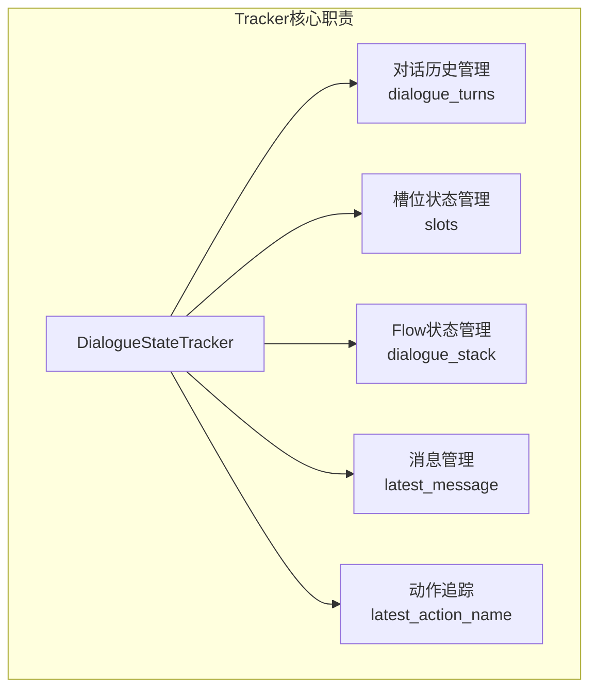

---

## 4.2 Tracker数据结构

### 4.2.1 类图

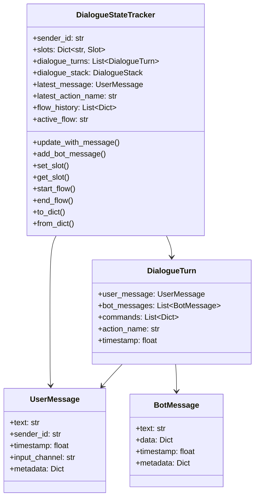

### 4.2.2 核心属性说明

| 属性 | 类型 | 说明 |
|------|------|------|
| `sender_id` | str | 会话ID（通常是用户ID） |
| `slots` | Dict[str, Slot] | 槽位状态字典 |
| `dialogue_turns` | List[DialogueTurn] | 对话轮次历史 |
| `dialogue_stack` | DialogueStack | 对话栈（唯一状态源） |
| `latest_message` | UserMessage | 最新的用户消息 |
| `latest_action_name` | str | 最新执行的动作 |
| `flow_history` | List[Dict] | Flow执行历史 |
| `active_flow` | str (property) | 当前活跃的Flow名称 |

### 4.2.3 调用关系图

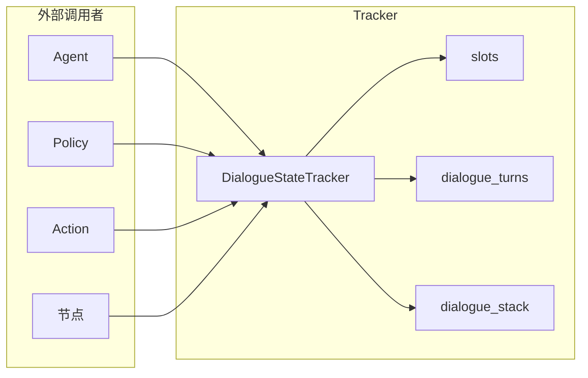

---

## 4.3 槽位系统（Slots）

### 4.3.1 概念解释

**槽位（Slot）** 是对话系统中用于存储收集信息的容器。

> **通俗比喻**：槽位就像"表单字段"，用户填写信息，系统记录下来。
>
> - 订单号槽位 → 存储用户提供的订单号
> - 地址槽位 → 存储用户的收货地址
> - 确认槽位 → 存储用户是否确认操作

### 4.3.2 槽位类型

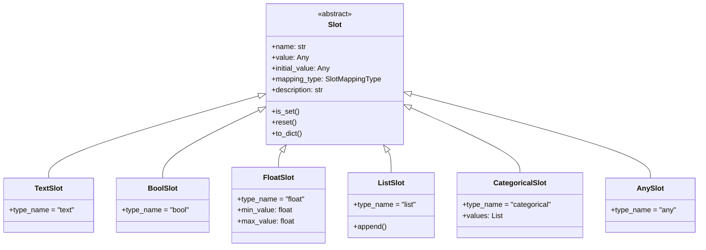

### 4.3.3 槽位类型说明

| 类型 | 说明 | 验证规则 | 示例 |
|------|------|----------|------|
| `TextSlot` | 文本槽位 | 必须是字符串 | 订单号、地址 |
| `BoolSlot` | 布尔槽位 | 必须是布尔值 | 是否确认 |
| `FloatSlot` | 数值槽位 | 必须是数字，可设范围 | 金额、数量 |
| `ListSlot` | 列表槽位 | 必须是列表 | 商品列表 |
| `CategoricalSlot` | 分类槽位 | 必须在预定义值中 | 支付方式 |
| `AnySlot` | 任意槽位 | 接受任何值 | 通用存储 |

### 4.3.4 槽位映射类型

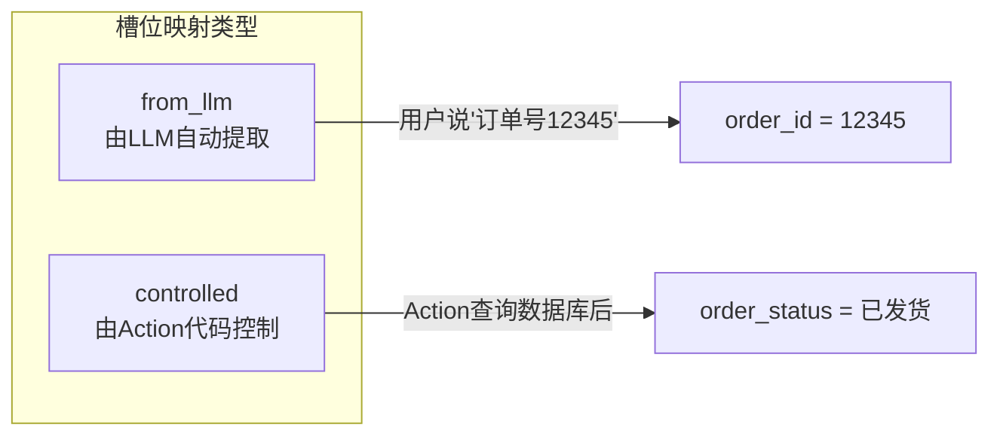

| 映射类型 | 说明 | 使用场景 |
|----------|------|----------|
| `from_llm` | LLM从用户输入中提取 | 用户主动提供的信息 |
| `controlled` | Action代码控制填充 | 系统查询/计算的结果 |

---

## 4.4 对话历史管理

### 4.4.1 DialogueTurn结构

每个对话轮次包含：
- 用户消息（UserMessage）
- Bot响应列表（List[BotMessage]）
- 生成的命令（commands）
- 执行的动作名称（action_name）

### 4.4.2 对话历史流程

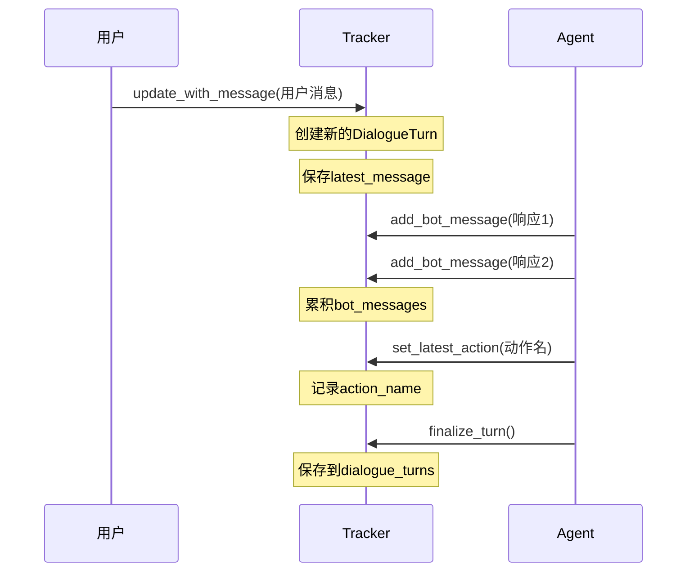

### 4.4.3 LLM消息格式转换

Tracker提供`get_messages_for_llm()`方法，将对话历史转换为LLM消息格式：

```python
# 转换结果示例
[
    {"role": "user", "content": "我想查订单"},
    {"role": "assistant", "content": "好的，请告诉我订单号"},
    {"role": "user", "content": "12345"},
]
```

---

## 4.5 完整代码

### 4.5.1 tracker.py

```python
# -*- coding: utf-8 -*-
"""
tracker - 对话状态追踪器

管理对话过程中的状态信息，包括槽位值、对话历史、活跃Flow等。
Tracker是对话系统的核心数据结构，记录完整的对话上下文。
"""

import time
from dataclasses import dataclass, field
from typing import Any, Dict, List, Optional, Text, Union
from copy import deepcopy

from atguigu_ai.shared.constants import (
    ACTION_LISTEN,
    ACTION_SESSION_START,
    DEFAULT_SENDER_ID,
)
from atguigu_ai.core.slots import Slot, create_slot
from atguigu_ai.dialogue_understanding.stack.dialogue_stack import DialogueStack
from atguigu_ai.dialogue_understanding.stack.stack_frame import FlowStackFrame


@dataclass
class UserMessage:
    """用户消息
    
    封装用户发送的消息及其元数据。
    
    属性：
        text: 消息文本
        sender_id: 发送者ID
        timestamp: 时间戳
        input_channel: 输入通道名称
        metadata: 额外元数据
    """
    text: str
    sender_id: str = DEFAULT_SENDER_ID
    timestamp: float = field(default_factory=time.time)
    input_channel: Optional[str] = None
    metadata: Dict[str, Any] = field(default_factory=dict)
    
    def to_dict(self) -> Dict[str, Any]:
        """转换为字典格式"""
        return {
            "text": self.text,
            "sender_id": self.sender_id,
            "timestamp": self.timestamp,
            "input_channel": self.input_channel,
            "metadata": self.metadata,
        }
    
    @classmethod
    def from_dict(cls, data: Dict[str, Any]) -> "UserMessage":
        """从字典创建用户消息"""
        return cls(
            text=data.get("text", ""),
            sender_id=data.get("sender_id", DEFAULT_SENDER_ID),
            timestamp=data.get("timestamp", time.time()),
            input_channel=data.get("input_channel"),
            metadata=data.get("metadata", {}),
        )


@dataclass
class BotMessage:
    """Bot响应消息
    
    封装Bot发送的响应消息。
    
    属性：
        text: 消息文本
        data: 结构化数据(按钮、图片等)
        timestamp: 时间戳
        metadata: 额外元数据
    """
    text: Optional[str] = None
    data: Dict[str, Any] = field(default_factory=dict)
    timestamp: float = field(default_factory=time.time)
    metadata: Dict[str, Any] = field(default_factory=dict)
    
    def to_dict(self) -> Dict[str, Any]:
        """转换为字典格式"""
        return {
            "text": self.text,
            "data": self.data,
            "timestamp": self.timestamp,
            "metadata": self.metadata,
        }
    
    @classmethod
    def from_dict(cls, data: Dict[str, Any]) -> "BotMessage":
        """从字典创建Bot消息"""
        return cls(
            text=data.get("text"),
            data=data.get("data", {}),
            timestamp=data.get("timestamp", time.time()),
            metadata=data.get("metadata", {}),
        )


@dataclass
class DialogueTurn:
    """对话轮次
    
    一个完整的对话轮次，包含用户消息和Bot响应。
    
    属性：
        user_message: 用户消息
        bot_messages: Bot响应消息列表
        commands: 生成的命令列表
        action_name: 执行的动作名称
        timestamp: 轮次时间戳
    """
    user_message: Optional[UserMessage] = None
    bot_messages: List[BotMessage] = field(default_factory=list)
    commands: List[Dict[str, Any]] = field(default_factory=list)
    action_name: Optional[str] = None
    timestamp: float = field(default_factory=time.time)
    
    def to_dict(self) -> Dict[str, Any]:
        """转换为字典格式"""
        return {
            "user_message": self.user_message.to_dict() if self.user_message else None,
            "bot_messages": [m.to_dict() for m in self.bot_messages],
            "commands": self.commands,
            "action_name": self.action_name,
            "timestamp": self.timestamp,
        }


class DialogueStateTracker:
    """对话状态追踪器
    
    管理单个用户会话的完整对话状态。
    
    核心功能：
    - 记录对话历史(用户消息和Bot响应)
    - 管理槽位状态
    - 跟踪活跃的Flow（通过dialogue_stack）
    - 支持状态序列化和反序列化
    
    状态管理：
        使用统一的 dialogue_stack 管理所有对话上下文（Flow、搜索、闲聊等）。
        active_flow 是从 dialogue_stack 派生的计算属性。
    
    属性：
        sender_id: 会话ID(通常是用户ID)
        slots: 槽位状态字典
        dialogue_turns: 对话轮次历史
        dialogue_stack: 对话栈（唯一状态源）
        active_flow: 当前活跃的Flow名称（从dialogue_stack计算）
        latest_message: 最新的用户消息
        latest_action_name: 最新执行的动作
    """
    
    def __init__(
        self,
        sender_id: str = DEFAULT_SENDER_ID,
        slots: Optional[Dict[str, Slot]] = None,
        max_turns: int = 100,
    ) -> None:
        """初始化对话状态追踪器
        
        参数：
            sender_id: 会话ID
            slots: 初始槽位字典
            max_turns: 最大保留轮次数
        """
        self.sender_id = sender_id
        self.slots: Dict[str, Slot] = slots or {}
        self.max_turns = max_turns
        
        # 对话历史
        self.dialogue_turns: List[DialogueTurn] = []
        
        # 当前轮次(正在进行中)
        self._current_turn: Optional[DialogueTurn] = None
        
        # ========== 核心：统一的对话栈 ==========
        self.dialogue_stack: DialogueStack = DialogueStack()
        
        # Flow历史记录（用于追溯）
        self.flow_history: List[Dict[str, Any]] = []
        
        # 最新状态
        self.latest_message: Optional[UserMessage] = None
        self.latest_action_name: str = ACTION_LISTEN
        
        # 元数据
        self.followup_action: Optional[str] = None
        self.paused: bool = False
        self.created_at: float = time.time()
        self.updated_at: float = time.time()
    
    @property
    def active_flow(self) -> Optional[str]:
        """当前活跃的Flow名称（从dialogue_stack计算）"""
        frame = self.dialogue_stack.active_flow_frame()
        return frame.flow_id if frame else None
    
    # ========== 消息管理 ==========
    
    def update_with_message(self, message: UserMessage) -> None:
        """使用新的用户消息更新状态
        
        开始新的对话轮次。
        
        参数：
            message: 用户消息
        """
        # 保存之前的轮次
        if self._current_turn is not None:
            self._save_current_turn()
        
        # 开始新轮次
        self._current_turn = DialogueTurn(user_message=message)
        self.latest_message = message
        self.latest_action_name = ACTION_LISTEN
        self.updated_at = time.time()
    
    def add_bot_message(self, message: BotMessage) -> None:
        """添加Bot响应消息"""
        if self._current_turn is None:
            self._current_turn = DialogueTurn()
        
        self._current_turn.bot_messages.append(message)
        self.updated_at = time.time()
    
    # ========== 槽位管理 ==========
    
    def set_slot(
        self,
        slot_name: str,
        value: Any,
        create_if_missing: bool = True,
    ) -> None:
        """设置槽位值
        
        参数：
            slot_name: 槽位名称
            value: 槽位值
            create_if_missing: 槽位不存在时是否创建
        """
        if slot_name in self.slots:
            self.slots[slot_name].value = value
        elif create_if_missing:
            self.slots[slot_name] = create_slot(name=slot_name, initial_value=None)
            self.slots[slot_name].value = value
        
        self.updated_at = time.time()
    
    def get_slot(self, slot_name: str) -> Any:
        """获取槽位值"""
        slot = self.slots.get(slot_name)
        return slot.value if slot else None
    
    def get_all_slots(self) -> Dict[str, Any]:
        """获取所有槽位的值"""
        return {name: slot.value for name, slot in self.slots.items()}
    
    def reset_slots(self) -> None:
        """重置所有槽位为初始值"""
        for slot in self.slots.values():
            slot.reset()
        self.updated_at = time.time()
    
    # ========== Flow管理 ==========
    
    def start_flow(self, flow_name: str, step_id: str = "START") -> None:
        """开始执行Flow
        
        将FlowStackFrame压入dialogue_stack。
        """
        self.dialogue_stack.push_flow(flow_name, step_id)
        
        # 记录到历史
        self.flow_history.append({
            "flow_name": flow_name,
            "started_at": time.time(),
            "ended_at": None,
            "completed": False,
        })
        self.updated_at = time.time()
    
    def end_flow(self) -> Optional[str]:
        """结束当前Flow
        
        从dialogue_stack弹出栈顶的FlowStackFrame。
        """
        flow_frame = self.dialogue_stack.top_flow_frame()
        if flow_frame is None:
            return None
        
        flow_name = flow_frame.flow_id
        
        # 弹出到该Flow（包括它上面的所有帧）
        self.dialogue_stack.pop_to_flow(flow_name)
        self.dialogue_stack.pop()  # 弹出Flow本身
        
        # 更新flow_history
        for hist in reversed(self.flow_history):
            if hist["flow_name"] == flow_name and hist["ended_at"] is None:
                hist["ended_at"] = time.time()
                hist["completed"] = True
                break
        
        self.updated_at = time.time()
        return flow_name
    
    def cancel_flow(self) -> None:
        """取消所有活跃的Flow"""
        self.dialogue_stack.clear()
        self.updated_at = time.time()
    
    # ========== 动作追踪 ==========
    
    def set_latest_action(self, action_name: str) -> None:
        """设置最新执行的动作"""
        self.latest_action_name = action_name
        if self._current_turn:
            self._current_turn.action_name = action_name
        self.updated_at = time.time()
    
    # ========== 对话历史 ==========
    
    def get_conversation_history(
        self,
        max_turns: Optional[int] = None,
    ) -> List[Dict[str, Any]]:
        """获取对话历史"""
        turns = self.dialogue_turns[:]
        if self._current_turn:
            turns.append(self._current_turn)
        
        if max_turns:
            turns = turns[-max_turns:]
        
        return [turn.to_dict() for turn in turns]
    
    def get_messages_for_llm(
        self,
        max_turns: int = 10,
    ) -> List[Dict[str, str]]:
        """获取用于LLM的消息历史"""
        messages = []
        turns = self.dialogue_turns[-max_turns:] if max_turns else self.dialogue_turns
        
        for turn in turns:
            if turn.user_message:
                messages.append({
                    "role": "user",
                    "content": turn.user_message.text,
                })
            
            for bot_msg in turn.bot_messages:
                if bot_msg.text:
                    messages.append({
                        "role": "assistant",
                        "content": bot_msg.text,
                    })
        
        # 添加当前轮次的用户消息
        if self._current_turn and self._current_turn.user_message:
            messages.append({
                "role": "user",
                "content": self._current_turn.user_message.text,
            })
        
        return messages
    
    # ========== 轮次管理 ==========
    
    def _save_current_turn(self) -> None:
        """保存当前轮次到历史"""
        if self._current_turn:
            self.dialogue_turns.append(self._current_turn)
            
            # 限制历史长度
            if len(self.dialogue_turns) > self.max_turns:
                self.dialogue_turns = self.dialogue_turns[-self.max_turns:]
            
            self._current_turn = None
    
    def finalize_turn(self) -> None:
        """完成当前轮次"""
        self._save_current_turn()
        self.updated_at = time.time()
    
    def restart(self) -> None:
        """重启会话，清除所有状态"""
        self.dialogue_turns.clear()
        self._current_turn = None
        self.reset_slots()
        self.dialogue_stack.clear()
        self.latest_message = None
        self.latest_action_name = ACTION_LISTEN
        self.followup_action = None
        self.paused = False
        self.updated_at = time.time()
    
    # ========== 序列化 ==========
    
    def current_state(self) -> Dict[str, Any]:
        """获取当前完整状态"""
        return {
            "sender_id": self.sender_id,
            "slots": self.get_all_slots(),
            "active_flow": self.active_flow,
            "dialogue_stack": self.dialogue_stack.as_dict(),
            "latest_message": self.latest_message.to_dict() if self.latest_message else None,
            "latest_action_name": self.latest_action_name,
            "paused": self.paused,
            "dialogue_turns_count": len(self.dialogue_turns),
            "created_at": self.created_at,
            "updated_at": self.updated_at,
        }
    
    def to_dict(self) -> Dict[str, Any]:
        """序列化为字典（用于持久化存储）"""
        self._save_current_turn()
        
        return {
            "sender_id": self.sender_id,
            "slots": {name: slot.to_dict() for name, slot in self.slots.items()},
            "dialogue_turns": [turn.to_dict() for turn in self.dialogue_turns],
            "dialogue_stack": self.dialogue_stack.as_dict(),
            "flow_history": self.flow_history,
            "latest_action_name": self.latest_action_name,
            "latest_message": self.latest_message.to_dict() if self.latest_message else None,
            "paused": self.paused,
            "created_at": self.created_at,
            "updated_at": self.updated_at,
        }
    
    @classmethod
    def from_dict(
        cls,
        data: Dict[str, Any],
        domain_slots: Optional[Dict[str, Slot]] = None,
    ) -> "DialogueStateTracker":
        """从字典反序列化"""
        # 恢复槽位
        slots = {}
        for slot_name, slot_data in data.get("slots", {}).items():
            if domain_slots and slot_name in domain_slots:
                slot = deepcopy(domain_slots[slot_name])
                slot._value = slot_data.get("value")
            else:
                slot = Slot.from_dict(slot_data)
            slots[slot_name] = slot
        
        tracker = cls(
            sender_id=data.get("sender_id", DEFAULT_SENDER_ID),
            slots=slots,
        )
        
        # 恢复dialogue_stack
        if "dialogue_stack" in data:
            tracker.dialogue_stack = DialogueStack.from_dict(data["dialogue_stack"])
        
        # 恢复其他状态
        tracker.flow_history = data.get("flow_history", [])
        tracker.latest_action_name = data.get("latest_action_name", ACTION_LISTEN)
        tracker.paused = data.get("paused", False)
        tracker.created_at = data.get("created_at", time.time())
        tracker.updated_at = data.get("updated_at", time.time())
        
        if data.get("latest_message"):
            tracker.latest_message = UserMessage.from_dict(data["latest_message"])
        
        # 恢复对话历史
        for turn_data in data.get("dialogue_turns", []):
            turn = DialogueTurn(
                timestamp=turn_data.get("timestamp", time.time()),
                action_name=turn_data.get("action_name"),
                commands=turn_data.get("commands", []),
            )
            
            if turn_data.get("user_message"):
                turn.user_message = UserMessage.from_dict(turn_data["user_message"])
            
            for bot_msg_data in turn_data.get("bot_messages", []):
                turn.bot_messages.append(BotMessage.from_dict(bot_msg_data))
            
            tracker.dialogue_turns.append(turn)
        
        return tracker
    
    def copy(self) -> "DialogueStateTracker":
        """创建Tracker的深拷贝"""
        return DialogueStateTracker.from_dict(self.to_dict())
    
    def __repr__(self) -> str:
        return (
            f"DialogueStateTracker(sender_id={self.sender_id}, "
            f"slots={len(self.slots)}, turns={len(self.dialogue_turns)}, "
            f"active_flow={self.active_flow})"
        )
```

### 4.5.2 slots.py

```python
# -*- coding: utf-8 -*-
"""
slots - 槽位系统

定义对话系统中的槽位类型，用于存储对话过程中收集的信息。
槽位是对话状态的核心组成部分，支持多种数据类型。

槽位映射类型：
- from_llm: 由LLM从用户输入中提取并填充
- controlled: 由Action填充，不由LLM自动提取
"""

from abc import ABC
from dataclasses import dataclass, field
from enum import Enum
from typing import Any, Dict, List, Optional, Text, Type, Union

from atguigu_ai.shared.constants import (
    SLOT_TYPE_ANY,
    SLOT_TYPE_BOOL,
    SLOT_TYPE_CATEGORICAL,
    SLOT_TYPE_FLOAT,
    SLOT_TYPE_LIST,
    SLOT_TYPE_TEXT,
)
from atguigu_ai.shared.exceptions import InvalidSlotValueError


class SlotMappingType(str, Enum):
    """槽位映射类型。
    
    定义槽位如何被填充：
    - FROM_LLM: LLM从用户输入中提取值填充
    - CONTROLLED: Action代码控制填充，LLM不自动提取
    """
    FROM_LLM = "from_llm"
    CONTROLLED = "controlled"


class Slot(ABC):
    """槽位基类
    
    所有槽位类型的抽象基类，定义槽位的基本属性和行为。
    """
    
    type_name: str = "any"
    
    def __init__(
        self,
        name: Text,
        initial_value: Any = None,
        influence_conversation: bool = True,
        mappings: Optional[List[Dict[str, Any]]] = None,
        mapping_type: Union[SlotMappingType, str] = SlotMappingType.FROM_LLM,
        description: Optional[str] = None,
    ) -> None:
        """初始化槽位"""
        self.name = name
        self.initial_value = initial_value
        self._value = initial_value
        self.influence_conversation = influence_conversation
        self.mappings = mappings or []
        
        # 槽位映射类型支持
        if isinstance(mapping_type, str):
            mapping_type = SlotMappingType(mapping_type)
        self.mapping_type = mapping_type
        self.description = description
    
    @property
    def value(self) -> Any:
        """获取槽位当前值"""
        return self._value
    
    @value.setter
    def value(self, new_value: Any) -> None:
        """设置槽位值（会进行类型验证）"""
        if new_value is not None and not self._validate_value(new_value):
            raise InvalidSlotValueError(
                f"槽位 '{self.name}' 的值 '{new_value}' 类型无效，"
                f"期望类型: {self.type_name}"
            )
        self._value = new_value
    
    def _validate_value(self, value: Any) -> bool:
        """验证槽位值是否有效（子类重写）"""
        return True
    
    def reset(self) -> None:
        """重置槽位为初始值"""
        self._value = self.initial_value
    
    def is_set(self) -> bool:
        """检查槽位是否已设置(非空)"""
        return self._value is not None
    
    def to_dict(self) -> Dict[str, Any]:
        """转换为字典格式"""
        data = {
            "name": self.name,
            "type": self.type_name,
            "value": self._value,
            "initial_value": self.initial_value,
            "influence_conversation": self.influence_conversation,
            "mapping_type": self.mapping_type.value,
        }
        if self.description:
            data["description"] = self.description
        return data
    
    @classmethod
    def from_dict(cls, data: Dict[str, Any]) -> "Slot":
        """从字典创建槽位实例"""
        slot_type = data.get("type", SLOT_TYPE_ANY)
        slot_class = SLOT_TYPE_MAP.get(slot_type, AnySlot)
        
        slot = slot_class(
            name=data["name"],
            initial_value=data.get("initial_value"),
            influence_conversation=data.get("influence_conversation", True),
            mappings=data.get("mappings"),
            mapping_type=data.get("mapping_type", SlotMappingType.FROM_LLM),
            description=data.get("description"),
        )
        
        if "value" in data:
            slot._value = data["value"]
        
        return slot
    
    def is_from_llm(self) -> bool:
        """检查槽位是否由LLM填充"""
        return self.mapping_type == SlotMappingType.FROM_LLM
    
    def is_controlled(self) -> bool:
        """检查槽位是否由Action控制填充"""
        return self.mapping_type == SlotMappingType.CONTROLLED


class TextSlot(Slot):
    """文本槽位 - 存储字符串类型的值"""
    type_name = SLOT_TYPE_TEXT
    
    def _validate_value(self, value: Any) -> bool:
        return isinstance(value, str)


class BoolSlot(Slot):
    """布尔槽位 - 存储布尔类型的值"""
    type_name = SLOT_TYPE_BOOL
    
    def _validate_value(self, value: Any) -> bool:
        return isinstance(value, bool)


class FloatSlot(Slot):
    """浮点槽位 - 存储数值类型的值，支持范围验证"""
    type_name = SLOT_TYPE_FLOAT
    
    def __init__(
        self,
        name: Text,
        initial_value: Any = None,
        influence_conversation: bool = True,
        mappings: Optional[List[Dict[str, Any]]] = None,
        mapping_type: Union[SlotMappingType, str] = SlotMappingType.FROM_LLM,
        description: Optional[str] = None,
        min_value: Optional[float] = None,
        max_value: Optional[float] = None,
    ) -> None:
        super().__init__(name, initial_value, influence_conversation, 
                         mappings, mapping_type, description)
        self.min_value = min_value
        self.max_value = max_value
    
    def _validate_value(self, value: Any) -> bool:
        if not isinstance(value, (int, float)):
            return False
        if self.min_value is not None and value < self.min_value:
            return False
        if self.max_value is not None and value > self.max_value:
            return False
        return True


class ListSlot(Slot):
    """列表槽位 - 存储列表类型的值"""
    type_name = SLOT_TYPE_LIST
    
    def __init__(self, name: Text, initial_value: Any = None, **kwargs) -> None:
        if initial_value is None:
            initial_value = []
        super().__init__(name, initial_value, **kwargs)
    
    def _validate_value(self, value: Any) -> bool:
        return isinstance(value, list)
    
    def append(self, item: Any) -> None:
        """向列表添加元素"""
        if self._value is None:
            self._value = []
        self._value.append(item)


class CategoricalSlot(Slot):
    """分类槽位 - 只允许预定义值列表中的值"""
    type_name = SLOT_TYPE_CATEGORICAL
    
    def __init__(
        self,
        name: Text,
        initial_value: Any = None,
        values: Optional[List[Any]] = None,
        **kwargs
    ) -> None:
        super().__init__(name, initial_value, **kwargs)
        self.values = values or []
    
    def _validate_value(self, value: Any) -> bool:
        if not self.values:
            return True
        return value in self.values


class AnySlot(Slot):
    """任意类型槽位 - 接受任何类型的值"""
    type_name = SLOT_TYPE_ANY
    
    def _validate_value(self, value: Any) -> bool:
        return True


# 槽位类型映射
SLOT_TYPE_MAP: Dict[str, Type[Slot]] = {
    SLOT_TYPE_TEXT: TextSlot,
    SLOT_TYPE_BOOL: BoolSlot,
    SLOT_TYPE_FLOAT: FloatSlot,
    SLOT_TYPE_LIST: ListSlot,
    SLOT_TYPE_CATEGORICAL: CategoricalSlot,
    SLOT_TYPE_ANY: AnySlot,
}


def create_slot(
    name: Text,
    slot_type: Text = SLOT_TYPE_ANY,
    mapping_type: Union[SlotMappingType, str] = SlotMappingType.FROM_LLM,
    description: Optional[str] = None,
    **kwargs: Any,
) -> Slot:
    """创建槽位实例的工厂函数"""
    slot_class = SLOT_TYPE_MAP.get(slot_type, AnySlot)
    return slot_class(
        name=name, 
        mapping_type=mapping_type, 
        description=description,
        **kwargs
    )
```

---

# 第5章 对话栈管理系统

## 5.1 对话栈设计理念

### 5.1.1 概念解释

**对话栈（DialogueStack）** 是管理对话上下文的栈结构，采用后进先出（LIFO）的数据结构。

> **通俗比喻**：对话栈就像"浏览器的标签页管理"：
>
> - **压栈(push)** = 打开新标签页（启动新Flow）
> - **弹栈(pop)** = 关闭当前标签页（完成Flow）
> - **栈顶(top)** = 当前活动标签页（当前正在处理的Flow）
> - **中断** = 切换到其他标签页处理紧急事务，之后再回来

### 5.1.2 设计意图

**为什么需要对话栈？**

1. **支持Flow嵌套**：A Flow执行中可以调用B Flow，B完成后自动返回A
2. **支持中断恢复**：用户在A Flow中突然问别的问题，回答后可以继续A
3. **上下文管理**：每个Flow有独立的执行状态，互不干扰
4. **多模式支持**：Flow、搜索、闲聊、人工转接都用栈帧表示

### 5.1.3 栈操作示意

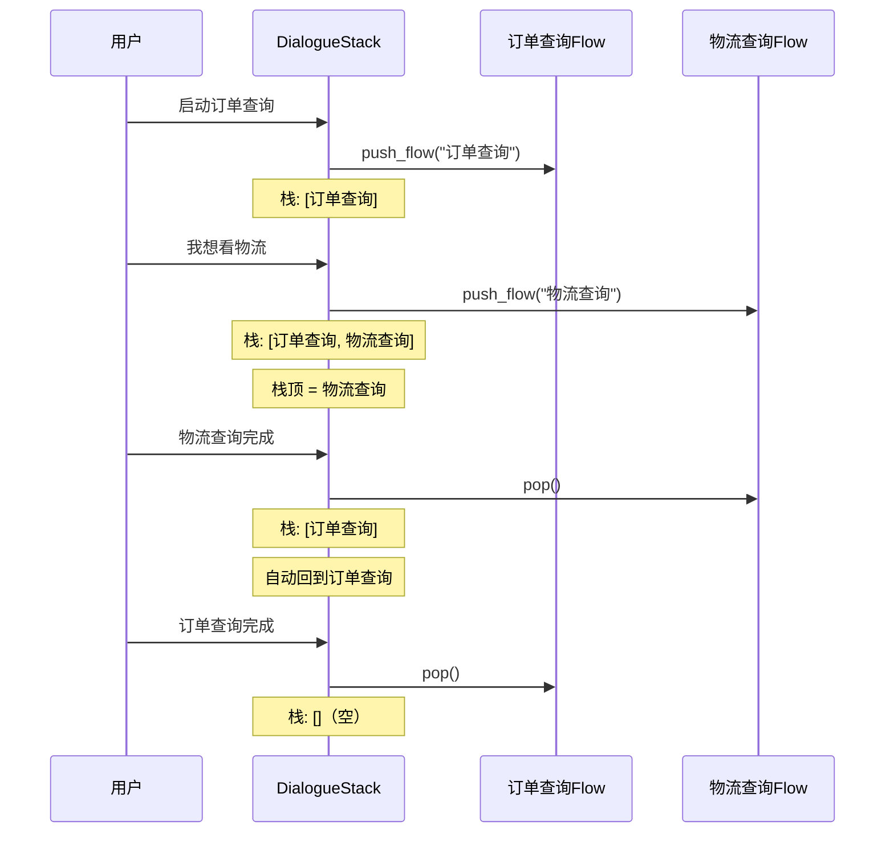

---

## 5.2 DialogueStack核心组件

### 5.2.1 类图

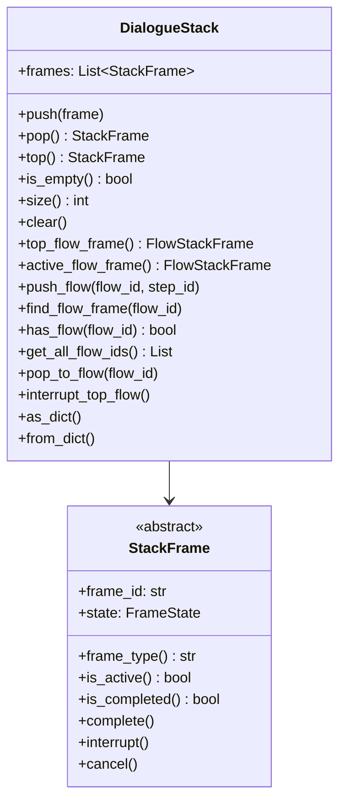

### 5.2.2 核心方法说明

| 方法 | 说明 |
|------|------|
| `push(frame)` | 将帧压入栈顶 |
| `pop()` | 弹出并返回栈顶帧 |
| `top()` | 获取栈顶帧（不弹出） |
| `is_empty()` | 检查栈是否为空 |
| `push_flow(flow_id, step_id)` | 压入新的Flow帧 |
| `top_flow_frame()` | 获取栈顶的Flow帧 |
| `active_flow_frame()` | 获取当前活动的Flow帧 |
| `pop_to_flow(flow_id)` | 弹出直到指定Flow |
| `interrupt_top_flow()` | 中断栈顶Flow |

---

## 5.3 FlowStackFrame栈帧

### 5.3.1 栈帧类型

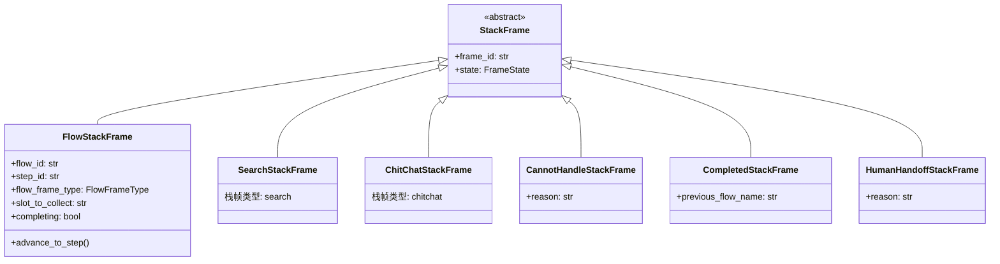

### 5.3.2 栈帧类型说明

| 类型 | 说明 | 使用场景 |
|------|------|----------|
| `FlowStackFrame` | Flow帧 | 执行定义的Flow流程 |
| `SearchStackFrame` | 搜索帧 | 执行知识库搜索 |
| `ChitChatStackFrame` | 闲聊帧 | 处理闲聊对话 |
| `CannotHandleStackFrame` | 无法处理帧 | 系统无法处理的请求 |
| `CompletedStackFrame` | 完成帧 | Flow完成后的空闲状态 |
| `HumanHandoffStackFrame` | 人工转接帧 | 需要转接人工客服 |

### 5.3.3 帧状态机

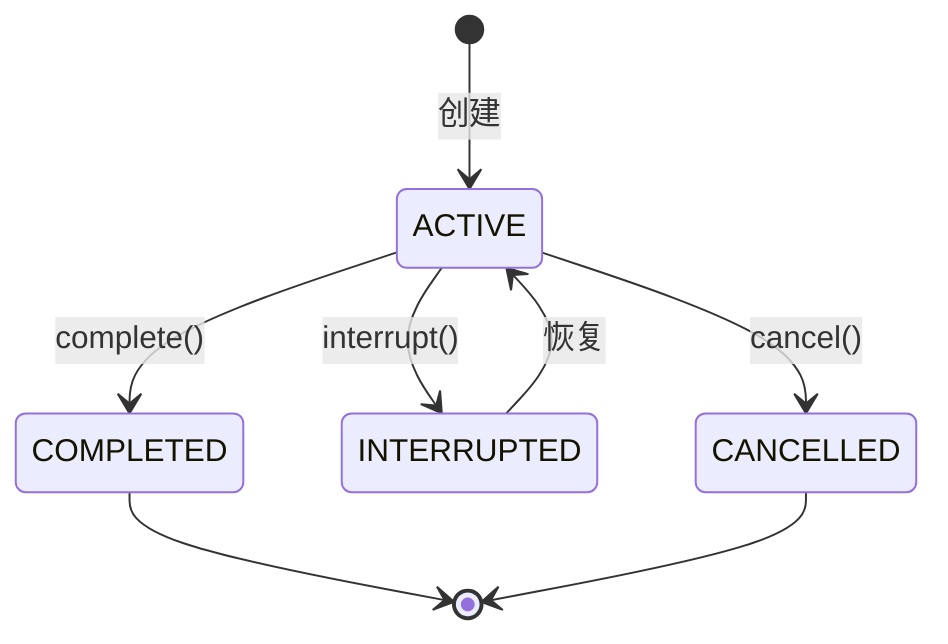

| 状态 | 说明 |
|------|------|
| `ACTIVE` | 活动状态，正在执行 |
| `COMPLETED` | 已完成 |
| `INTERRUPTED` | 已中断，可恢复 |
| `CANCELLED` | 已取消 |

---

## 5.4 对话栈操作

### 5.4.1 压栈与弹栈

```python
# 创建对话栈
stack = DialogueStack()

# 压入Flow帧
stack.push_flow("订单查询", "START")
print(stack)  # DialogueStack([Flow(订单查询@START)])

# 压入另一个Flow帧
stack.push_flow("物流查询", "START")
print(stack)  # DialogueStack([Flow(物流查询@START) > Flow(订单查询@START)])

# 获取栈顶
top_frame = stack.top()
print(top_frame.flow_id)  # 物流查询

# 弹出栈顶
popped = stack.pop()
print(popped.flow_id)  # 物流查询
print(stack)  # DialogueStack([Flow(订单查询@START)])
```

### 5.4.2 Flow嵌套管理

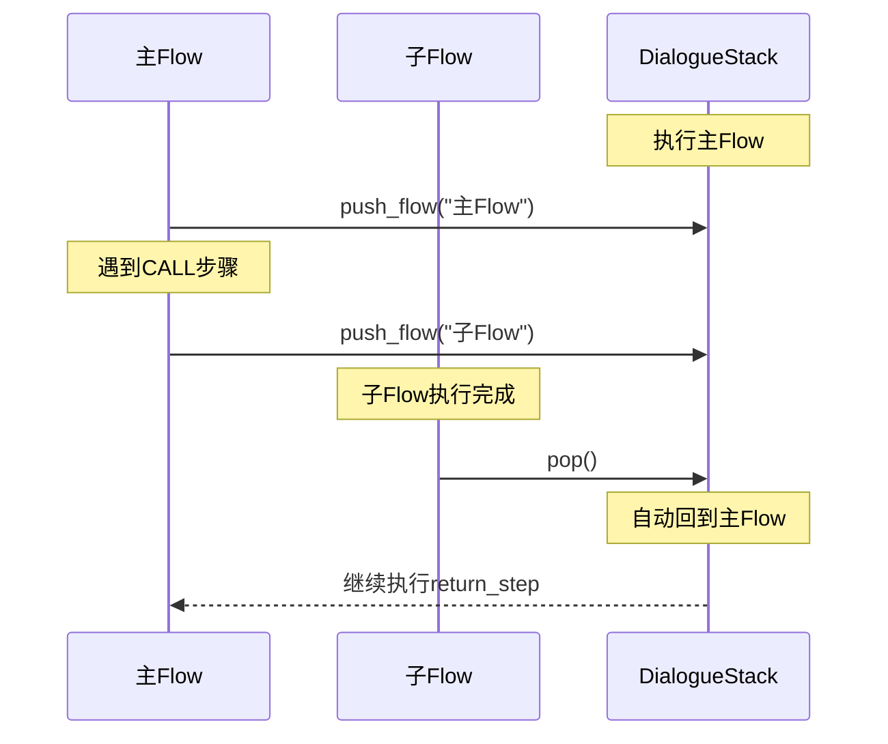

### 5.4.3 中断与恢复

```python
# 场景：用户在订单查询中突然问其他问题

# 1. 订单查询进行中
stack.push_flow("订单查询", "collect_order_id")

# 2. 用户突然问退货政策
stack.interrupt_top_flow()  # 中断订单查询
stack.push(SearchStackFrame())  # 压入搜索帧

# 3. 搜索完成后
stack.pop()  # 弹出搜索帧
# 订单查询自动恢复（仍在栈中）
print(stack.active_flow_frame().flow_id)  # 订单查询
```

---

## 5.5 完整代码

### 5.5.1 dialogue_stack.py

```python
# -*- coding: utf-8 -*-
"""
对话栈

管理对话上下文的栈结构，支持Flow嵌套、中断和恢复。
"""

from __future__ import annotations

from dataclasses import dataclass, field
from typing import Any, Dict, Iterator, List, Optional, Type

from atguigu_ai.dialogue_understanding.stack.stack_frame import (
    StackFrame,
    FlowStackFrame,
    FrameState,
    create_frame_from_dict,
)


@dataclass
class DialogueStack:
    """对话栈。
    
    管理对话过程中的上下文栈，支持：
    - Flow嵌套执行
    - 中断和恢复
    - 模式触发
    
    栈采用后进先出(LIFO)结构，栈顶是当前活动的帧。
    
    Attributes:
        frames: 栈帧列表，最后一个是栈顶
    """
    
    frames: List[StackFrame] = field(default_factory=list)
    
    # ========== 基础栈操作 ==========
    
    def push(self, frame: StackFrame) -> None:
        """将帧压入栈顶。"""
        self.frames.append(frame)
    
    def pop(self) -> Optional[StackFrame]:
        """弹出栈顶帧。"""
        if self.frames:
            return self.frames.pop()
        return None
    
    def top(self) -> Optional[StackFrame]:
        """获取栈顶帧（不弹出）。"""
        if self.frames:
            return self.frames[-1]
        return None
    
    def is_empty(self) -> bool:
        """检查栈是否为空。"""
        return len(self.frames) == 0
    
    def size(self) -> int:
        """返回栈的大小。"""
        return len(self.frames)
    
    def clear(self) -> None:
        """清空栈。"""
        self.frames.clear()
    
    def __len__(self) -> int:
        return len(self.frames)
    
    def __iter__(self) -> Iterator[StackFrame]:
        """从栈顶到栈底迭代。"""
        return reversed(self.frames).__iter__()
    
    def bottom_up(self) -> Iterator[StackFrame]:
        """从栈底到栈顶迭代。"""
        return iter(self.frames)
    
    # ========== Flow相关操作 ==========
    
    def top_flow_frame(self) -> Optional[FlowStackFrame]:
        """获取栈顶的Flow帧。
        
        从栈顶开始查找第一个FlowStackFrame。
        """
        for frame in self:
            if isinstance(frame, FlowStackFrame):
                return frame
        return None
    
    def active_flow_frame(self) -> Optional[FlowStackFrame]:
        """获取当前活动的Flow帧。
        
        返回栈顶的活动状态的Flow帧。
        """
        for frame in self:
            if isinstance(frame, FlowStackFrame) and frame.is_active():
                return frame
        return None
    
    def push_flow(self, flow_id: str, step_id: str = "START") -> FlowStackFrame:
        """压入新的Flow帧。"""
        frame = FlowStackFrame(flow_id=flow_id, step_id=step_id)
        self.push(frame)
        return frame
    
    def find_flow_frame(self, flow_id: str) -> Optional[FlowStackFrame]:
        """查找指定Flow的帧。"""
        for frame in self:
            if isinstance(frame, FlowStackFrame) and frame.flow_id == flow_id:
                return frame
        return None
    
    def has_flow(self, flow_id: str) -> bool:
        """检查栈中是否包含指定Flow。"""
        return self.find_flow_frame(flow_id) is not None
    
    def get_all_flow_ids(self) -> List[str]:
        """获取栈中所有Flow的ID列表。"""
        return [
            frame.flow_id
            for frame in self
            if isinstance(frame, FlowStackFrame)
        ]
    
    def pop_to_flow(self, flow_id: str) -> List[StackFrame]:
        """弹出栈帧直到到达指定Flow。
        
        弹出目标Flow之上的所有帧（不包括目标Flow本身）。
        """
        popped = []
        while self.frames:
            top = self.top()
            if isinstance(top, FlowStackFrame) and top.flow_id == flow_id:
                break
            popped.append(self.pop())
        return popped
    
    def interrupt_top_flow(self) -> Optional[FlowStackFrame]:
        """中断栈顶的Flow。"""
        flow_frame = self.top_flow_frame()
        if flow_frame:
            flow_frame.interrupt()
        return flow_frame
    
    # ========== 帧查找操作 ==========
    
    def find_frame(self, frame_id: str) -> Optional[StackFrame]:
        """根据帧ID查找帧。"""
        for frame in self:
            if frame.frame_id == frame_id:
                return frame
        return None
    
    def find_frames_of_type(self, frame_type: Type[StackFrame]) -> List[StackFrame]:
        """查找指定类型的所有帧。"""
        return [frame for frame in self if isinstance(frame, frame_type)]
    
    def remove_frame(self, frame_id: str) -> Optional[StackFrame]:
        """移除指定ID的帧。"""
        for i, frame in enumerate(self.frames):
            if frame.frame_id == frame_id:
                return self.frames.pop(i)
        return None
    
    # ========== 序列化 ==========
    
    def as_dict(self) -> Dict[str, Any]:
        """将栈转换为字典。"""
        return {
            "frames": [frame.as_dict() for frame in self.frames]
        }
    
    @classmethod
    def from_dict(cls, data: Dict[str, Any]) -> "DialogueStack":
        """从字典创建栈。"""
        frames = []
        for frame_data in data.get("frames", []):
            try:
                frame = create_frame_from_dict(frame_data)
                frames.append(frame)
            except ValueError:
                continue
        
        stack = cls()
        stack.frames = frames
        return stack
    
    def copy(self) -> "DialogueStack":
        """创建栈的副本。"""
        return DialogueStack.from_dict(self.as_dict())
    
    def __repr__(self) -> str:
        if self.is_empty():
            return "DialogueStack(empty)"
        
        frame_strs = []
        for frame in self:
            if isinstance(frame, FlowStackFrame):
                frame_strs.append(f"Flow({frame.flow_id}@{frame.step_id})")
            else:
                frame_strs.append(f"{frame.frame_type()}")
        
        return f"DialogueStack([{' > '.join(frame_strs)}])"
```

### 5.5.2 stack_frame.py

```python
# -*- coding: utf-8 -*-
"""
栈帧定义

定义对话栈中的各种帧类型。
"""

from __future__ import annotations

import dataclasses
from abc import ABC, abstractmethod
from dataclasses import dataclass, field
from enum import Enum
from typing import Any, Dict, List, Optional, Type
import uuid


def generate_frame_id() -> str:
    """生成唯一的帧ID。"""
    return uuid.uuid4().hex[:8]


# 帧类型注册表
_FRAME_TYPE_REGISTRY: Dict[str, Type["StackFrame"]] = {}


def register_frame_type(cls: Type["StackFrame"]) -> Type["StackFrame"]:
    """栈帧类型注册装饰器。"""
    _FRAME_TYPE_REGISTRY[cls.frame_type()] = cls
    return cls


class FrameState(str, Enum):
    """帧状态枚举。"""
    ACTIVE = "active"
    COMPLETED = "completed"
    INTERRUPTED = "interrupted"
    CANCELLED = "cancelled"


class FlowFrameType(str, Enum):
    """Flow帧类型枚举。"""
    REGULAR = "regular"      # 普通Flow
    INTERRUPT = "interrupt"  # 中断Flow
    LINK = "link"           # 链接Flow


@dataclass
class StackFrame(ABC):
    """栈帧基类。
    
    栈帧表示对话栈中的一个条目，记录对话上下文的一个状态点。
    """
    
    frame_id: str = field(default_factory=generate_frame_id)
    state: FrameState = FrameState.ACTIVE
    
    @classmethod
    @abstractmethod
    def frame_type(cls) -> str:
        """返回帧类型标识。"""
        raise NotImplementedError()
    
    @classmethod
    @abstractmethod
    def from_dict(cls, data: Dict[str, Any]) -> "StackFrame":
        """从字典创建帧实例。"""
        raise NotImplementedError()
    
    def as_dict(self) -> Dict[str, Any]:
        """将帧转换为字典。"""
        data = {}
        for f in dataclasses.fields(self):
            value = getattr(self, f.name)
            if isinstance(value, Enum):
                data[f.name] = value.value
            else:
                data[f.name] = value
        data["type"] = self.frame_type()
        return data
    
    def is_active(self) -> bool:
        """检查帧是否处于活动状态。"""
        return self.state == FrameState.ACTIVE
    
    def is_completed(self) -> bool:
        """检查帧是否已完成。"""
        return self.state == FrameState.COMPLETED
    
    def complete(self) -> None:
        """将帧标记为已完成。"""
        self.state = FrameState.COMPLETED
    
    def interrupt(self) -> None:
        """将帧标记为已中断。"""
        self.state = FrameState.INTERRUPTED
    
    def cancel(self) -> None:
        """将帧标记为已取消。"""
        self.state = FrameState.CANCELLED


@register_frame_type
@dataclass
class FlowStackFrame(StackFrame):
    """Flow栈帧。
    
    表示一个正在执行的Flow。
    
    Attributes:
        flow_id: Flow的ID
        step_id: 当前步骤ID
        flow_frame_type: Flow帧类型（regular, interrupt, link）
        slot_to_collect: 当前正在收集的槽位名称
        completing: Flow是否正在完成中
    """
    
    flow_id: str = ""
    step_id: str = "START"
    flow_frame_type: FlowFrameType = FlowFrameType.REGULAR
    slot_to_collect: Optional[str] = None
    completing: bool = False
    
    @classmethod
    def frame_type(cls) -> str:
        return "flow"
    
    @classmethod
    def from_dict(cls, data: Dict[str, Any]) -> "FlowStackFrame":
        state = data.get("state", FrameState.ACTIVE.value)
        if isinstance(state, str):
            state = FrameState(state)
        
        flow_frame_type = data.get("flow_frame_type", FlowFrameType.REGULAR.value)
        if isinstance(flow_frame_type, str):
            flow_frame_type = FlowFrameType(flow_frame_type)
        
        return FlowStackFrame(
            frame_id=data.get("frame_id", generate_frame_id()),
            state=state,
            flow_id=data.get("flow_id", ""),
            step_id=data.get("step_id", "START"),
            flow_frame_type=flow_frame_type,
            slot_to_collect=data.get("slot_to_collect"),
            completing=data.get("completing", False),
        )
    
    def advance_to_step(self, step_id: str) -> None:
        """前进到指定步骤。"""
        self.step_id = step_id
    
    def is_interrupt(self) -> bool:
        """检查是否是中断帧。"""
        return self.flow_frame_type == FlowFrameType.INTERRUPT


@register_frame_type
@dataclass
class SearchStackFrame(StackFrame):
    """搜索栈帧 - 表示正在执行知识库搜索（RAG）。"""
    
    @classmethod
    def frame_type(cls) -> str:
        return "search"
    
    @classmethod
    def from_dict(cls, data: Dict[str, Any]) -> "SearchStackFrame":
        state = data.get("state", FrameState.ACTIVE.value)
        if isinstance(state, str):
            state = FrameState(state)
        return SearchStackFrame(
            frame_id=data.get("frame_id", generate_frame_id()),
            state=state,
        )


@register_frame_type
@dataclass
class ChitChatStackFrame(StackFrame):
    """闲聊栈帧 - 表示正在处理闲聊。"""
    
    @classmethod
    def frame_type(cls) -> str:
        return "chitchat"
    
    @classmethod
    def from_dict(cls, data: Dict[str, Any]) -> "ChitChatStackFrame":
        state = data.get("state", FrameState.ACTIVE.value)
        if isinstance(state, str):
            state = FrameState(state)
        return ChitChatStackFrame(
            frame_id=data.get("frame_id", generate_frame_id()),
            state=state,
        )


@register_frame_type
@dataclass
class CannotHandleStackFrame(StackFrame):
    """无法处理栈帧 - 表示系统无法处理用户请求。"""
    
    reason: str = ""
    
    @classmethod
    def frame_type(cls) -> str:
        return "cannot_handle"
    
    @classmethod
    def from_dict(cls, data: Dict[str, Any]) -> "CannotHandleStackFrame":
        state = data.get("state", FrameState.ACTIVE.value)
        if isinstance(state, str):
            state = FrameState(state)
        return CannotHandleStackFrame(
            frame_id=data.get("frame_id", generate_frame_id()),
            state=state,
            reason=data.get("reason", ""),
        )


@register_frame_type
@dataclass
class CompletedStackFrame(StackFrame):
    """完成栈帧 - 表示Flow已完成，系统处于空闲状态。"""
    
    previous_flow_name: str = ""
    
    @classmethod
    def frame_type(cls) -> str:
        return "completed"
    
    @classmethod
    def from_dict(cls, data: Dict[str, Any]) -> "CompletedStackFrame":
        state = data.get("state", FrameState.ACTIVE.value)
        if isinstance(state, str):
            state = FrameState(state)
        return CompletedStackFrame(
            frame_id=data.get("frame_id", generate_frame_id()),
            state=state,
            previous_flow_name=data.get("previous_flow_name", ""),
        )


@register_frame_type
@dataclass
class HumanHandoffStackFrame(StackFrame):
    """人工转接栈帧 - 表示需要将对话转接给人工客服。"""
    
    reason: str = ""
    
    @classmethod
    def frame_type(cls) -> str:
        return "human_handoff"
    
    @classmethod
    def from_dict(cls, data: Dict[str, Any]) -> "HumanHandoffStackFrame":
        state = data.get("state", FrameState.ACTIVE.value)
        if isinstance(state, str):
            state = FrameState(state)
        return HumanHandoffStackFrame(
            frame_id=data.get("frame_id", generate_frame_id()),
            state=state,
            reason=data.get("reason", ""),
        )


def create_frame_from_dict(data: Dict[str, Any]) -> StackFrame:
    """从字典创建栈帧。
    
    根据type字段确定帧类型，然后创建对应的帧实例。
    """
    frame_type = data.get("type")
    if not frame_type:
        raise ValueError("Missing 'type' field in frame data")
    
    frame_cls = _FRAME_TYPE_REGISTRY.get(frame_type)
    if frame_cls is None:
        raise ValueError(f"Unknown frame type: {frame_type}")
    
    return frame_cls.from_dict(data)
```

---

## 本章小结

本章介绍了：

1. **Tracker核心职责**：统一状态源，管理槽位、对话历史、Flow状态
2. **槽位系统**：6种槽位类型，支持映射模式（from_llm/controlled）
3. **对话栈设计**：LIFO结构，支持Flow嵌套、中断恢复
4. **栈帧类型**：6种栈帧类型，覆盖各种对话模式
5. **完整代码实现**：tracker.py、slots.py、dialogue_stack.py、stack_frame.py

**核心要点**：

- Tracker是对话系统的"记忆本"，记录所有状态
- 槽位是收集用户信息的"表单字段"
- 对话栈是管理上下文的"浏览器标签页"
- 栈帧是栈中的"单个标签页"，有不同类型

**下一章预告**：第6-7章将讲解Flow流程系统，包括Flow定义、步骤类型和执行引擎。
