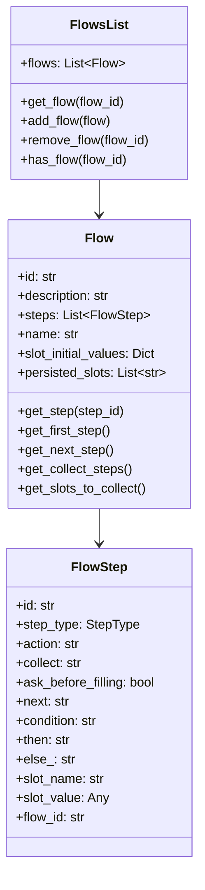
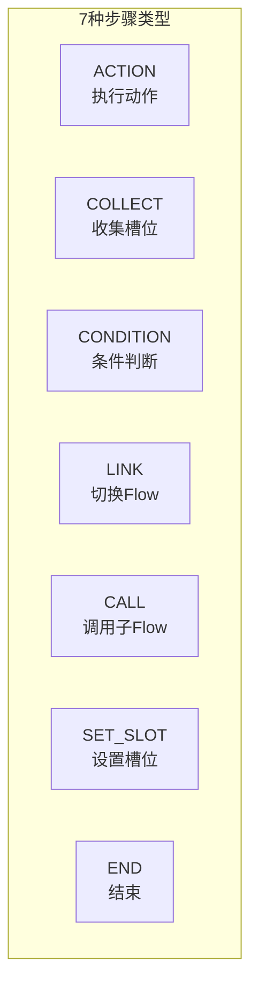
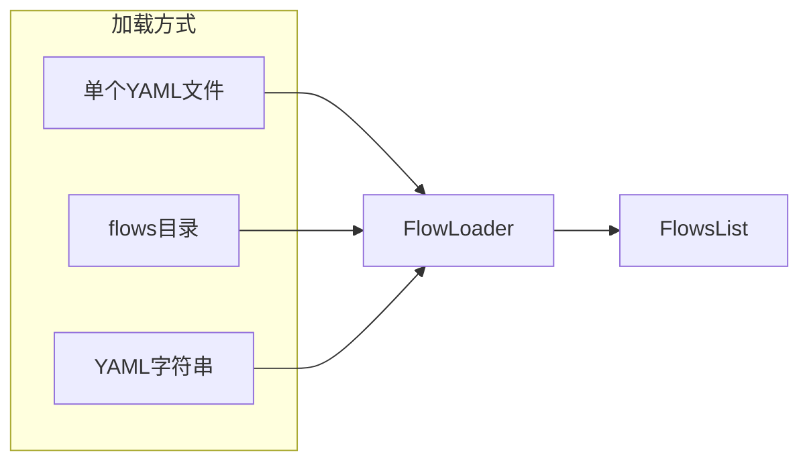
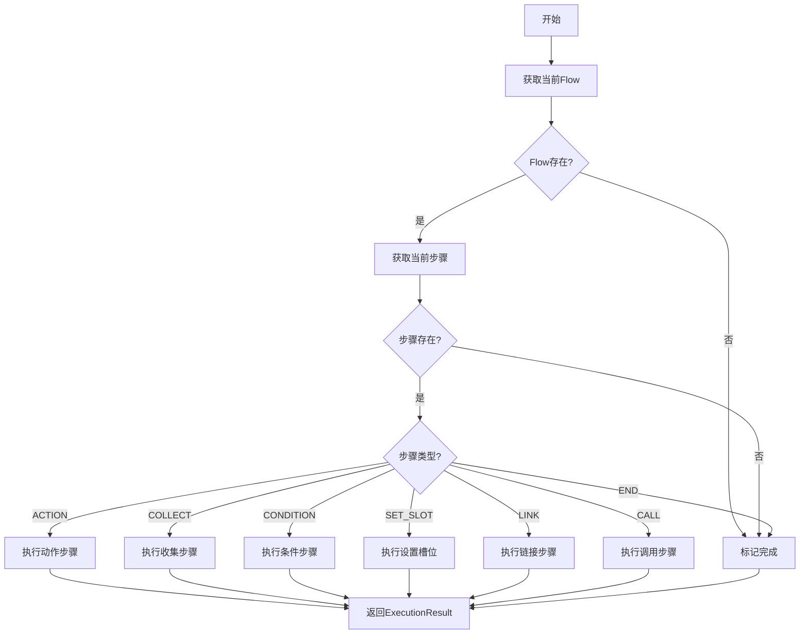
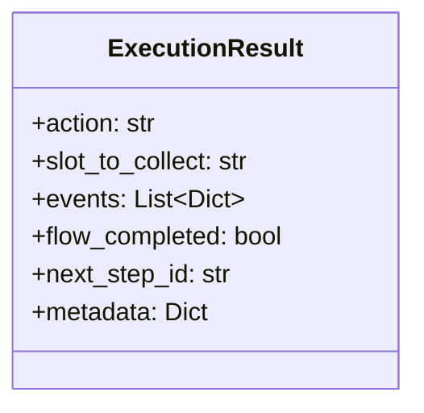
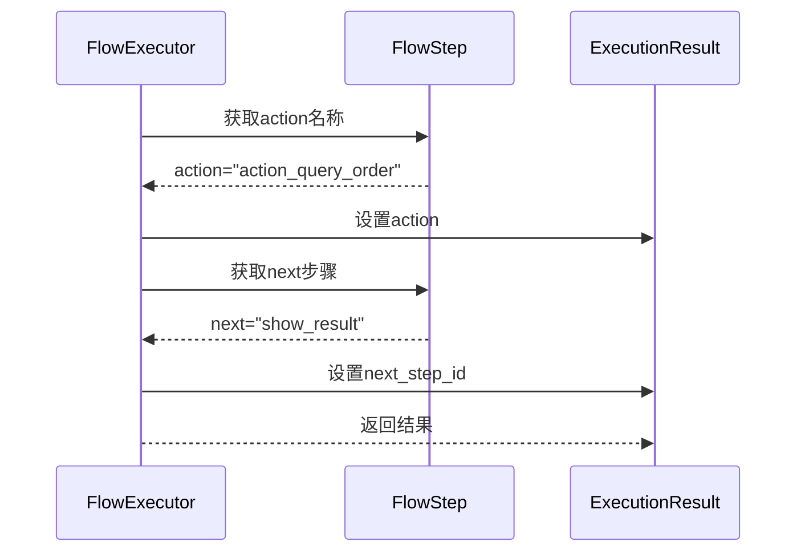
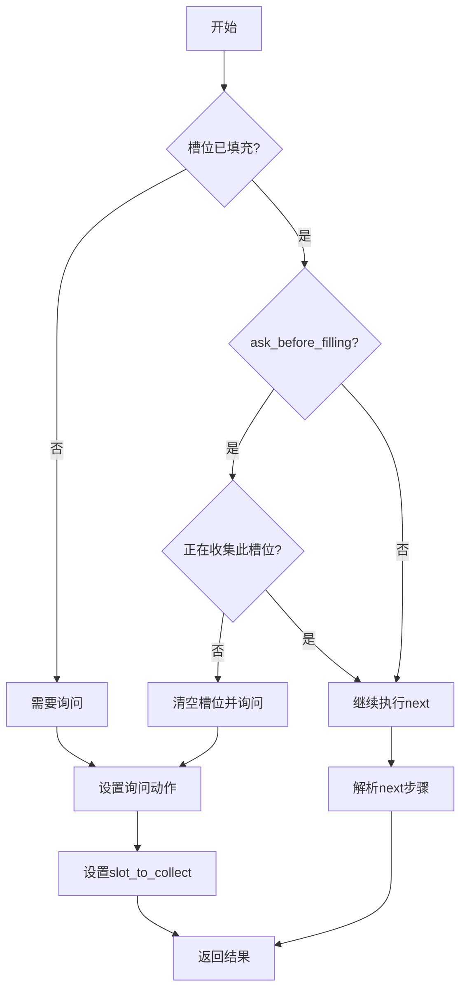
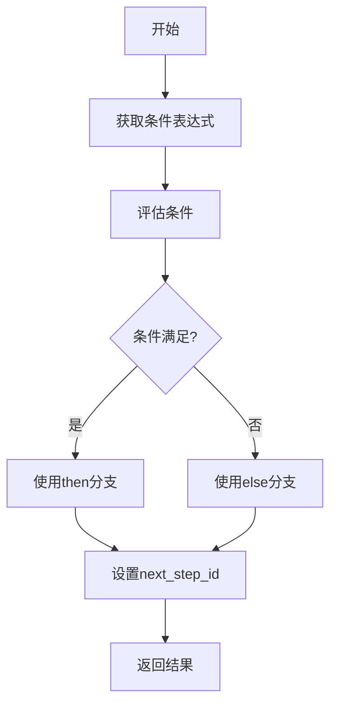

# Flow流程系统

本文档涵盖第6-7章内容，讲解Flow流程定义和执行引擎。

---

# 第6章 Flow流程系统

## 6.1 Flow概念与设计

### 6.1.1 概念解释

**Flow** 是对话系统中的"流程模板"，定义了完成某个任务所需的步骤序列。

> **通俗比喻**：Flow就像"订餐流程"：
> - **Flow** = 整个订餐流程（从选菜到支付）
> - **FlowStep** = 每个具体步骤（选菜 → 填地址 → 选支付方式 → 确认 → 支付）
> - **next** = 下一步指引（选完菜后，系统提示"请填写地址"）
> - **COLLECT** = 收集信息（"请选择菜品"）
> - **ACTION** = 执行操作（"创建订单"）
> - **CONDITION** = 条件分支（余额不足 → 充值；否则 → 支付）

### 6.1.2 设计意图

**为什么需要Flow？**

1. **结构化定义**：用YAML声明式定义对话流程，避免硬编码
2. **可复用性**：一个Flow可以在多个场景复用
3. **可维护性**：修改业务流程只需修改YAML，无需改代码
4. **可视化**：Flow定义直观易懂，方便业务人员理解
5. **嵌套支持**：Flow可以调用其他Flow（CALL），或切换到其他Flow（LINK）

### 6.1.3 Flow数据结构



---

## 6.2 FlowStep步骤类型

Flow中的每个步骤（FlowStep）有7种类型：



### 6.2.1 ACTION 动作步骤

**用途**：执行一个动作（Action），如查询数据库、调用API、发送消息等。

**YAML语法**：
```yaml
- id: query_order
  action: action_query_order
  next: show_result
```

**执行逻辑**：执行指定的action，然后跳转到next步骤。

### 6.2.2 COLLECT 收集步骤

**用途**：收集用户输入，填充槽位。

**YAML语法**：
```yaml
- collect: order_id
  description: 订单号
  ask_before_filling: true   # 是否清空槽位重新询问
  reset_after_flow_ends: true  # Flow结束后是否重置槽位
  next: process_order
```

**执行逻辑**：
1. 检查槽位是否已填充
2. 如果未填充或`ask_before_filling=true`，执行询问动作
3. 默认询问动作：`utter_ask_{slot_name}`，找不到则用`action_ask_{slot_name}`
4. 槽位填充后，跳转到next步骤

**带条件的next**：
```yaml
- collect: order_id
  next:
    - if: slots.order_id != "false"
      then: process_order
    - else: END
```

### 6.2.3 CONDITION 条件步骤

**用途**：根据条件选择不同的执行路径。

**YAML语法**：
```yaml
- id: check_balance
  if: slots.balance >= slots.total_price
  then: create_order
  else: recharge
```

**支持的条件表达式**：
| 表达式 | 说明 | 示例 |
|--------|------|------|
| `slot_name == value` | 相等判断 | `order_status == "paid"` |
| `slot_name != value` | 不等判断 | `order_id != "false"` |
| `slot_name` | 布尔判断 | `if_confirm`（检查槽位是否为真） |

### 6.2.4 LINK 链接步骤

**用途**：切换到另一个Flow（结束当前Flow）。

**YAML语法**：
```yaml
- id: go_to_logistics
  link: query_logistics
```

**执行逻辑**：结束当前Flow，启动目标Flow。

### 6.2.5 CALL 调用步骤

**用途**：调用子Flow，完成后返回当前Flow继续执行。

**YAML语法**：
```yaml
- id: call_address_flow
  call: collect_address
  next: confirm_order
```

**执行逻辑**：
1. 将子Flow压入栈
2. 执行子Flow
3. 子Flow完成后，弹出栈，回到当前Flow的next步骤

### 6.2.6 SET_SLOT 设置槽位步骤

**用途**：程序化设置槽位值。

**YAML语法**：
```yaml
- id: init_status
  set_slot:
    order_status: "processing"
  next: process_order
```

### 6.2.7 END 结束步骤

**用途**：标记Flow结束。

**YAML语法**：
```yaml
- id: end
  action: end
```

或简写为：
```yaml
next: END
```

---

## 6.3 Flow定义语法

### 6.3.1 完整YAML结构

```yaml
version: "3.1"

flows:
  flow_id:
    name: 显示名称（可选）
    description: Flow描述
    slot_initial_values:  # 槽位初始值（可选）
      slot_name: initial_value
    persisted_slots:  # Flow结束后保留的槽位（可选）
      - slot_name
    steps:
      - id: step_1
        action: action_name
        next: step_2
      
      - id: step_2
        collect: slot_name
        ask_before_filling: true
        next:
          - if: condition
            then: step_3
          - else: END
      
      - id: step_3
        if: condition
        then: step_4
        else: step_5
```

### 6.3.2 实战示例：订单查询Flow

```yaml
# 查询订单详情Flow
query_order_detail:
  name: 查询订单详情
  description: 查询订单详情
  steps:
    # 步骤1：设置查询条件
    - set_slots:
        - goto: action_ask_order_id_before_completed_3_days
    
    # 步骤2：收集订单ID
    - collect: order_id  # 用户选择一个订单
      next:
        - if: slots.order_id != "false"  # 用户选择了有效订单
          then:
            - action: action_get_order_detail  # 查询订单详情
              next: END
        - else: END  # 用户取消，结束Flow
```

### 6.3.3 实战示例：修改收货信息Flow

```yaml
modify_order_receive_info:
  name: 修改订单收货信息
  description: 修改订单收货信息
  steps:
    # 步骤1：查询可修改的订单
    - set_slots:
        - goto: action_ask_order_id_before_delivered
    
    # 步骤2：选择订单
    - collect: order_id
      next:
        - if: slots.order_id != "false"
          then: get_order_detail
        - else: END
    
    # 步骤3：显示订单详情
    - id: get_order_detail
      action: action_get_order_detail
    
    # 步骤4：选择收货信息
    - collect: receive_id
      ask_before_filling: true
      next:
        - if: slots.receive_id == "false"
          then: END
        - if: slots.receive_id == "modify"
          then: select_modify_content  # 修改收货信息
        - else: confirm_receive_info  # 使用现有收货信息
    
    # 步骤5：选择修改内容
    - id: select_modify_content
      collect: modify_content
      ask_before_filling: true
      next:
        - if: slots.modify_content == "收货人姓名"
          then:
            - collect: receiver_name
              ask_before_filling: true
              next: if_modify_continue
        - if: slots.modify_content == "收货人电话"
          then:
            - collect: receiver_phone
              ask_before_filling: true
              next: if_modify_continue
        - if: slots.modify_content == "收货地址"
          then:
            - collect: receive_province
              ask_before_filling: true
            - collect: receive_city
              ask_before_filling: true
            - collect: receive_district
              ask_before_filling: true
            - collect: receive_street_address
              ask_before_filling: true
              next: if_modify_continue
        - else: END
    
    # 步骤6：询问是否继续修改
    - id: if_modify_continue
      collect: if_modify_continue
      ask_before_filling: true
      next:
        - if: slots.if_modify_continue
          then:
            - set_slots:
                - receive_id: modified
              next: select_modify_content
        - else: confirm_receive_info
    
    # 步骤7：确认修改
    - id: confirm_receive_info
      collect: set_receive_info
      ask_before_filling: true
      next:
        - if: slots.set_receive_info
          then:
            - action: action_ask_set_receive_info
              next: END
        - else: END
```

---

## 6.4 Flow加载与管理

### 6.4.1 FlowLoader加载器



### 6.4.2 使用示例

```python
from atguigu_ai.dialogue_understanding.flow import load_flows

# 从目录加载
flows = load_flows("data/flows/")

# 从单个文件加载
flows = load_flows("flows.yml")

# 获取Flow
order_flow = flows.get_flow("query_order_detail")
print(f"Flow: {order_flow.name}, Steps: {len(order_flow.steps)}")

# 遍历所有Flow
for flow in flows:
    print(f"- {flow.id}: {flow.description}")
```

---

## 6.5 完整代码

### 6.5.1 flow.py

```python
# -*- coding: utf-8 -*-
"""
Flow定义

定义对话流程的数据结构。
"""

from __future__ import annotations

from dataclasses import dataclass, field
from enum import Enum
from typing import Any, Dict, Iterator, List, Optional, Union


class StepType(str, Enum):
    """步骤类型枚举。"""
    ACTION = "action"       # 执行动作
    COLLECT = "collect"     # 收集槽位
    LINK = "link"          # 切换Flow
    SET_SLOT = "set_slot"  # 设置槽位
    CONDITION = "condition" # 条件判断
    END = "end"            # 结束
    CALL = "call"          # 调用子Flow


@dataclass
class FlowStep:
    """Flow步骤。
    
    表示Flow中的一个执行步骤。
    
    Attributes:
        id: 步骤ID
        step_type: 步骤类型
        action: 要执行的动作
        collect: 要收集的槽位（当step_type为collect时）
        ask_before_filling: 是否在LLM预填充后仍询问用户确认
        reset_after_flow_ends: flow结束时是否重置该槽位
        next: 下一个步骤ID
        condition: 条件表达式（当step_type为condition时）
        then: 条件为真时的下一步
        else_: 条件为假时的下一步
        slot_name: 槽位名（当step_type为set_slot时）
        slot_value: 槽位值
        flow_id: 要调用的Flow ID（当step_type为call或link时）
        description: 步骤描述
    """
    id: str
    step_type: StepType = StepType.ACTION
    action: Optional[str] = None
    collect: Optional[str] = None
    ask_before_filling: bool = False
    reset_after_flow_ends: bool = True
    next: Optional[str] = None
    condition: Optional[str] = None
    then: Optional[str] = None
    else_: Optional[str] = None
    slot_name: Optional[str] = None
    slot_value: Any = None
    flow_id: Optional[str] = None
    description: Optional[str] = None
    metadata: Dict[str, Any] = field(default_factory=dict)
    
    @classmethod
    def from_dict(cls, step_id: str, data: Dict[str, Any]) -> "FlowStep":
        """从字典创建步骤。"""
        # 确定步骤类型
        step_type = StepType.ACTION
        if "collect" in data:
            step_type = StepType.COLLECT
        elif "link" in data:
            step_type = StepType.LINK
        elif "set_slot" in data or "set_slots" in data:
            step_type = StepType.SET_SLOT
        elif "if" in data or "condition" in data:
            step_type = StepType.CONDITION
        elif "call" in data:
            step_type = StepType.CALL
        elif data.get("id") == "end" or data.get("action") == "end":
            step_type = StepType.END
        
        # 提取字段
        action = data.get("action")
        collect = data.get("collect")
        ask_before_filling = data.get("ask_before_filling", False)
        reset_after_flow_ends = data.get("reset_after_flow_ends", True)
        next_step = data.get("next")
        condition = data.get("if") or data.get("condition")
        then = data.get("then")
        else_ = data.get("else")
        
        # set_slot处理
        slot_name = None
        slot_value = None
        if "set_slot" in data:
            set_slot = data["set_slot"]
            if isinstance(set_slot, dict):
                slot_name = list(set_slot.keys())[0] if set_slot else None
                slot_value = set_slot.get(slot_name) if slot_name else None
        
        # link/call处理
        flow_id = data.get("link") or data.get("call")
        
        return cls(
            id=step_id,
            step_type=step_type,
            action=action,
            collect=collect,
            ask_before_filling=ask_before_filling,
            reset_after_flow_ends=reset_after_flow_ends,
            next=next_step,
            condition=condition,
            then=then,
            else_=else_,
            slot_name=slot_name,
            slot_value=slot_value,
            flow_id=flow_id,
            description=data.get("description"),
            metadata=data.get("metadata", {}),
        )
    
    def as_dict(self) -> Dict[str, Any]:
        """转换为字典。"""
        data = {"id": self.id}
        
        if self.action:
            data["action"] = self.action
        if self.collect:
            data["collect"] = self.collect
        if self.ask_before_filling:
            data["ask_before_filling"] = self.ask_before_filling
        if not self.reset_after_flow_ends:
            data["reset_after_flow_ends"] = self.reset_after_flow_ends
        if self.next:
            data["next"] = self.next
        if self.condition:
            data["condition"] = self.condition
        if self.then:
            data["then"] = self.then
        if self.else_:
            data["else"] = self.else_
        if self.slot_name:
            data["set_slot"] = {self.slot_name: self.slot_value}
        if self.flow_id:
            data["link"] = self.flow_id
        if self.description:
            data["description"] = self.description
        
        return data
    
    def is_end(self) -> bool:
        """检查是否是结束步骤。"""
        return self.step_type == StepType.END or self.id == "end"


@dataclass
class Flow:
    """对话流程。
    
    Flow定义了一个完整的对话流程，包含多个步骤。
    """
    id: str
    description: str = ""
    steps: List[FlowStep] = field(default_factory=list)
    name: Optional[str] = None
    slot_initial_values: Dict[str, Any] = field(default_factory=dict)
    persisted_slots: List[str] = field(default_factory=list)
    metadata: Dict[str, Any] = field(default_factory=dict)
    
    def __post_init__(self):
        """初始化后处理。"""
        self._step_index: Dict[str, FlowStep] = {}
        for step in self.steps:
            self._step_index[step.id] = step
    
    @classmethod
    def from_dict(cls, flow_id: str, data: Dict[str, Any]) -> "Flow":
        """从字典创建Flow。"""
        steps = []
        steps_data = data.get("steps", [])
        
        for i, step_data in enumerate(steps_data):
            if isinstance(step_data, dict):
                step_id = step_data.get("id", f"step_{i}")
                step = FlowStep.from_dict(step_id, step_data)
            else:
                step = FlowStep(
                    id=f"step_{i}",
                    step_type=StepType.ACTION,
                    action=str(step_data),
                )
            
            # 自动设置next
            if step.next is None and i < len(steps_data) - 1:
                next_step_data = steps_data[i + 1]
                if isinstance(next_step_data, dict):
                    step.next = next_step_data.get("id", f"step_{i + 1}")
                else:
                    step.next = f"step_{i + 1}"
            
            steps.append(step)
        
        return cls(
            id=flow_id,
            description=data.get("description", ""),
            steps=steps,
            name=data.get("name"),
            slot_initial_values=data.get("slot_initial_values", {}),
            persisted_slots=data.get("persisted_slots", []),
            metadata=data.get("metadata", {}),
        )
    
    def get_step(self, step_id: str) -> Optional[FlowStep]:
        """获取指定ID的步骤。"""
        return self._step_index.get(step_id)
    
    def get_first_step(self) -> Optional[FlowStep]:
        """获取第一个步骤。"""
        return self.steps[0] if self.steps else None
    
    def get_next_step(self, current_step_id: str) -> Optional[FlowStep]:
        """获取下一个步骤。"""
        current_step = self.get_step(current_step_id)
        if current_step and current_step.next:
            return self.get_step(current_step.next)
        return None
    
    def get_collect_steps(self) -> List[FlowStep]:
        """获取所有收集信息的步骤。"""
        return [step for step in self.steps if step.step_type == StepType.COLLECT]
    
    def get_slots_to_collect(self) -> List[str]:
        """获取需要收集的所有槽位名。"""
        return [step.collect for step in self.steps if step.collect]
    
    def __iter__(self) -> Iterator[FlowStep]:
        return iter(self.steps)
    
    def __len__(self) -> int:
        return len(self.steps)


@dataclass
class FlowsList:
    """Flow列表容器。"""
    flows: List[Flow] = field(default_factory=list)
    
    def __post_init__(self):
        self._flow_index: Dict[str, Flow] = {}
        for flow in self.flows:
            self._flow_index[flow.id] = flow
    
    @property
    def flow_ids(self) -> List[str]:
        return list(self._flow_index.keys())
    
    def get_flow(self, flow_id: str) -> Optional[Flow]:
        return self._flow_index.get(flow_id)
    
    def add_flow(self, flow: Flow) -> None:
        self.flows.append(flow)
        self._flow_index[flow.id] = flow
    
    def remove_flow(self, flow_id: str) -> Optional[Flow]:
        flow = self._flow_index.pop(flow_id, None)
        if flow:
            self.flows.remove(flow)
        return flow
    
    def has_flow(self, flow_id: str) -> bool:
        return flow_id in self._flow_index
    
    def __iter__(self) -> Iterator[Flow]:
        return iter(self.flows)
    
    def __len__(self) -> int:
        return len(self.flows)
```

### 6.5.2 flow_loader.py

```python
# -*- coding: utf-8 -*-
"""
Flow加载器

从YAML文件加载Flow定义。
"""

from __future__ import annotations

import logging
from pathlib import Path
from typing import Any, Dict, List, Optional, Union

from atguigu_ai.dialogue_understanding.flow.flow import Flow, FlowsList
from atguigu_ai.shared.yaml_loader import read_yaml_file
from atguigu_ai.shared.exceptions import ConfigurationException

logger = logging.getLogger(__name__)


class FlowLoader:
    """Flow加载器。
    
    从YAML文件加载Flow定义。
    """
    
    def __init__(self):
        pass
    
    def load(self, path: Union[str, Path]) -> FlowsList:
        """加载Flow。"""
        path = Path(path)
        
        if path.is_file():
            return self._load_from_file(path)
        elif path.is_dir():
            return self._load_from_directory(path)
        else:
            raise ConfigurationException(f"Flow path not found: {path}")
    
    def _load_from_file(self, file_path: Path) -> FlowsList:
        """从单个文件加载。"""
        logger.debug(f"Loading flows from file: {file_path}")
        
        data = read_yaml_file(str(file_path))
        if not data:
            return FlowsList()
        
        return self._parse_flows_data(data)
    
    def _load_from_directory(self, dir_path: Path) -> FlowsList:
        """从目录加载。"""
        logger.debug(f"Loading flows from directory: {dir_path}")
        
        yaml_files = list(dir_path.glob("*.yml")) + list(dir_path.glob("*.yaml"))
        
        if not yaml_files:
            return FlowsList()
        
        all_flows = FlowsList()
        
        for yaml_file in yaml_files:
            try:
                flows_list = self._load_from_file(yaml_file)
                for flow in flows_list:
                    all_flows.add_flow(flow)
            except Exception as e:
                logger.error(f"Failed to load flow file {yaml_file}: {e}")
        
        return all_flows
    
    def _parse_flows_data(self, data: Dict[str, Any]) -> FlowsList:
        """解析Flow数据。"""
        flows = []
        
        # 支持两种格式
        flows_data = data.get("flows", data)
        
        if not isinstance(flows_data, dict):
            return FlowsList()
        
        for flow_id, flow_config in flows_data.items():
            if flow_id in ("version", "metadata", "imports"):
                continue
            
            if not isinstance(flow_config, dict):
                continue
            
            try:
                flow = Flow.from_dict(flow_id, flow_config)
                flows.append(flow)
                logger.debug(f"Loaded flow: {flow_id}")
            except Exception as e:
                logger.error(f"Failed to parse flow {flow_id}: {e}")
        
        return FlowsList(flows=flows)


# 便捷函数
def load_flows(path: Union[str, Path]) -> FlowsList:
    """加载Flow。"""
    loader = FlowLoader()
    return loader.load(path)
```

---

# 第7章 Flow执行引擎

## 7.1 FlowExecutor设计原理

### 7.1.1 概念解释

**FlowExecutor（Flow执行器）** 负责根据当前Flow定义和对话状态，执行相应的步骤。

> **通俗比喻**：FlowExecutor就像"工厂流水线的调度员"：
> - 查看当前工序（当前步骤）
> - 根据工序类型安排工人（执行对应逻辑）
> - 决定下一道工序（推进到next步骤）
> - 处理特殊情况（条件分支、子流程调用）

### 7.1.2 设计意图

**FlowExecutor的职责**：
1. 获取当前Flow和步骤
2. 根据步骤类型分发执行
3. 处理条件分支
4. 管理Flow状态转换
5. 返回执行结果（action、slot_to_collect、flow_completed等）

### 7.1.3 执行流程图



### 7.1.4 ExecutionResult结构



| 字段 | 说明 |
|------|------|
| `action` | 要执行的动作名称 |
| `slot_to_collect` | 要收集的槽位名称 |
| `events` | 产生的事件列表 |
| `flow_completed` | Flow是否已完成 |
| `next_step_id` | 下一个步骤ID |
| `metadata` | 额外元数据 |

---

## 7.2 步骤执行流程

### 7.2.1 ACTION步骤执行



**执行逻辑**：
1. 获取步骤的action名称
2. 设置到ExecutionResult.action
3. 获取next步骤ID
4. 检查是否到达结束（next为None或"END"）

### 7.2.2 COLLECT步骤执行



**询问动作降级策略**：
1. 如果显式指定了action，使用指定的action
2. 否则，默认使用`utter_ask_{slot_name}`
3. 找不到则降级为`action_ask_{slot_name}`

### 7.2.3 CONDITION步骤执行



**条件表达式评估**：
```python
def _evaluate_condition(self, condition: str, tracker) -> bool:
    # 移除 "slots." 前缀
    condition = condition.replace("slots.", "")
    
    # 相等判断: slot_name == value
    if "==" in condition:
        parts = condition.split("==")
        slot_name = parts[0].strip()
        expected = parts[1].strip().strip('"\'')
        actual = tracker.get_slot(slot_name)
        return str(actual) == expected
    
    # 不等判断: slot_name != value
    if "!=" in condition:
        parts = condition.split("!=")
        slot_name = parts[0].strip()
        expected = parts[1].strip().strip('"\'')
        actual = tracker.get_slot(slot_name)
        return str(actual) != expected
    
    # 布尔判断: slot_name
    slot_value = tracker.get_slot(condition)
    return bool(slot_value)
```

---

## 7.3 next解析与推进

### 7.3.1 next字段的多种形式

**形式1：简单字符串**
```yaml
next: step_2
```

**形式2：条件列表**
```yaml
next:
  - if: slots.order_id != "false"
    then: process_order
  - else: END
```

**形式3：嵌套动作**
```yaml
next:
  - if: slots.order_id != "false"
    then:
      - action: action_get_order_detail
        next: END
  - else: END
```

### 7.3.2 next解析逻辑

```python
def _resolve_next_step(self, next_value, tracker) -> Optional[str]:
    """解析下一步骤ID。"""
    if next_value is None:
        return None
    
    # 字符串直接返回
    if isinstance(next_value, str):
        return next_value
    
    # 列表：评估条件
    if isinstance(next_value, list):
        for branch in next_value:
            if not isinstance(branch, dict):
                continue
            
            # 处理 if-then 分支
            if "if" in branch:
                condition = branch["if"]
                if self._evaluate_condition(condition, tracker):
                    return branch.get("then")
            
            # 处理 else 分支
            if "else" in branch:
                return branch["else"]
    
    return None
```

### 7.3.3 Flow推进

```python
def advance_flow(self, tracker, next_step_id: str) -> None:
    """推进Flow到下一步。"""
    flow_frame = tracker.dialogue_stack.top_flow_frame()
    if flow_frame:
        flow_frame.step_id = next_step_id
```

---

## 7.4 条件表达式评估

### 7.4.1 支持的条件格式

| 格式 | 示例 | 说明 |
|------|------|------|
| 相等 | `slots.status == "paid"` | 检查槽位值是否等于指定值 |
| 不等 | `slots.order_id != "false"` | 检查槽位值是否不等于指定值 |
| 布尔 | `slots.if_confirm` | 检查槽位值是否为真（truthy） |

### 7.4.2 布尔判断规则

```python
# 字符串 "true"/"false" 会被转换为布尔值
if slot_value.lower() == "true":
    return True
elif slot_value.lower() == "false":
    return False

# 其他值使用Python的bool()
# None、False、空字符串、0、空列表等返回False
return bool(slot_value)
```

---

## 7.5 完整代码

### 7.5.1 flow_executor.py

```python
# -*- coding: utf-8 -*-
"""
Flow执行器

负责执行Flow中的步骤。
"""

from __future__ import annotations

import logging
from dataclasses import dataclass, field
from typing import Any, Dict, List, Optional, TYPE_CHECKING

from atguigu_ai.dialogue_understanding.flow.flow import (
    Flow, FlowStep, FlowsList, StepType
)
from atguigu_ai.dialogue_understanding.stack.stack_frame import FlowStackFrame

if TYPE_CHECKING:
    from atguigu_ai.core.tracker import DialogueStateTracker
    from atguigu_ai.core.domain import Domain

logger = logging.getLogger(__name__)


@dataclass
class ExecutionResult:
    """执行结果。"""
    action: Optional[str] = None
    slot_to_collect: Optional[str] = None
    events: List[Dict[str, Any]] = field(default_factory=list)
    flow_completed: bool = False
    next_step_id: Optional[str] = None
    metadata: Dict[str, Any] = field(default_factory=dict)


class FlowExecutor:
    """Flow执行器。
    
    负责执行Flow中的步骤，管理Flow的状态转换。
    """
    
    def __init__(
        self,
        flows: Optional[FlowsList] = None,
        domain: Optional["Domain"] = None,
    ):
        self.flows = flows or FlowsList()
        self.domain = domain
    
    def execute_next_step(
        self,
        tracker: "DialogueStateTracker",
    ) -> ExecutionResult:
        """执行下一个步骤。"""
        result = ExecutionResult()
        
        # 获取当前Flow
        flow_id = tracker.active_flow
        if not flow_id:
            result.flow_completed = True
            return result
        
        flow = self.flows.get_flow(flow_id)
        if not flow:
            result.flow_completed = True
            return result
        
        # 获取当前步骤
        current_step_id = self._get_current_step_id(tracker, flow)
        current_step = flow.get_step(current_step_id)
        
        if not current_step:
            result.flow_completed = True
            return result
        
        logger.debug(f"Executing step: {current_step_id} in flow {flow_id}")
        
        # 根据步骤类型执行
        if current_step.step_type == StepType.ACTION:
            result = self._execute_action_step(current_step, tracker, flow)
        elif current_step.step_type == StepType.COLLECT:
            result = self._execute_collect_step(current_step, tracker, flow)
        elif current_step.step_type == StepType.SET_SLOT:
            result = self._execute_set_slot_step(current_step, tracker, flow)
        elif current_step.step_type == StepType.CONDITION:
            result = self._execute_condition_step(current_step, tracker, flow)
        elif current_step.step_type == StepType.LINK:
            result = self._execute_link_step(current_step, tracker, flow)
        elif current_step.step_type == StepType.CALL:
            result = self._execute_call_step(current_step, tracker, flow)
        elif current_step.step_type == StepType.END:
            result.flow_completed = True
        
        return result
    
    def _get_current_step_id(
        self,
        tracker: "DialogueStateTracker",
        flow: Flow,
    ) -> str:
        """获取当前步骤ID。"""
        flow_frame = tracker.dialogue_stack.find_flow_frame(flow.id)
        if flow_frame:
            step_id = flow_frame.step_id
            if step_id.lower() == "start":
                first_step = flow.get_first_step()
                return first_step.id if first_step else step_id
            return step_id
        
        first_step = flow.get_first_step()
        return first_step.id if first_step else "START"
    
    def _execute_action_step(
        self,
        step: FlowStep,
        tracker: "DialogueStateTracker",
        flow: Flow,
    ) -> ExecutionResult:
        """执行动作步骤。"""
        result = ExecutionResult()
        result.action = step.action
        result.next_step_id = step.next
        
        if step.next is None or step.next == "end":
            result.flow_completed = True
        
        return result
    
    def _execute_collect_step(
        self,
        step: FlowStep,
        tracker: "DialogueStateTracker",
        flow: Flow,
    ) -> ExecutionResult:
        """执行收集步骤。"""
        result = ExecutionResult()
        
        slot_name = step.collect
        if not slot_name:
            result.next_step_id = self._resolve_next_step(step.next, tracker)
            return result
        
        # 检查槽位是否已填充
        current_value = tracker.get_slot(slot_name)
        
        # 获取flow_frame检查是否正在收集此槽位
        flow_frame = tracker.dialogue_stack.top_flow_frame()
        currently_collecting = flow_frame.slot_to_collect if flow_frame else None
        
        # 判断是否需要询问用户
        need_ask = False
        if current_value is None:
            need_ask = True
        elif step.ask_before_filling and currently_collecting != slot_name:
            # 第一次进入此步骤，清空槽位并询问
            need_ask = True
            tracker.set_slot(slot_name, None)
        
        if need_ask:
            result.slot_to_collect = slot_name
            
            if step.action:
                result.action = step.action
            else:
                result.action = f"utter_ask_{slot_name}"
                result.metadata["fallback_action"] = f"action_ask_{slot_name}"
        else:
            # 槽位已填充，跳到下一步
            resolved_next = self._resolve_next_step(step.next, tracker)
            
            nested_action = self._get_nested_action(step.next, tracker)
            if nested_action:
                result.action = nested_action["action"]
                result.next_step_id = nested_action.get("next")
            else:
                result.next_step_id = resolved_next
        
        # 检查是否流程结束
        next_val = self._resolve_next_step(step.next, tracker)
        if next_val is None or (isinstance(next_val, str) and next_val.upper() == "END"):
            if not result.action:
                result.flow_completed = True
        
        return result
    
    def _execute_set_slot_step(
        self,
        step: FlowStep,
        tracker: "DialogueStateTracker",
        flow: Flow,
    ) -> ExecutionResult:
        """执行设置槽位步骤。"""
        result = ExecutionResult()
        
        if step.slot_name and step.slot_value is not None:
            tracker.set_slot(step.slot_name, step.slot_value)
            result.events.append({
                "event": "slot_set",
                "name": step.slot_name,
                "value": step.slot_value,
            })
        
        result.next_step_id = step.next
        
        if step.next is None or step.next == "end":
            result.flow_completed = True
        
        return result
    
    def _execute_condition_step(
        self,
        step: FlowStep,
        tracker: "DialogueStateTracker",
        flow: Flow,
    ) -> ExecutionResult:
        """执行条件步骤。"""
        result = ExecutionResult()
        
        condition_met = self._evaluate_condition(step.condition, tracker)
        
        if condition_met:
            result.next_step_id = step.then
        else:
            result.next_step_id = step.else_
        
        if result.next_step_id is None or result.next_step_id == "end":
            result.flow_completed = True
        
        return result
    
    def _execute_link_step(
        self,
        step: FlowStep,
        tracker: "DialogueStateTracker",
        flow: Flow,
    ) -> ExecutionResult:
        """执行链接步骤（切换Flow）。"""
        result = ExecutionResult()
        
        if step.flow_id:
            tracker.end_flow()
            tracker.start_flow(step.flow_id)
            result.events.append({
                "event": "flow_switched",
                "from_flow": flow.id,
                "to_flow": step.flow_id,
            })
        
        result.flow_completed = True
        return result
    
    def _execute_call_step(
        self,
        step: FlowStep,
        tracker: "DialogueStateTracker",
        flow: Flow,
    ) -> ExecutionResult:
        """执行调用步骤（调用子Flow）。"""
        result = ExecutionResult()
        
        if step.flow_id:
            tracker.start_flow(step.flow_id)
            result.events.append({
                "event": "subflow_called",
                "parent_flow": flow.id,
                "child_flow": step.flow_id,
            })
            result.metadata["return_step"] = step.next
        
        return result
    
    def _evaluate_condition(
        self,
        condition: Optional[str],
        tracker: "DialogueStateTracker",
    ) -> bool:
        """评估条件表达式。"""
        if not condition:
            return True
        
        condition = condition.strip().replace("slots.", "")
        
        # 相等判断
        if "==" in condition:
            parts = condition.split("==")
            if len(parts) == 2:
                slot_name = parts[0].strip()
                expected = parts[1].strip().strip('"\'')
                actual = tracker.get_slot(slot_name)
                return str(actual) == expected
        
        # 不等判断
        if "!=" in condition:
            parts = condition.split("!=")
            if len(parts) == 2:
                slot_name = parts[0].strip()
                expected = parts[1].strip().strip('"\'')
                actual = tracker.get_slot(slot_name)
                return str(actual) != expected
        
        # 布尔判断
        slot_value = tracker.get_slot(condition)
        if isinstance(slot_value, str):
            if slot_value.lower() == "true":
                return True
            elif slot_value.lower() == "false":
                return False
        return bool(slot_value)
    
    def _resolve_next_step(
        self,
        next_value: Any,
        tracker: "DialogueStateTracker",
    ) -> Optional[str]:
        """解析下一步骤ID。"""
        if next_value is None:
            return None
        
        if isinstance(next_value, str):
            return next_value
        
        if isinstance(next_value, list):
            for branch in next_value:
                if not isinstance(branch, dict):
                    continue
                
                if "if" in branch:
                    condition = branch["if"]
                    if self._evaluate_condition(condition, tracker):
                        then_value = branch.get("then")
                        if isinstance(then_value, str):
                            return then_value
                        return then_value
                
                if "else" in branch:
                    return branch["else"]
        
        return None
    
    def _get_nested_action(
        self,
        next_value: Any,
        tracker: "DialogueStateTracker",
    ) -> Optional[Dict[str, Any]]:
        """获取嵌套步骤中的动作。"""
        if not isinstance(next_value, list):
            return None
        
        for branch in next_value:
            if not isinstance(branch, dict):
                continue
            
            if "if" in branch:
                condition = branch["if"]
                if self._evaluate_condition(condition, tracker):
                    then_value = branch.get("then")
                    if isinstance(then_value, list) and then_value:
                        first_step = then_value[0]
                        if isinstance(first_step, dict) and "action" in first_step:
                            return {
                                "action": first_step["action"],
                                "next": first_step.get("next"),
                            }
                    return None
        
        return None
    
    def advance_flow(
        self,
        tracker: "DialogueStateTracker",
        next_step_id: str,
    ) -> None:
        """推进Flow到下一步。"""
        flow_frame = tracker.dialogue_stack.top_flow_frame()
        if flow_frame:
            flow_frame.step_id = next_step_id
    
    def set_flows(self, flows: FlowsList) -> None:
        """设置Flow列表。"""
        self.flows = flows
```

---

## 本章小结

本章介绍了：

1. **Flow概念**：声明式定义对话流程的模板
2. **7种步骤类型**：ACTION、COLLECT、CONDITION、LINK、CALL、SET_SLOT、END
3. **Flow定义语法**：YAML格式，支持条件分支、嵌套动作
4. **FlowLoader**：从文件/目录加载Flow
5. **FlowExecutor**：执行Flow步骤，管理状态转换
6. **条件表达式**：支持相等、不等、布尔判断

**核心要点**：
- Flow是对话流程的"蓝图"
- FlowStep是Flow中的"工序"
- FlowExecutor是"调度员"，决定执行哪个工序
- next字段支持简单字符串、条件列表、嵌套动作

**下一章预告**：第8-9章将讲解Policy策略系统和Action动作系统。
