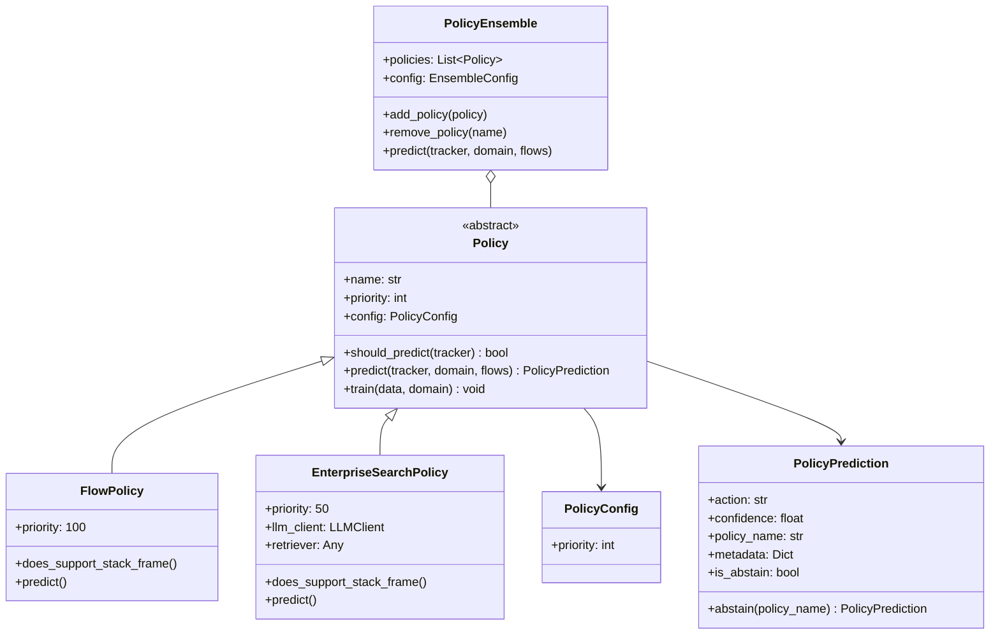
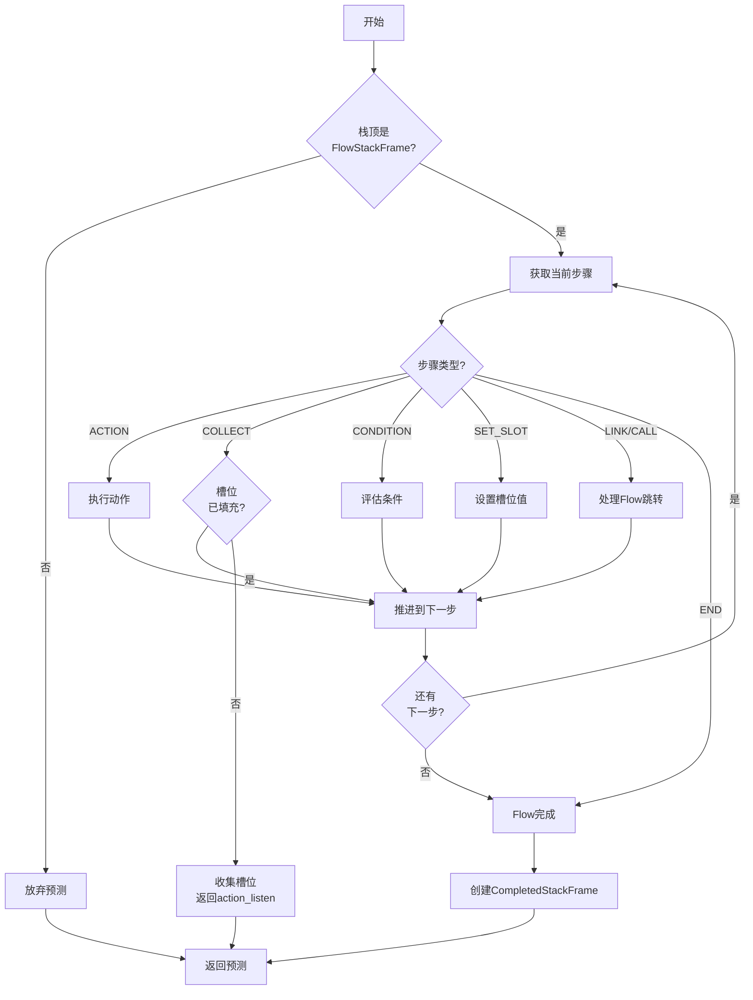
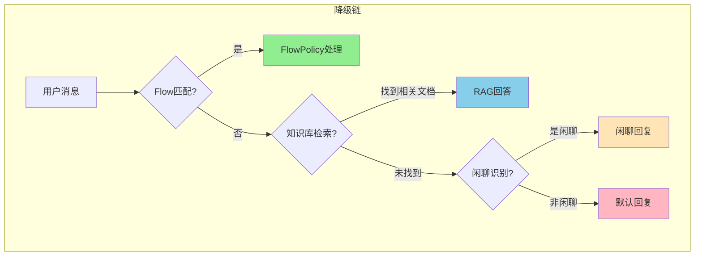
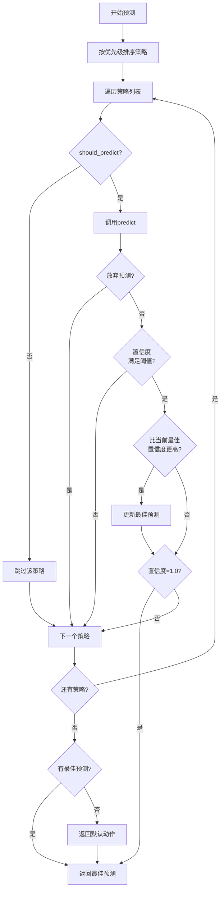
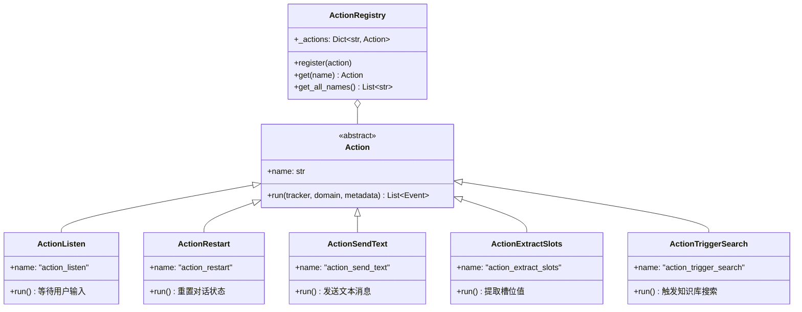
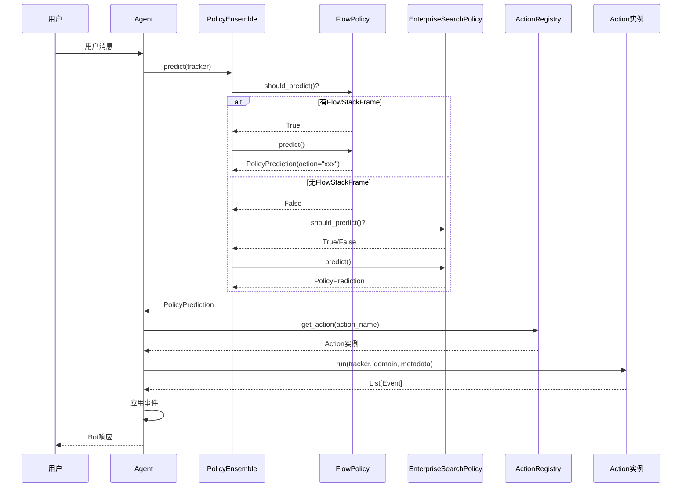

# 策略与动作系统

本文档涵盖第8-9章内容，讲解Policy策略系统和Action动作系统。

---

# 第8章 策略系统

## 8.1 Policy概念与设计

### 8.1.1 概念解释

**Policy（策略）** 是对话系统的"决策大脑"，负责根据当前对话状态决定下一步要执行的动作。

> **通俗比喻**：Policy就像"交通指挥员"：
> - **Policy** = 指挥员（根据路况决定车辆走向）
> - **PolicyPrediction** = 指挥手势（左转、右转、直行、停下）
> - **FlowPolicy** = VIP通道指挥员（优先处理有明确目标的车辆）
> - **EnterpriseSearchPolicy** = 问询台（处理不知道去哪的乘客）
> - **PolicyEnsemble** = 总调度中心（协调多个指挥员）

### 8.1.2 设计意图

**为什么需要多策略架构？**

1. **关注点分离**：每个Policy专注于特定类型的对话场景
2. **优先级控制**：通过priority确保重要策略先执行
3. **可扩展性**：新增策略不影响现有策略
4. **降级机制**：当高优先级策略无法处理时，自动降级到低优先级策略

### 8.1.3 策略体系结构



### 8.1.4 策略优先级

| 策略 | 优先级 | 职责 |
|------|--------|------|
| FlowPolicy | 100 | 执行Flow流程步骤 |
| EnterpriseSearchPolicy | 50 | RAG检索、闲聊、降级处理 |

---

## 8.2 base_policy.py 完整代码

```python
# -*- coding: utf-8 -*-
"""
策略基类

定义策略的抽象接口和通用功能。
"""

from __future__ import annotations

import logging
from abc import ABC, abstractmethod
from dataclasses import dataclass, field
from typing import Any, Dict, List, Optional, TYPE_CHECKING

if TYPE_CHECKING:
    from atguigu_ai.core.tracker import DialogueStateTracker
    from atguigu_ai.core.domain import Domain
    from atguigu_ai.dialogue_understanding.flow import FlowsList

logger = logging.getLogger(__name__)


@dataclass
class PolicyConfig:
    """策略配置基类。
    
    Attributes:
        priority: 策略优先级，数值越大优先级越高
    """
    priority: int = 0


@dataclass
class PolicyPrediction:
    """策略预测结果。
    
    封装策略预测的动作、置信度和元数据。
    
    Attributes:
        action: 预测的动作名称
        confidence: 预测置信度 (0.0-1.0)
        policy_name: 产生此预测的策略名称
        metadata: 额外的元数据
    """
    action: str
    confidence: float
    policy_name: str
    metadata: Dict[str, Any] = field(default_factory=dict)
    
    @property
    def is_abstain(self) -> bool:
        """是否放弃预测。"""
        return self.action == "" or self.confidence <= 0.0
    
    @classmethod
    def abstain(cls, policy_name: str) -> "PolicyPrediction":
        """创建一个放弃预测的结果。
        
        Args:
            policy_name: 策略名称
            
        Returns:
            表示放弃的PolicyPrediction
        """
        return cls(
            action="",
            confidence=0.0,
            policy_name=policy_name,
            metadata={"abstain": True},
        )


class Policy(ABC):
    """策略抽象基类。
    
    所有策略都必须继承此类并实现predict方法。
    
    Attributes:
        name: 策略名称
        priority: 策略优先级
        config: 策略配置
    """
    
    DEFAULT_PRIORITY = 0
    
    def __init__(
        self,
        config: Optional[PolicyConfig] = None,
        **kwargs: Any,
    ):
        """初始化策略。
        
        Args:
            config: 策略配置
            **kwargs: 额外参数
        """
        self.config = config or PolicyConfig()
        self._priority = self.config.priority or self.DEFAULT_PRIORITY
    
    @property
    def name(self) -> str:
        """策略名称。"""
        return self.__class__.__name__
    
    @property
    def priority(self) -> int:
        """策略优先级。"""
        return self._priority
    
    def should_predict(self, tracker: "DialogueStateTracker") -> bool:
        """判断策略是否应该进行预测。
        
        子类可以重写此方法来实现特定的过滤逻辑。
        默认行为是检查策略是否支持当前栈帧。
        
        Args:
            tracker: 对话状态追踪器
            
        Returns:
            是否应该预测
        """
        top_frame = tracker.dialogue_stack.top()
        return self.does_support_stack_frame(top_frame)
    
    def does_support_stack_frame(self, frame: Optional[Any] = None) -> bool:
        """检查策略是否支持处理指定栈帧。
        
        子类应该重写此方法来声明自己支持的栈帧类型。
        
        Args:
            frame: 要检查的栈帧
            
        Returns:
            是否支持处理该栈帧
        """
        # 默认支持所有栈帧
        return True
    
    @abstractmethod
    async def predict(
        self,
        tracker: "DialogueStateTracker",
        domain: Optional["Domain"] = None,
        flows: Optional["FlowsList"] = None,
        **kwargs: Any,
    ) -> PolicyPrediction:
        """预测下一步动作。
        
        这是策略的核心方法，必须由子类实现。
        
        Args:
            tracker: 对话状态追踪器
            domain: Domain定义
            flows: Flow列表
            **kwargs: 额外参数
            
        Returns:
            预测结果
        """
        pass
    
    def train(
        self,
        training_data: Any,
        domain: Optional["Domain"] = None,
        **kwargs: Any,
    ) -> None:
        """训练策略。
        
        可选的训练方法，用于需要训练的策略。
        
        Args:
            training_data: 训练数据
            domain: Domain定义
            **kwargs: 额外参数
        """
        pass


# 导出
__all__ = [
    "Policy",
    "PolicyConfig", 
    "PolicyPrediction",
]
```

---

## 8.3 FlowPolicy实现

### 8.3.1 设计意图

**FlowPolicy** 是系统中最高优先级的策略（priority=100），负责执行Flow流程。

**核心职责**：

1. **检查活动Flow**：只在有FlowStackFrame时工作
2. **逐步执行**：从当前步骤开始，逐步推进Flow
3. **槽位收集**：处理COLLECT步骤，记录需要填充的槽位
4. **Flow完成**：当到达END或无下一步时，创建CompletedStackFrame

### 8.3.2 FlowPolicy工作流程



### 8.3.3 flow_policy.py 完整代码

```python
# -*- coding: utf-8 -*-
"""
Flow策略

执行Flow流程步骤的策略。
"""

from __future__ import annotations

import logging
from dataclasses import dataclass
from typing import Any, Dict, List, Optional, TYPE_CHECKING

from atguigu_ai.policies.base_policy import Policy, PolicyConfig, PolicyPrediction
from atguigu_ai.shared.constants import ACTION_LISTEN

if TYPE_CHECKING:
    from atguigu_ai.core.tracker import DialogueStateTracker
    from atguigu_ai.core.domain import Domain
    from atguigu_ai.dialogue_understanding.flow import FlowsList, Flow, FlowStep

logger = logging.getLogger(__name__)


@dataclass
class FlowPolicyConfig(PolicyConfig):
    """Flow策略配置。
    
    Attributes:
        priority: 策略优先级
        max_steps_per_turn: 每轮最大执行步数（防止死循环）
    """
    priority: int = 100  # 高优先级
    max_steps_per_turn: int = 20


class FlowPolicy(Policy):
    """Flow策略。
    
    执行Flow流程步骤，是系统中优先级最高的策略。
    
    工作流程：
    1. 检查栈顶是否为FlowStackFrame
    2. 获取当前Flow和步骤
    3. 逐步执行直到需要用户输入或Flow结束
    """
    
    DEFAULT_PRIORITY = 100
    
    def __init__(
        self,
        config: Optional[FlowPolicyConfig] = None,
        **kwargs: Any,
    ):
        """初始化Flow策略。"""
        super().__init__(config or FlowPolicyConfig(), **kwargs)
        self.config: FlowPolicyConfig = self.config
    
    def does_support_stack_frame(self, frame: Optional[Any] = None) -> bool:
        """检查是否支持指定栈帧。
        
        FlowPolicy只处理FlowStackFrame。
        """
        from atguigu_ai.dialogue_understanding.stack.stack_frame import FlowStackFrame
        return isinstance(frame, FlowStackFrame)
    
    async def predict(
        self,
        tracker: "DialogueStateTracker",
        domain: Optional["Domain"] = None,
        flows: Optional["FlowsList"] = None,
        **kwargs: Any,
    ) -> PolicyPrediction:
        """预测下一步动作。
        
        执行Flow步骤直到需要用户输入或Flow结束。
        """
        from atguigu_ai.dialogue_understanding.stack.stack_frame import (
            FlowStackFrame,
            CompletedStackFrame,
        )
        from atguigu_ai.dialogue_understanding.flow import StepType
        
        # 获取栈顶帧
        top_frame = tracker.dialogue_stack.top()
        if not isinstance(top_frame, FlowStackFrame):
            return PolicyPrediction.abstain(self.name)
        
        # 检查是否刚执行了非listen动作
        if (tracker.latest_action_name 
            and tracker.latest_action_name != ACTION_LISTEN
            and not getattr(top_frame, 'completing', False)):
            logger.debug(f"Action {tracker.latest_action_name} just executed, abstaining")
            return PolicyPrediction.abstain(self.name)
        
        # 获取Flow定义
        if not flows:
            logger.warning("No flows provided")
            return PolicyPrediction.abstain(self.name)
        
        flow = flows.get_flow(top_frame.flow_id)
        if not flow:
            logger.error(f"Flow not found: {top_frame.flow_id}")
            return PolicyPrediction.abstain(self.name)
        
        # 执行Flow步骤
        steps_executed = 0
        max_steps = self.config.max_steps_per_turn
        
        while steps_executed < max_steps:
            steps_executed += 1
            
            # 获取当前步骤
            current_step = flow.get_step(top_frame.step_id)
            if not current_step:
                # 没有当前步骤，Flow完成
                return self._complete_flow(tracker, flow, top_frame)
            
            logger.debug(
                f"Processing step {current_step.id} "
                f"(type={current_step.step_type})"
            )
            
            # 根据步骤类型处理
            result = await self._process_step(
                tracker, flow, current_step, top_frame, domain
            )
            
            if result is not None:
                # 需要返回预测（如ACTION或COLLECT）
                return result
            
            # 获取下一步
            next_step_id = self._get_next_step_id(
                flow, current_step, tracker
            )
            
            if not next_step_id:
                # 没有下一步，Flow完成
                return self._complete_flow(tracker, flow, top_frame)
            
            # 更新栈帧的当前步骤
            top_frame.step_id = next_step_id
        
        # 超过最大步数，可能有死循环
        logger.warning(f"Max steps ({max_steps}) exceeded in flow {flow.id}")
        return PolicyPrediction.abstain(self.name)
    
    async def _process_step(
        self,
        tracker: "DialogueStateTracker",
        flow: "Flow",
        step: "FlowStep",
        frame: Any,
        domain: Optional["Domain"],
    ) -> Optional[PolicyPrediction]:
        """处理单个步骤。
        
        返回None表示继续执行下一步，
        返回PolicyPrediction表示需要返回预测。
        """
        from atguigu_ai.dialogue_understanding.flow import StepType
        
        step_type = step.step_type
        
        if step_type == StepType.ACTION:
            # 执行动作
            action_name = step.action
            if action_name:
                logger.info(f"[FlowPolicy] Execute action: {action_name}")
                return PolicyPrediction(
                    action=action_name,
                    confidence=1.0,
                    policy_name=self.name,
                    metadata={
                        "flow_id": flow.id,
                        "step_id": step.id,
                    },
                )
        
        elif step_type == StepType.COLLECT:
            # 收集槽位
            slot_name = step.collect
            if slot_name:
                slot_value = tracker.get_slot(slot_name)
                
                # 槽位未填充，需要收集
                if slot_value is None:
                    logger.info(f"[FlowPolicy] Collecting slot: {slot_name}")
                    
                    # 设置槽位收集元数据
                    frame.slot_to_collect = slot_name
                    
                    # 检查是否需要先发送询问消息
                    if step.ask_before_filling:
                        # 发送询问utterance
                        utter_name = f"utter_ask_{slot_name}"
                        return PolicyPrediction(
                            action=utter_name,
                            confidence=1.0,
                            policy_name=self.name,
                            metadata={
                                "flow_id": flow.id,
                                "step_id": step.id,
                                "slot_to_collect": slot_name,
                            },
                        )
                    
                    # 等待用户输入
                    return PolicyPrediction(
                        action=ACTION_LISTEN,
                        confidence=1.0,
                        policy_name=self.name,
                        metadata={
                            "flow_id": flow.id,
                            "step_id": step.id,
                            "slot_to_collect": slot_name,
                        },
                    )
                else:
                    # 槽位已填充，继续下一步
                    logger.debug(f"Slot {slot_name} already filled: {slot_value}")
                    frame.slot_to_collect = None
        
        elif step_type == StepType.CONDITION:
            # 条件判断，在_get_next_step_id中处理
            pass
        
        elif step_type == StepType.SET_SLOT:
            # 设置槽位值
            slot_name = step.slot_name
            slot_value = step.slot_value
            if slot_name:
                logger.info(f"[FlowPolicy] Set slot {slot_name} = {slot_value}")
                tracker.set_slot(slot_name, slot_value)
        
        elif step_type == StepType.LINK:
            # 切换到另一个Flow
            target_flow_id = step.flow_id
            if target_flow_id:
                logger.info(f"[FlowPolicy] Link to flow: {target_flow_id}")
                # 弹出当前Flow，压入新Flow
                tracker.dialogue_stack.pop()
                from atguigu_ai.dialogue_understanding.stack.stack_frame import FlowStackFrame
                new_frame = FlowStackFrame(
                    flow_id=target_flow_id,
                    step_id="START",
                )
                tracker.dialogue_stack.push(new_frame)
                return PolicyPrediction.abstain(self.name)
        
        elif step_type == StepType.CALL:
            # 调用子Flow
            target_flow_id = step.flow_id
            if target_flow_id:
                logger.info(f"[FlowPolicy] Call flow: {target_flow_id}")
                # 压入子Flow（不弹出当前Flow）
                from atguigu_ai.dialogue_understanding.stack.stack_frame import FlowStackFrame
                new_frame = FlowStackFrame(
                    flow_id=target_flow_id,
                    step_id="START",
                )
                tracker.dialogue_stack.push(new_frame)
                return PolicyPrediction.abstain(self.name)
        
        elif step_type == StepType.END:
            # 显式结束
            return self._complete_flow(tracker, flow, frame)
        
        return None
    
    def _get_next_step_id(
        self,
        flow: "Flow",
        current_step: "FlowStep",
        tracker: "DialogueStateTracker",
    ) -> Optional[str]:
        """获取下一步ID。
        
        处理简单next和条件分支。
        """
        from atguigu_ai.dialogue_understanding.flow import StepType
        
        # 条件步骤
        if current_step.step_type == StepType.CONDITION:
            condition = current_step.condition
            if condition:
                # 评估条件表达式
                result = self._evaluate_condition(condition, tracker)
                if result:
                    return current_step.then
                else:
                    return current_step.else_
        
        # 普通next字段
        next_value = current_step.next
        
        if not next_value:
            return None
        
        # 简单字符串
        if isinstance(next_value, str):
            return next_value
        
        # 条件列表
        if isinstance(next_value, list):
            for branch in next_value:
                if isinstance(branch, dict):
                    condition = branch.get("if")
                    if condition:
                        if self._evaluate_condition(condition, tracker):
                            return branch.get("then")
                    else:
                        # 无条件的默认分支
                        return branch.get("then")
        
        return None
    
    def _evaluate_condition(
        self,
        condition: str,
        tracker: "DialogueStateTracker",
    ) -> bool:
        """评估条件表达式。
        
        支持简单的槽位比较：
        - slot_name == value
        - slot_name != value
        - slot_name (检查是否有值)
        - not slot_name (检查是否无值)
        """
        condition = condition.strip()
        
        # 处理 not 前缀
        if condition.startswith("not "):
            inner = condition[4:].strip()
            return not self._evaluate_condition(inner, tracker)
        
        # 相等比较
        if "==" in condition:
            parts = condition.split("==", 1)
            slot_name = parts[0].strip()
            expected = parts[1].strip().strip('"').strip("'")
            actual = tracker.get_slot(slot_name)
            return str(actual) == expected
        
        # 不等比较
        if "!=" in condition:
            parts = condition.split("!=", 1)
            slot_name = parts[0].strip()
            expected = parts[1].strip().strip('"').strip("'")
            actual = tracker.get_slot(slot_name)
            return str(actual) != expected
        
        # 简单存在性检查
        slot_value = tracker.get_slot(condition)
        return slot_value is not None and slot_value != ""
    
    def _complete_flow(
        self,
        tracker: "DialogueStateTracker",
        flow: "Flow",
        frame: Any,
    ) -> PolicyPrediction:
        """完成Flow处理。
        
        弹出当前Flow栈帧，压入CompletedStackFrame。
        """
        from atguigu_ai.dialogue_understanding.stack.stack_frame import CompletedStackFrame
        
        logger.info(f"[FlowPolicy] Flow completed: {flow.id}")
        
        # 重置作用域槽位
        self._reset_scoped_slots(tracker, flow)
        
        # 记录 Pattern 执行历史
        tracker.record_pattern("flow")
        
        # 弹出Flow栈帧
        tracker.dialogue_stack.pop()
        
        # 压入完成栈帧
        completed_frame = CompletedStackFrame(
            previous_flow_name=flow.id,
        )
        tracker.dialogue_stack.push(completed_frame)
        
        # 返回放弃，让其他策略处理完成后的响应
        return PolicyPrediction.abstain(self.name)
    
    def _reset_scoped_slots(
        self,
        tracker: "DialogueStateTracker",
        flow: "Flow",
    ) -> None:
        """重置Flow作用域槽位。
        
        Flow结束时，重置非持久化的槽位。
        """
        persisted = set(flow.persisted_slots or [])
        collected_slots = flow.get_slots_to_collect()
        
        for slot_name in collected_slots:
            if slot_name not in persisted:
                logger.debug(f"Resetting scoped slot: {slot_name}")
                tracker.set_slot(slot_name, None)


# 导出
__all__ = [
    "FlowPolicy",
    "FlowPolicyConfig",
]
```

---

## 8.4 EnterpriseSearchPolicy实现

### 8.4.1 设计意图

**EnterpriseSearchPolicy** 是中等优先级的策略（priority=50），负责处理Flow之外的场景。

**核心职责**：

1. **知识库检索**：处理SearchStackFrame，执行RAG回答
2. **闲聊处理**：处理ChitChatStackFrame，生成闲聊回复
3. **降级机制**：当无法处理时，返回默认回复
4. **Flow完成响应**：处理CompletedStackFrame，询问是否还需要帮助
5. **人工转接**：处理HumanHandoffStackFrame，执行转接逻辑

### 8.4.2 降级链设计



### 8.4.3 EnterpriseSearchPolicy支持的栈帧类型

| 栈帧类型 | 处理方式 |
|----------|----------|
| SearchStackFrame | 执行知识库检索，生成RAG回答 |
| ChitChatStackFrame | 调用LLM生成闲聊回复 |
| CannotHandleStackFrame | 返回默认降级响应 |
| CompletedStackFrame | 询问是否还有其他需求 |
| HumanHandoffStackFrame | 执行人工客服转接 |

### 8.4.4 enterprise_search_policy.py 完整代码

```python
# -*- coding: utf-8 -*-
"""
企业搜索策略

基于知识库检索的策略，实现RAG功能和降级机制。
"""

from __future__ import annotations

import logging
from dataclasses import dataclass, field
from typing import Any, Dict, List, Optional, TYPE_CHECKING

from atguigu_ai.policies.base_policy import Policy, PolicyConfig, PolicyPrediction
from atguigu_ai.shared.constants import DegradationReason, ACTION_DEFAULT_FALLBACK
from atguigu_ai.shared.llm import create_llm_client
from atguigu_ai.shared.llm.base_client import LLMClient
from atguigu_ai.retrieval.base_retriever import SearchResult

if TYPE_CHECKING:
    from atguigu_ai.core.tracker import DialogueStateTracker
    from atguigu_ai.core.domain import Domain
    from atguigu_ai.dialogue_understanding.flow import FlowsList
    from atguigu_ai.dialogue_understanding.stack.stack_frame import StackFrame

logger = logging.getLogger(__name__)


@dataclass
class _InternalRetrievalConfig:
    """内部检索配置（简化版）。"""
    enabled: bool = True
    top_k: int = 3
    similarity_threshold: float = 0.5


@dataclass
class EnterpriseSearchPolicyConfig(PolicyConfig):
    """企业搜索策略配置。
    
    Attributes:
        priority: 策略优先级
        retrieval: 检索配置
        llm_type: LLM类型 (openai/qwen/azure/anthropic)
        llm_model: LLM模型名
        enable_citation: 是否启用引用
        enable_relevancy_check: 是否启用相关性检查
        chitchat_enabled: 是否启用闲聊降级
    """
    priority: int = 50  # 中等优先级
    retrieval: _InternalRetrievalConfig = field(default_factory=_InternalRetrievalConfig)
    llm_type: str = "openai"
    llm_model: str = "gpt-4o-mini"
    llm_temperature: float = 0.0
    enable_citation: bool = False
    enable_relevancy_check: bool = True
    chitchat_enabled: bool = True


class EnterpriseSearchPolicy(Policy):
    """企业搜索策略。
    
    基于知识库检索实现RAG功能，并包含内置的降级机制。
    
    降级链：
    1. Flow匹配 → 执行Flow
    2. 知识库检索 → 生成RAG回答
    3. 闲聊识别 → 生成闲聊回复
    4. 无法处理 → 返回默认回复
    
    工作流程：
    1. 检索相关文档
    2. 检查相关性
    3. 使用LLM生成回答
    4. 如果无相关答案，降级到闲聊或默认回复
    """
    
    DEFAULT_PRIORITY = 50
    
    # RAG提示词模板
    RAG_PROMPT_TEMPLATE = """你是一个专业的客服助手，正在根据知识库文档回答用户问题。

### 8.4.5 参考文档
{context}

### 8.4.6 用户问题
{question}

### 8.4.7 回答要求
严格基于上述文档内容回答：
1. 直接回答问题，不要添加问候语或寒暄
2. 禁止使用 emoji 表情符号
3. 使用专业、简洁的语气
4. 只陈述文档中明确提到的信息
5. 如果文档包含具体的产品名称、品牌、规格等，必须准确引用
6. 最多2-3句话，避免冗余
7. 如果文档信息不足以回答问题，仅回复"[NO_RAG_ANSWER]"

回答：
"""
    
    # 闲聊提示词模板
    CHITCHAT_PROMPT_TEMPLATE = """你是一个友好的AI助手。用户发送了一条闲聊消息，请用自然、友好的方式回复。

用户: {message}

请回复（保持简短友好）：
"""
    
    def __init__(
        self,
        config: Optional[EnterpriseSearchPolicyConfig] = None,
        llm_client: Optional[LLMClient] = None,
        retriever: Optional[Any] = None,
        **kwargs: Any,
    ):
        """初始化企业搜索策略。
        
        Args:
            config: 策略配置
            llm_client: LLM客户端
            retriever: 检索器
            **kwargs: 额外参数
        """
        super().__init__(config or EnterpriseSearchPolicyConfig(), **kwargs)
        self.config: EnterpriseSearchPolicyConfig = self.config
        
        self._llm_client = llm_client
        self._retriever = retriever
    
    @property
    def llm_client(self) -> LLMClient:
        """获取LLM客户端（延迟初始化）。"""
        if self._llm_client is None:
            self._llm_client = create_llm_client(
                type=self.config.llm_type,
                model=self.config.llm_model,
                temperature=self.config.llm_temperature,
            )
        return self._llm_client
    
    def does_support_stack_frame(self, frame: Optional[Any] = None) -> bool:
        """检查策略是否支持处理指定栈帧。
        
        支持：SearchStackFrame、ChitChatStackFrame、CannotHandleStackFrame、
              CompletedStackFrame、HumanHandoffStackFrame
        """
        from atguigu_ai.dialogue_understanding.stack.stack_frame import (
            SearchStackFrame,
            ChitChatStackFrame,
            CannotHandleStackFrame,
            CompletedStackFrame,
            HumanHandoffStackFrame,
        )
        return isinstance(frame, (
            SearchStackFrame, 
            ChitChatStackFrame, 
            CannotHandleStackFrame,
            CompletedStackFrame,
            HumanHandoffStackFrame,
        ))
    
    async def predict(
        self,
        tracker: "DialogueStateTracker",
        domain: Optional["Domain"] = None,
        flows: Optional["FlowsList"] = None,
        **kwargs: Any,
    ) -> PolicyPrediction:
        """预测下一步动作。
        
        检测栈帧类型并分发处理：
        - SearchStackFrame → 执行检索
        - ChitChatStackFrame → 生成闲聊回复
        - CannotHandleStackFrame → 返回降级响应
        - CompletedStackFrame → 询问是否还有其他需求
        - HumanHandoffStackFrame → 执行人工转接
        """
        from atguigu_ai.dialogue_understanding.stack.stack_frame import (
            SearchStackFrame,
            ChitChatStackFrame,
            CannotHandleStackFrame,
            CompletedStackFrame,
            HumanHandoffStackFrame,
        )
        
        # 获取栈顶帧
        top_frame = tracker.dialogue_stack.top()
        
        # 检查是否已经有 bot 响应
        from atguigu_ai.dialogue_understanding.stack.stack_frame import (
            CompletedStackFrame as CompletedFrame,
            HumanHandoffStackFrame as HandoffFrame,
        )
        needs_immediate_handling = isinstance(top_frame, (CompletedFrame, HandoffFrame))
        
        if (tracker.latest_action_name 
            and tracker.latest_action_name != "action_listen"
            and not needs_immediate_handling):
            logger.debug(f"Action {tracker.latest_action_name} just executed, abstaining")
            return PolicyPrediction.abstain(self.name)
        
        # 获取用户消息
        user_message = ""
        if tracker.latest_message:
            user_message = tracker.latest_message.text
        
        # 根据栈帧类型分发处理
        if isinstance(top_frame, CompletedStackFrame):
            return await self._handle_completed_frame(tracker, top_frame, domain)
        
        if isinstance(top_frame, HumanHandoffStackFrame):
            return await self._handle_human_handoff_frame(tracker, top_frame, domain)
        
        if isinstance(top_frame, ChitChatStackFrame):
            return await self._handle_chitchat_frame(tracker, user_message)
        
        if isinstance(top_frame, CannotHandleStackFrame):
            return await self._handle_cannot_handle_frame(tracker, top_frame, domain)
        
        if isinstance(top_frame, SearchStackFrame):
            return await self._handle_search_frame(tracker, user_message)
        
        # 没有特定栈帧，放弃处理
        return PolicyPrediction.abstain(self.name)
    
    async def _handle_search_frame(
        self,
        tracker: "DialogueStateTracker",
        user_message: str,
    ) -> PolicyPrediction:
        """处理SearchStackFrame - 执行检索。"""
        if not user_message:
            return PolicyPrediction.abstain(self.name)
        
        logger.info(f"[EnterpriseSearchPolicy] SearchStackFrame processing: {user_message}")
        
        try:
            # 尝试知识库检索
            if self.config.retrieval.enabled and self._retriever:
                search_results = await self._search(user_message, tracker)
                
                if search_results:
                    logger.info(f"[EnterpriseSearchPolicy] 检索到 {len(search_results)} 条结果")
                    answer = await self._generate_rag_answer(user_message, search_results)
                    
                    if answer and "[NO_RAG_ANSWER]" not in answer:
                        # 检索成功，弹出栈帧
                        tracker.dialogue_stack.pop()
                        tracker.record_pattern("search")
                        
                        return PolicyPrediction(
                            action="action_send_text",
                            confidence=0.9,
                            policy_name=self.name,
                            metadata={
                                "text": answer,
                                "degradation_reason": DegradationReason.DEFAULT,
                                "search_results": [r.content for r in search_results],
                            },
                        )
            
            # 降级到闲聊
            if self.config.chitchat_enabled:
                chitchat_answer = await self._generate_chitchat_answer(user_message)
                if chitchat_answer:
                    tracker.dialogue_stack.pop()
                    tracker.record_pattern("search")
                    
                    return PolicyPrediction(
                        action="action_send_text",
                        confidence=0.7,
                        policy_name=self.name,
                        metadata={
                            "text": chitchat_answer,
                            "degradation_reason": DegradationReason.CHITCHAT,
                        },
                    )
            
            # 无法处理
            tracker.dialogue_stack.pop()
            tracker.record_pattern("search")
            return PolicyPrediction(
                action=ACTION_DEFAULT_FALLBACK,
                confidence=0.5,
                policy_name=self.name,
                metadata={"degradation_reason": DegradationReason.CANNOT_HANDLE},
            )
            
        except Exception as e:
            logger.error(f"Search frame error: {e}")
            try:
                tracker.dialogue_stack.pop()
                tracker.record_pattern("search")
            except Exception:
                pass
            return PolicyPrediction(
                action=ACTION_DEFAULT_FALLBACK,
                confidence=0.3,
                policy_name=self.name,
                metadata={"degradation_reason": DegradationReason.INTERNAL_ERROR, "error": str(e)},
            )
    
    async def _handle_chitchat_frame(
        self,
        tracker: "DialogueStateTracker",
        user_message: str,
    ) -> PolicyPrediction:
        """处理ChitChatStackFrame - 生成闲聊回复。"""
        logger.debug(f"ChitChatStackFrame processing: {user_message}")
        
        # 弹出栈帧
        tracker.dialogue_stack.pop()
        tracker.record_pattern("chitchat")
        
        if not user_message:
            return PolicyPrediction(
                action="action_send_text",
                confidence=0.8,
                policy_name=self.name,
                metadata={"text": "你好！有什么可以帮您的吗？"},
            )
        
        try:
            chitchat_answer = await self._generate_chitchat_answer(user_message)
            if chitchat_answer:
                return PolicyPrediction(
                    action="action_send_text",
                    confidence=0.9,
                    policy_name=self.name,
                    metadata={
                        "text": chitchat_answer,
                        "degradation_reason": DegradationReason.CHITCHAT,
                    },
                )
        except Exception as e:
            logger.error(f"Chitchat generation error: {e}")
        
        # 默认回复
        return PolicyPrediction(
            action="action_send_text",
            confidence=0.7,
            policy_name=self.name,
            metadata={"text": "你好！很高兴和你聊天。"},
        )
    
    async def _handle_cannot_handle_frame(
        self,
        tracker: "DialogueStateTracker",
        frame: Any,
        domain: Optional["Domain"],
    ) -> PolicyPrediction:
        """处理CannotHandleStackFrame - 返回降级响应。"""
        logger.debug(f"CannotHandleStackFrame processing, reason: {getattr(frame, 'reason', '')}")
        
        # 弹出栈帧
        tracker.dialogue_stack.pop()
        tracker.record_pattern("cannot_handle")
        
        # 尝试从domain获取默认回复
        fallback_text = "抱歉，我没有理解您的意思。请换一种方式表达。"
        if domain:
            responses = domain.get_response("utter_default")
            if responses:
                import random
                fallback_text = random.choice(responses).text
        
        return PolicyPrediction(
            action="action_send_text",
            confidence=0.5,
            policy_name=self.name,
            metadata={
                "text": fallback_text,
                "degradation_reason": DegradationReason.CANNOT_HANDLE,
                "reason": getattr(frame, 'reason', ''),
            },
        )
    
    async def _handle_completed_frame(
        self,
        tracker: "DialogueStateTracker",
        frame: Any,
        domain: Optional["Domain"],
    ) -> PolicyPrediction:
        """处理CompletedStackFrame - 询问是否还有其他需求。"""
        previous_flow = getattr(frame, 'previous_flow_name', '')
        logger.debug(f"CompletedStackFrame processing, previous_flow: {previous_flow}")
        
        # 弹出栈帧
        tracker.dialogue_stack.pop()
        tracker.record_pattern("completed")
        
        # 尝试从domain获取完成响应
        completed_text = "还有什么我可以帮您的吗？"
        if domain:
            responses = domain.get_response("utter_can_do_something_else")
            if responses:
                import random
                completed_text = random.choice(responses).text
        
        return PolicyPrediction(
            action="action_send_text",
            confidence=0.9,
            policy_name=self.name,
            metadata={
                "text": completed_text,
                "previous_flow": previous_flow,
            },
        )
    
    async def _handle_human_handoff_frame(
        self,
        tracker: "DialogueStateTracker",
        frame: Any,
        domain: Optional["Domain"],
    ) -> PolicyPrediction:
        """处理HumanHandoffStackFrame - 执行人工转接。"""
        reason = getattr(frame, 'reason', '')
        logger.debug(f"HumanHandoffStackFrame processing, reason: {reason}")
        
        # 弹出栈帧
        tracker.dialogue_stack.pop()
        tracker.record_pattern("human_handoff")
        
        # 尝试从domain获取转接响应
        handoff_text = "好的，正在为您转接人工客服，请稍候..."
        if domain:
            responses = domain.get_response("utter_human_handoff")
            if responses:
                import random
                handoff_text = random.choice(responses).text
        
        return PolicyPrediction(
            action="action_send_text",
            confidence=0.95,
            policy_name=self.name,
            metadata={
                "text": handoff_text,
                "human_handoff": True,
                "reason": reason,
            },
        )
    
    async def _search(
        self,
        query: str,
        tracker: "DialogueStateTracker" = None,
    ) -> List[SearchResult]:
        """执行知识库搜索。"""
        if not self._retriever:
            logger.debug("未配置检索器，跳过知识库搜索")
            return []
        
        try:
            tracker_state = tracker.to_dict() if tracker else None
            
            results = await self._retriever.search(
                query,
                top_k=self.config.retrieval.top_k,
                tracker_state=tracker_state,
            )
            
            # 过滤低相似度结果
            threshold = self.config.retrieval.similarity_threshold
            filtered = [
                r for r in results
                if r.score is None or r.score >= threshold
            ]
            
            return filtered
            
        except Exception as e:
            logger.error(f"[EnterpriseSearchPolicy] 搜索错误: {e}")
            return []
    
    async def _generate_rag_answer(
        self,
        question: str,
        search_results: List[SearchResult],
    ) -> Optional[str]:
        """生成RAG回答。"""
        if not search_results:
            return None
        
        # 构建上下文
        context_parts = []
        for i, result in enumerate(search_results, 1):
            source = result.source
            content = result.content
            context_parts.append(f"{i}. {source}\n{content}")
        
        context = "\n\n".join(context_parts)
        
        # 构建提示词
        prompt = self.RAG_PROMPT_TEMPLATE.format(
            context=context,
            question=question,
        )
        
        # 调用LLM
        try:
            response = await self.llm_client.complete([
                {"role": "user", "content": prompt}
            ])
            return response.content
        except Exception as e:
            logger.error(f"RAG generation error: {e}")
            return None
    
    async def _generate_chitchat_answer(self, message: str) -> Optional[str]:
        """生成闲聊回答。"""
        prompt = self.CHITCHAT_PROMPT_TEMPLATE.format(message=message)
        
        try:
            response = await self.llm_client.complete([
                {"role": "user", "content": prompt}
            ])
            return response.content
        except Exception as e:
            logger.error(f"Chitchat generation error: {e}")
            return None
    
    def set_retriever(self, retriever: Any) -> None:
        """设置检索器。"""
        self._retriever = retriever


# 导出
__all__ = [
    "EnterpriseSearchPolicy",
    "EnterpriseSearchPolicyConfig",
    "SearchResult",
]
```

---

## 8.5 PolicyEnsemble策略集成器

### 8.5.1 设计意图

**PolicyEnsemble** 是策略的"总调度中心"，负责协调多个策略的执行。

**核心机制**：

1. **优先级排序**：策略按priority从高到低排序
2. **顺序尝试**：依次调用每个策略的predict方法
3. **最佳选择**：选择置信度最高的非放弃预测
4. **降级兜底**：所有策略都放弃时，返回默认动作

### 8.5.2 策略选择流程



### 8.5.3 policy_ensemble.py 完整代码

```python
# -*- coding: utf-8 -*-
"""
策略集成器

管理多个策略，按优先级选择最佳预测。
"""

from __future__ import annotations

import logging
from dataclasses import dataclass, field
from typing import Any, Dict, List, Optional, Type, TYPE_CHECKING

from atguigu_ai.policies.base_policy import Policy, PolicyPrediction
from atguigu_ai.shared.constants import ACTION_LISTEN

if TYPE_CHECKING:
    from atguigu_ai.core.tracker import DialogueStateTracker
    from atguigu_ai.core.domain import Domain
    from atguigu_ai.dialogue_understanding.flow import FlowsList

logger = logging.getLogger(__name__)


@dataclass
class EnsembleConfig:
    """集成器配置。
    
    Attributes:
        fallback_action: 所有策略都放弃时的默认动作
        min_confidence: 最小置信度阈值
    """
    fallback_action: str = ACTION_LISTEN
    min_confidence: float = 0.0


class PolicyEnsemble:
    """策略集成器。
    
    管理多个策略，按优先级顺序执行预测，选择最佳结果。
    
    策略选择逻辑：
    1. 按优先级从高到低遍历策略
    2. 选择第一个非放弃且置信度最高的预测
    3. 如果所有策略都放弃，返回默认动作
    """
    
    def __init__(
        self,
        policies: Optional[List[Policy]] = None,
        config: Optional[EnsembleConfig] = None,
    ):
        """初始化策略集成器。
        
        Args:
            policies: 策略列表
            config: 集成器配置
        """
        self.policies = policies or []
        self.config = config or EnsembleConfig()
        
        # 按优先级排序（从高到低）
        self._sort_policies()
    
    def _sort_policies(self) -> None:
        """按优先级排序策略。"""
        self.policies.sort(key=lambda p: p.priority, reverse=True)
    
    def add_policy(self, policy: Policy) -> None:
        """添加策略。"""
        self.policies.append(policy)
        self._sort_policies()
    
    def remove_policy(self, policy_name: str) -> Optional[Policy]:
        """移除策略。"""
        for i, policy in enumerate(self.policies):
            if policy.name == policy_name:
                return self.policies.pop(i)
        return None
    
    async def predict(
        self,
        tracker: "DialogueStateTracker",
        domain: Optional["Domain"] = None,
        flows: Optional["FlowsList"] = None,
        **kwargs: Any,
    ) -> PolicyPrediction:
        """使用策略集成进行预测。
        
        按优先级顺序尝试每个策略，返回最佳预测。
        """
        best_prediction: Optional[PolicyPrediction] = None
        all_predictions: List[PolicyPrediction] = []
        
        for policy in self.policies:
            # 检查策略是否应该预测
            if not policy.should_predict(tracker):
                logger.debug(f"Policy {policy.name} skipped (should_predict=False)")
                continue
            
            try:
                prediction = await policy.predict(
                    tracker, domain, flows, **kwargs
                )
                all_predictions.append(prediction)
                
                logger.debug(
                    f"Policy {policy.name} predicted: "
                    f"action={prediction.action}, confidence={prediction.confidence}"
                )
                
                # 如果策略给出了非放弃的预测
                if not prediction.is_abstain:
                    # 检查置信度是否满足阈值
                    if prediction.confidence >= self.config.min_confidence:
                        # 选择置信度最高的
                        if best_prediction is None or \
                           prediction.confidence > best_prediction.confidence:
                            best_prediction = prediction
                        
                        # 如果置信度为1.0，直接返回
                        if prediction.confidence >= 1.0:
                            break
                            
            except Exception as e:
                logger.error(f"Policy {policy.name} error: {e}")
                continue
        
        # 如果有有效预测，返回最佳预测
        if best_prediction is not None:
            logger.info(
                f"Selected prediction from {best_prediction.policy_name}: "
                f"action={best_prediction.action}"
            )
            return best_prediction
        
        # 所有策略都放弃，返回默认动作
        logger.debug("All policies abstained, using fallback action")
        return PolicyPrediction(
            action=self.config.fallback_action,
            confidence=0.0,
            policy_name="PolicyEnsemble",
            metadata={"fallback": True},
        )
    
    def predict_sync(
        self,
        tracker: "DialogueStateTracker",
        domain: Optional["Domain"] = None,
        flows: Optional["FlowsList"] = None,
        **kwargs: Any,
    ) -> PolicyPrediction:
        """同步版本的预测方法。"""
        import asyncio
        try:
            loop = asyncio.get_event_loop()
        except RuntimeError:
            loop = asyncio.new_event_loop()
            asyncio.set_event_loop(loop)
        
        return loop.run_until_complete(
            self.predict(tracker, domain, flows, **kwargs)
        )
    
    def get_policy(self, name: str) -> Optional[Policy]:
        """根据名称获取策略。"""
        for policy in self.policies:
            if policy.name == name:
                return policy
        return None
    
    @property
    def policy_names(self) -> List[str]:
        """获取所有策略名称。"""
        return [p.name for p in self.policies]
    
    def train_all(
        self,
        training_data: Any,
        domain: Optional["Domain"] = None,
        **kwargs: Any,
    ) -> None:
        """训练所有策略。"""
        for policy in self.policies:
            try:
                policy.train(training_data, domain, **kwargs)
                logger.info(f"Trained policy: {policy.name}")
            except Exception as e:
                logger.error(f"Failed to train {policy.name}: {e}")


# 便捷函数

def create_default_ensemble() -> PolicyEnsemble:
    """创建默认的策略集成器。
    
    包含FlowPolicy和EnterpriseSearchPolicy。
    """
    from atguigu_ai.policies.flow_policy import FlowPolicy
    from atguigu_ai.policies.enterprise_search_policy import EnterpriseSearchPolicy
    
    return PolicyEnsemble(policies=[
        FlowPolicy(),
        EnterpriseSearchPolicy(),
    ])


# 导出
__all__ = [
    "PolicyEnsemble",
    "EnsembleConfig",
    "create_default_ensemble",
]
```

---

# 第9章 动作系统

## 9.1 Action概念与设计

### 9.1.1 概念解释

**Action（动作）** 是对话系统执行的最小操作单元，每个Action完成一个具体任务。

> **通俗比喻**：Action就像"工具箱里的工具"：
> - **Action** = 一把工具（螺丝刀、锤子、扳手）
> - **ActionListen** = 耳朵（等待用户说话）
> - **ActionSendText** = 嘴巴（发送消息给用户）
> - **ActionExtractSlots** = 笔记本（记录用户说的关键信息）
> - **ActionTriggerSearch** = 搜索引擎（去知识库找答案）
> - **ActionRegistry** = 工具架（存放所有工具的地方）

### 9.1.2 设计意图

**为什么需要Action抽象？**

1. **职责单一**：每个Action只做一件事
2. **可复用性**：同一个Action可以在多个Flow中使用
3. **可扩展性**：通过注册机制轻松添加自定义Action
4. **可测试性**：独立的Action便于单元测试

### 9.1.3 Action体系结构



---

## 9.2 内置Action分类

系统内置了15+个Action，按功能分为以下类别：

### 9.2.1 系统类Action

| Action名称 | 功能 |
|------------|------|
| action_listen | 等待用户输入 |
| action_restart | 重置对话状态 |
| action_session_start | 初始化会话 |
| action_default_fallback | 默认降级回复 |

### 9.2.2 Flow控制类Action

| Action名称 | 功能 |
|------------|------|
| action_cancel_flow | 取消当前Flow |
| action_change_flow | 切换到另一个Flow |
| action_clean_stack | 清空对话栈 |
| action_flow_completed | Flow完成处理 |

### 9.2.3 响应类Action

| Action名称 | 功能 |
|------------|------|
| action_send_text | 发送文本消息 |
| action_handle_help | 处理帮助请求 |
| action_clarify | 请求用户澄清 |
| action_chitchat_response | 生成闲聊回复 |

### 9.2.4 特殊类Action

| Action名称 | 功能 |
|------------|------|
| action_extract_slots | 从用户消息提取槽位 |
| action_trigger_search | 触发知识库搜索 |
| action_human_handoff | 转接人工客服 |

---

## 9.3 actions.py 完整代码

```python
# -*- coding: utf-8 -*-
"""
动作系统

定义所有内置动作和动作注册机制。
"""

from __future__ import annotations

import logging
import re
from abc import ABC, abstractmethod
from dataclasses import dataclass
from typing import Any, Callable, Dict, List, Optional, TYPE_CHECKING

if TYPE_CHECKING:
    from atguigu_ai.core.tracker import DialogueStateTracker
    from atguigu_ai.core.domain import Domain
    from atguigu_ai.core.events import Event

logger = logging.getLogger(__name__)

# 动作注册表
_ACTION_REGISTRY: Dict[str, "Action"] = {}


def register_action(action: "Action") -> None:
    """注册动作到全局注册表。
    
    Args:
        action: 动作实例
    """
    _ACTION_REGISTRY[action.name] = action
    logger.debug(f"Registered action: {action.name}")


def get_action(name: str) -> Optional["Action"]:
    """从注册表获取动作。
    
    Args:
        name: 动作名称
        
    Returns:
        动作实例，不存在则返回None
    """
    return _ACTION_REGISTRY.get(name)


def get_all_action_names() -> List[str]:
    """获取所有已注册的动作名称。"""
    return list(_ACTION_REGISTRY.keys())


class Action(ABC):
    """动作抽象基类。
    
    所有动作都必须继承此类并实现run方法。
    """
    
    @property
    @abstractmethod
    def name(self) -> str:
        """动作名称。"""
        pass
    
    @abstractmethod
    async def run(
        self,
        tracker: "DialogueStateTracker",
        domain: Optional["Domain"] = None,
        metadata: Optional[Dict[str, Any]] = None,
    ) -> List["Event"]:
        """执行动作。
        
        Args:
            tracker: 对话状态追踪器
            domain: Domain定义
            metadata: 动作元数据
            
        Returns:
            产生的事件列表
        """
        pass


# ============================================================
# 系统类动作
# ============================================================

class ActionListen(Action):
    """等待用户输入的动作。
    
    这是一个特殊动作，表示系统等待用户下一条消息。
    """
    
    @property
    def name(self) -> str:
        return "action_listen"
    
    async def run(
        self,
        tracker: "DialogueStateTracker",
        domain: Optional["Domain"] = None,
        metadata: Optional[Dict[str, Any]] = None,
    ) -> List["Event"]:
        """等待用户输入，不产生事件。"""
        logger.debug("ActionListen: waiting for user input")
        return []


class ActionRestart(Action):
    """重置对话状态的动作。"""
    
    @property
    def name(self) -> str:
        return "action_restart"
    
    async def run(
        self,
        tracker: "DialogueStateTracker",
        domain: Optional["Domain"] = None,
        metadata: Optional[Dict[str, Any]] = None,
    ) -> List["Event"]:
        """重置对话状态。"""
        from atguigu_ai.core.events import Restarted
        
        logger.info("ActionRestart: resetting dialogue state")
        return [Restarted()]


class ActionSessionStart(Action):
    """初始化会话的动作。"""
    
    @property
    def name(self) -> str:
        return "action_session_start"
    
    async def run(
        self,
        tracker: "DialogueStateTracker",
        domain: Optional["Domain"] = None,
        metadata: Optional[Dict[str, Any]] = None,
    ) -> List["Event"]:
        """初始化会话。"""
        from atguigu_ai.core.events import SessionStarted, SlotSet
        
        logger.info("ActionSessionStart: initializing session")
        events: List[Event] = [SessionStarted()]
        
        # 设置默认槽位值
        if domain and domain.slots:
            for slot_name, slot_def in domain.slots.items():
                if slot_def.initial_value is not None:
                    events.append(SlotSet(slot_name, slot_def.initial_value))
        
        return events


class ActionDefaultFallback(Action):
    """默认降级回复动作。"""
    
    @property
    def name(self) -> str:
        return "action_default_fallback"
    
    async def run(
        self,
        tracker: "DialogueStateTracker",
        domain: Optional["Domain"] = None,
        metadata: Optional[Dict[str, Any]] = None,
    ) -> List["Event"]:
        """返回默认降级消息。"""
        from atguigu_ai.core.events import BotUttered
        
        # 从domain获取默认回复
        fallback_text = "抱歉，我没有理解您的意思。请问还有什么可以帮您的吗？"
        
        if domain:
            responses = domain.get_response("utter_default")
            if responses:
                import random
                fallback_text = random.choice(responses).text
        
        logger.info(f"ActionDefaultFallback: {fallback_text}")
        return [BotUttered(text=fallback_text)]


# ============================================================
# Flow控制类动作
# ============================================================

class ActionCancelFlow(Action):
    """取消当前Flow的动作。"""
    
    @property
    def name(self) -> str:
        return "action_cancel_flow"
    
    async def run(
        self,
        tracker: "DialogueStateTracker",
        domain: Optional["Domain"] = None,
        metadata: Optional[Dict[str, Any]] = None,
    ) -> List["Event"]:
        """取消当前Flow。"""
        from atguigu_ai.dialogue_understanding.stack.stack_frame import FlowStackFrame
        
        # 弹出栈顶的FlowStackFrame
        top_frame = tracker.dialogue_stack.top()
        if isinstance(top_frame, FlowStackFrame):
            flow_id = top_frame.flow_id
            tracker.dialogue_stack.pop()
            logger.info(f"ActionCancelFlow: cancelled flow {flow_id}")
        
        return []


class ActionChangeFlow(Action):
    """切换到另一个Flow的动作。"""
    
    @property
    def name(self) -> str:
        return "action_change_flow"
    
    async def run(
        self,
        tracker: "DialogueStateTracker",
        domain: Optional["Domain"] = None,
        metadata: Optional[Dict[str, Any]] = None,
    ) -> List["Event"]:
        """切换到指定Flow。"""
        from atguigu_ai.dialogue_understanding.stack.stack_frame import FlowStackFrame
        
        metadata = metadata or {}
        target_flow = metadata.get("target_flow")
        
        if not target_flow:
            logger.warning("ActionChangeFlow: no target_flow specified")
            return []
        
        # 清空栈并压入新Flow
        tracker.dialogue_stack.clear()
        new_frame = FlowStackFrame(
            flow_id=target_flow,
            step_id="START",
        )
        tracker.dialogue_stack.push(new_frame)
        
        logger.info(f"ActionChangeFlow: changed to flow {target_flow}")
        return []


class ActionCleanStack(Action):
    """清空对话栈的动作。"""
    
    @property
    def name(self) -> str:
        return "action_clean_stack"
    
    async def run(
        self,
        tracker: "DialogueStateTracker",
        domain: Optional["Domain"] = None,
        metadata: Optional[Dict[str, Any]] = None,
    ) -> List["Event"]:
        """清空对话栈。"""
        tracker.dialogue_stack.clear()
        logger.info("ActionCleanStack: stack cleared")
        return []


class ActionFlowCompleted(Action):
    """Flow完成处理动作。"""
    
    @property
    def name(self) -> str:
        return "action_flow_completed"
    
    async def run(
        self,
        tracker: "DialogueStateTracker",
        domain: Optional["Domain"] = None,
        metadata: Optional[Dict[str, Any]] = None,
    ) -> List["Event"]:
        """处理Flow完成后的逻辑。"""
        from atguigu_ai.core.events import BotUttered
        
        metadata = metadata or {}
        previous_flow = metadata.get("previous_flow", "")
        
        # 从domain获取完成回复
        completed_text = "还有什么我可以帮您的吗？"
        if domain:
            responses = domain.get_response("utter_can_do_something_else")
            if responses:
                import random
                completed_text = random.choice(responses).text
        
        logger.info(f"ActionFlowCompleted: flow {previous_flow} completed")
        return [BotUttered(text=completed_text)]


# ============================================================
# 响应类动作
# ============================================================

class ActionSendText(Action):
    """发送文本消息的动作。"""
    
    @property
    def name(self) -> str:
        return "action_send_text"
    
    async def run(
        self,
        tracker: "DialogueStateTracker",
        domain: Optional["Domain"] = None,
        metadata: Optional[Dict[str, Any]] = None,
    ) -> List["Event"]:
        """发送文本消息。"""
        from atguigu_ai.core.events import BotUttered
        
        metadata = metadata or {}
        text = metadata.get("text", "")
        
        if not text:
            logger.warning("ActionSendText: no text provided")
            return []
        
        logger.info(f"ActionSendText: {text[:100]}...")
        return [BotUttered(text=text)]


class ActionHandleHelp(Action):
    """处理帮助请求的动作。"""
    
    @property
    def name(self) -> str:
        return "action_handle_help"
    
    async def run(
        self,
        tracker: "DialogueStateTracker",
        domain: Optional["Domain"] = None,
        metadata: Optional[Dict[str, Any]] = None,
    ) -> List["Event"]:
        """返回帮助信息。"""
        from atguigu_ai.core.events import BotUttered
        
        # 从domain获取帮助信息
        help_text = "我可以帮您处理订单查询、修改收货信息等操作。请问有什么需要帮助的？"
        if domain:
            responses = domain.get_response("utter_help")
            if responses:
                import random
                help_text = random.choice(responses).text
        
        logger.info("ActionHandleHelp: sending help message")
        return [BotUttered(text=help_text)]


class ActionClarify(Action):
    """请求用户澄清的动作。"""
    
    @property
    def name(self) -> str:
        return "action_clarify"
    
    async def run(
        self,
        tracker: "DialogueStateTracker",
        domain: Optional["Domain"] = None,
        metadata: Optional[Dict[str, Any]] = None,
    ) -> List["Event"]:
        """请求澄清。"""
        from atguigu_ai.core.events import BotUttered
        
        metadata = metadata or {}
        slot_name = metadata.get("slot_name", "")
        
        # 从domain获取澄清消息
        clarify_text = "请您再说一下，我没有完全理解。"
        if domain and slot_name:
            utter_name = f"utter_ask_{slot_name}"
            responses = domain.get_response(utter_name)
            if responses:
                import random
                clarify_text = random.choice(responses).text
        
        logger.info(f"ActionClarify: requesting clarification for {slot_name}")
        return [BotUttered(text=clarify_text)]


class ActionChitChatResponse(Action):
    """生成闲聊回复的动作。"""
    
    @property
    def name(self) -> str:
        return "action_chitchat_response"
    
    async def run(
        self,
        tracker: "DialogueStateTracker",
        domain: Optional["Domain"] = None,
        metadata: Optional[Dict[str, Any]] = None,
    ) -> List["Event"]:
        """生成闲聊回复。"""
        from atguigu_ai.core.events import BotUttered
        
        metadata = metadata or {}
        text = metadata.get("text", "你好！有什么可以帮您的吗？")
        
        logger.info(f"ActionChitChatResponse: {text[:50]}...")
        return [BotUttered(text=text)]


# ============================================================
# 特殊类动作
# ============================================================

class ActionExtractSlots(Action):
    """从用户消息提取槽位值的动作。"""
    
    @property
    def name(self) -> str:
        return "action_extract_slots"
    
    async def run(
        self,
        tracker: "DialogueStateTracker",
        domain: Optional["Domain"] = None,
        metadata: Optional[Dict[str, Any]] = None,
    ) -> List["Event"]:
        """提取槽位值。
        
        这个动作通常由LLM驱动，根据用户消息填充槽位。
        """
        from atguigu_ai.core.events import SlotSet
        
        metadata = metadata or {}
        extractions = metadata.get("extractions", {})
        
        events = []
        for slot_name, slot_value in extractions.items():
            if slot_value is not None:
                logger.info(f"ActionExtractSlots: {slot_name} = {slot_value}")
                events.append(SlotSet(slot_name, slot_value))
        
        return events


class ActionTriggerSearch(Action):
    """触发知识库搜索的动作。"""
    
    @property
    def name(self) -> str:
        return "action_trigger_search"
    
    async def run(
        self,
        tracker: "DialogueStateTracker",
        domain: Optional["Domain"] = None,
        metadata: Optional[Dict[str, Any]] = None,
    ) -> List["Event"]:
        """触发搜索，压入SearchStackFrame。"""
        from atguigu_ai.dialogue_understanding.stack.stack_frame import SearchStackFrame
        
        metadata = metadata or {}
        query = metadata.get("query", "")
        
        if not query and tracker.latest_message:
            query = tracker.latest_message.text
        
        # 压入搜索栈帧
        search_frame = SearchStackFrame(query=query)
        tracker.dialogue_stack.push(search_frame)
        
        logger.info(f"ActionTriggerSearch: triggered search for '{query}'")
        return []


class ActionHumanHandoff(Action):
    """转接人工客服的动作。"""
    
    @property
    def name(self) -> str:
        return "action_human_handoff"
    
    async def run(
        self,
        tracker: "DialogueStateTracker",
        domain: Optional["Domain"] = None,
        metadata: Optional[Dict[str, Any]] = None,
    ) -> List["Event"]:
        """执行人工转接。"""
        from atguigu_ai.core.events import BotUttered
        from atguigu_ai.dialogue_understanding.stack.stack_frame import HumanHandoffStackFrame
        
        metadata = metadata or {}
        reason = metadata.get("reason", "用户请求")
        
        # 压入转接栈帧
        handoff_frame = HumanHandoffStackFrame(reason=reason)
        tracker.dialogue_stack.push(handoff_frame)
        
        logger.info(f"ActionHumanHandoff: handoff requested, reason: {reason}")
        return []


# ============================================================
# Utter模板动作
# ============================================================

class ActionUtter(Action):
    """通用的Utter动作。
    
    根据名称从domain获取响应模板并发送。
    """
    
    def __init__(self, utter_name: str):
        """初始化Utter动作。
        
        Args:
            utter_name: utter名称（如 utter_greet）
        """
        self._name = utter_name
    
    @property
    def name(self) -> str:
        return self._name
    
    async def run(
        self,
        tracker: "DialogueStateTracker",
        domain: Optional["Domain"] = None,
        metadata: Optional[Dict[str, Any]] = None,
    ) -> List["Event"]:
        """发送模板响应。"""
        from atguigu_ai.core.events import BotUttered
        
        if not domain:
            logger.warning(f"ActionUtter {self.name}: no domain provided")
            return []
        
        responses = domain.get_response(self.name)
        if not responses:
            logger.warning(f"ActionUtter {self.name}: no response found")
            return []
        
        import random
        response = random.choice(responses)
        
        # 变量替换
        text = response.text
        if tracker:
            text = self._fill_slots(text, tracker)
        
        logger.info(f"ActionUtter {self.name}: {text[:100]}...")
        return [BotUttered(text=text)]
    
    def _fill_slots(self, text: str, tracker: "DialogueStateTracker") -> str:
        """填充槽位变量。
        
        替换 {slot_name} 格式的占位符。
        """
        pattern = r'\{(\w+)\}'
        
        def replace(match):
            slot_name = match.group(1)
            slot_value = tracker.get_slot(slot_name)
            if slot_value is not None:
                return str(slot_value)
            return match.group(0)  # 保留原样
        
        return re.sub(pattern, replace, text)


# ============================================================
# 注册所有内置动作
# ============================================================

def _register_builtin_actions() -> None:
    """注册所有内置动作。"""
    builtin_actions = [
        ActionListen(),
        ActionRestart(),
        ActionSessionStart(),
        ActionDefaultFallback(),
        ActionCancelFlow(),
        ActionChangeFlow(),
        ActionCleanStack(),
        ActionFlowCompleted(),
        ActionSendText(),
        ActionHandleHelp(),
        ActionClarify(),
        ActionChitChatResponse(),
        ActionExtractSlots(),
        ActionTriggerSearch(),
        ActionHumanHandoff(),
    ]
    
    for action in builtin_actions:
        register_action(action)


# 模块加载时注册内置动作
_register_builtin_actions()


# 导出
__all__ = [
    # 基类
    "Action",
    # 注册函数
    "register_action",
    "get_action",
    "get_all_action_names",
    # 系统动作
    "ActionListen",
    "ActionRestart",
    "ActionSessionStart",
    "ActionDefaultFallback",
    # Flow控制动作
    "ActionCancelFlow",
    "ActionChangeFlow",
    "ActionCleanStack",
    "ActionFlowCompleted",
    # 响应动作
    "ActionSendText",
    "ActionHandleHelp",
    "ActionClarify",
    "ActionChitChatResponse",
    # 特殊动作
    "ActionExtractSlots",
    "ActionTriggerSearch",
    "ActionHumanHandoff",
    # Utter动作
    "ActionUtter",
]
```

---

## 9.4 自定义Action开发

### 9.4.1 开发步骤

1. 继承 `Action` 基类
2. 实现 `name` 属性
3. 实现 `run` 方法
4. 使用 `register_action()` 注册

### 9.4.2 示例：查询订单详情Action

```python
from atguigu_ai.agent.actions import Action, register_action

class ActionQueryOrderDetail(Action):
    """查询订单详情的动作。"""
    
    @property
    def name(self) -> str:
        return "action_query_order_detail"
    
    async def run(
        self,
        tracker: "DialogueStateTracker",
        domain: Optional["Domain"] = None,
        metadata: Optional[Dict[str, Any]] = None,
    ) -> List["Event"]:
        """查询订单详情。"""
        from atguigu_ai.core.events import BotUttered, SlotSet
        
        # 获取订单号槽位
        order_id = tracker.get_slot("order_id")
        if not order_id:
            return [BotUttered(text="请提供订单号")]
        
        # 调用业务服务查询订单
        order_info = await self._query_order(order_id)
        
        if order_info:
            text = f"订单 {order_id} 的状态是：{order_info['status']}"
            return [
                SlotSet("order_status", order_info['status']),
                BotUttered(text=text),
            ]
        else:
            return [BotUttered(text=f"未找到订单 {order_id}")]
    
    async def _query_order(self, order_id: str) -> Optional[dict]:
        """调用订单服务。"""
        # 实际项目中调用数据库或API
        # 这里返回模拟数据
        return {
            "order_id": order_id,
            "status": "已发货",
            "create_time": "2024-01-15",
        }


# 注册自定义动作
register_action(ActionQueryOrderDetail())
```

---

## 9.5 调用关系图

### 9.5.1 策略与动作的完整调用链



---

## 本章小结

本章详细介绍了对话系统的两大核心组件：

**策略系统**：
- `Policy` 抽象基类定义了策略的标准接口
- `FlowPolicy`（优先级100）负责执行Flow流程
- `EnterpriseSearchPolicy`（优先级50）处理RAG检索、闲聊和降级
- `PolicyEnsemble` 协调多策略，选择最佳预测

**动作系统**：
- `Action` 抽象基类定义了动作的执行接口
- 15+内置动作覆盖系统控制、Flow管理、响应生成等场景
- 全局注册表支持动态扩展自定义动作
- `ActionUtter` 支持模板响应和槽位变量替换

下一章将介绍对话理解和LangGraph图式编排系统。
