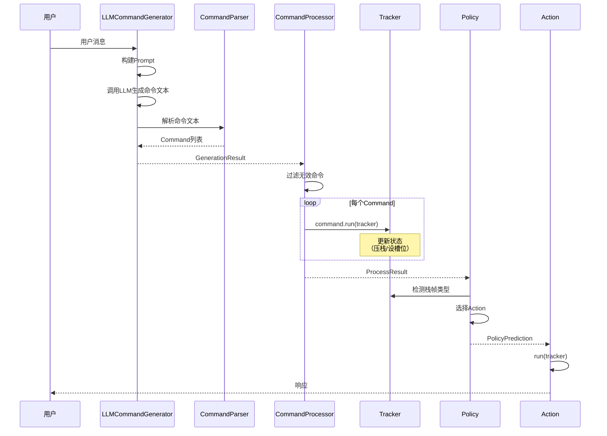
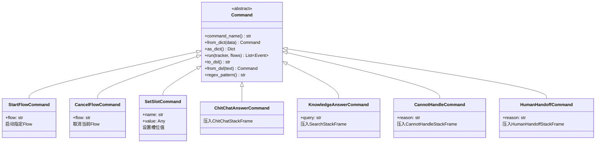
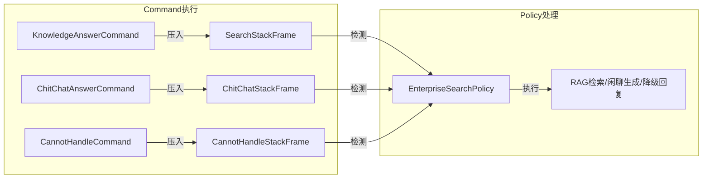
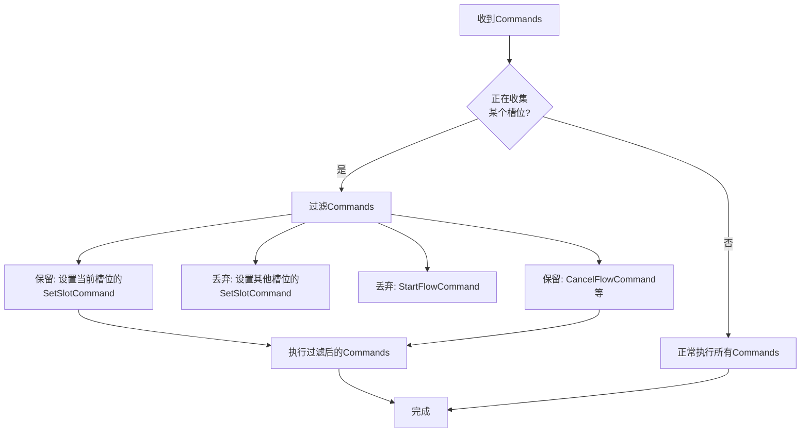
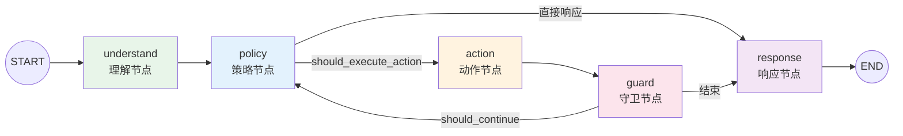
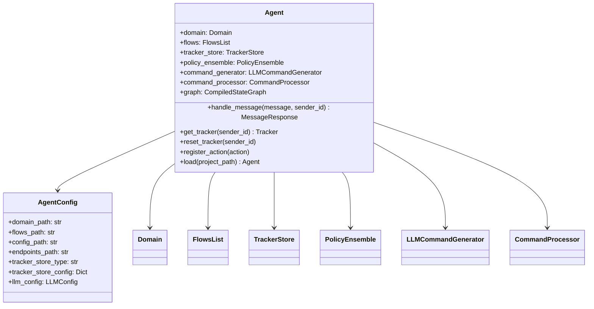
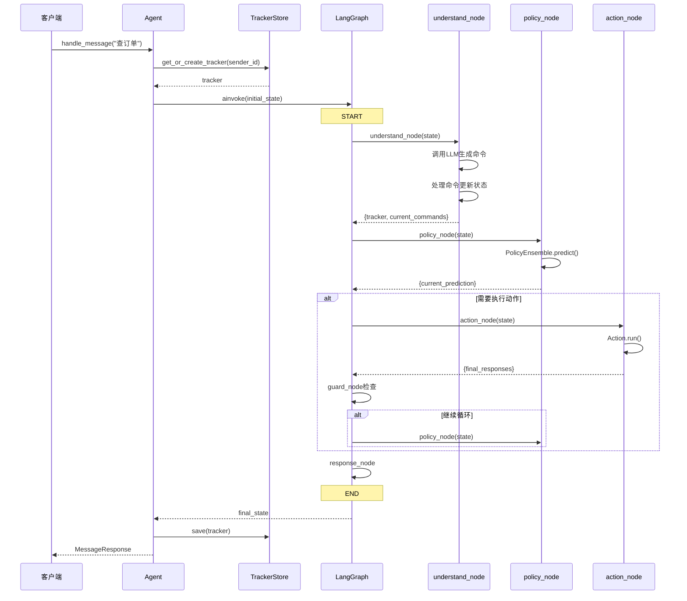

# 对话理解与图式编排

本文档涵盖第10-12章内容，讲解Command命令系统、LangGraph图式编排和Agent核心系统。

---

# 第10章 命令系统

## 10.1 Command概念与设计

### 10.1.1 概念解释

**Command（命令）** 是LLM生成的"意图指令"，表示系统应该执行的原子操作。

> **通俗比喻**：Command就像"餐厅里的点单"：
> - **Command** = 一张点单（告诉厨房要做什么）
> - **StartFlowCommand** = "来一份宫保鸡丁"（启动某个流程）
> - **SetSlotCommand** = "不要放辣椒"（设置参数）
> - **ChitChatAnswerCommand** = "聊两句"（非业务交流）
> - **KnowledgeAnswerCommand** = "查一下菜单"（去知识库找答案）
> - **CommandProcessor** = 服务员（把点单传给厨房执行）

### 10.1.2 设计意图

**Command 与 Action 的职责边界**

在本架构中，Command 和 Action 有明确的分工：

| 维度 | Command | Action |
|------|---------|--------|
| 来源 | LLM根据用户输入生成 | Policy根据栈帧状态选择 |
| 职责 | 解析用户意图，更新对话状态 | 执行具体操作，生成响应 |
| 执行方式 | 通过CommandProcessor执行 | 通过Agent执行 |
| 输出 | 直接修改Tracker状态（压入栈帧、设置槽位） | 返回ActionResult（事件、响应） |

### 10.1.3 命令处理流程



---

## 10.2 Command基类

### 10.2.1 命令体系结构



### 10.2.2 base.py 完整代码

```python
# -*- coding: utf-8 -*-
"""
命令基类

定义所有命令的抽象基类，提供统一的接口规范。
"""

from __future__ import annotations

import re
import dataclasses
from abc import ABC, abstractmethod
from dataclasses import dataclass, field
from typing import Any, Dict, List, Optional, Type, TYPE_CHECKING

if TYPE_CHECKING:
    from atguigu_ai.core.tracker import DialogueStateTracker


# 命令注册表
_COMMAND_REGISTRY: Dict[str, Type["Command"]] = {}


def register_command(cls: Type["Command"]) -> Type["Command"]:
    """命令注册装饰器。
    
    用于将命令类注册到全局注册表中，便于动态创建命令。
    
    Args:
        cls: 要注册的命令类
        
    Returns:
        注册后的命令类
    """
    _COMMAND_REGISTRY[cls.command_name()] = cls
    return cls


def get_command_class(name: str) -> Optional[Type["Command"]]:
    """根据命令名获取命令类。"""
    return _COMMAND_REGISTRY.get(name)


def get_all_command_classes() -> Dict[str, Type["Command"]]:
    """获取所有已注册的命令类。"""
    return _COMMAND_REGISTRY.copy()


@dataclass
class Command(ABC):
    """命令基类。
    
    命令是本架构中的核心概念，表示对话系统可以执行的原子操作。
    所有具体的命令类型都应继承此基类。
    
    命令的生命周期：
    1. LLM生成器根据用户输入生成命令文本
    2. 命令解析器将文本解析为命令对象
    3. 命令处理器执行命令并更新对话状态
    """
    
    @classmethod
    @abstractmethod
    def command_name(cls) -> str:
        """返回命令名称。
        
        用于识别命令类型，应该是唯一的。
        例如: "start_flow", "set_slot", "cancel_flow"
        """
        raise NotImplementedError()
    
    @classmethod
    @abstractmethod
    def from_dict(cls, data: Dict[str, Any]) -> "Command":
        """从字典创建命令实例。"""
        raise NotImplementedError()
    
    def as_dict(self) -> Dict[str, Any]:
        """将命令转换为字典。"""
        data = dataclasses.asdict(self)
        data["command"] = self.command_name()
        return data
    
    @abstractmethod
    def run(
        self,
        tracker: "DialogueStateTracker",
        flows: Optional[Any] = None,
    ) -> List[Dict[str, Any]]:
        """执行命令。
        
        在对话状态追踪器上执行此命令，并返回产生的事件。
        """
        raise NotImplementedError()
    
    @classmethod
    def from_dsl(cls, text: str) -> Optional["Command"]:
        """从DSL文本解析命令。"""
        pattern = cls.regex_pattern()
        if not pattern:
            return None
        
        match = re.match(pattern, text, re.IGNORECASE)
        if match:
            return cls._from_regex_match(match)
        return None
    
    @classmethod
    def _from_regex_match(cls, match: re.Match) -> Optional["Command"]:
        """从正则匹配结果创建命令。子类应覆盖此方法。"""
        raise NotImplementedError()
    
    def to_dsl(self) -> str:
        """将命令转换为DSL文本。"""
        return f"{self.command_name()}"
    
    @classmethod
    def regex_pattern(cls) -> Optional[str]:
        """返回用于解析此命令的正则表达式模式。"""
        return None


def command_from_dict(data: Dict[str, Any]) -> Command:
    """从字典创建命令对象。
    
    根据字典中的command字段确定命令类型，然后创建对应的命令对象。
    """
    command_name = data.get("command")
    if not command_name:
        raise ValueError("Missing 'command' field in data")
    
    command_cls = get_command_class(command_name)
    if command_cls is None:
        raise ValueError(f"Unknown command type: {command_name}")
    
    return command_cls.from_dict(data)


def parse_command_from_text(text: str) -> Optional[Command]:
    """从文本解析命令。
    
    尝试使用所有已注册的命令类的正则模式解析文本。
    """
    text = text.strip()
    for command_cls in _COMMAND_REGISTRY.values():
        try:
            command = command_cls.from_dsl(text)
            if command is not None:
                return command
        except (NotImplementedError, ValueError):
            continue
    return None


# 导出
__all__ = [
    "Command",
    "register_command",
    "get_command_class",
    "get_all_command_classes",
    "command_from_dict",
    "parse_command_from_text",
]
```

---

## 10.3 Flow命令

### 10.3.1 StartFlowCommand

```python
@register_command
@dataclass
class StartFlowCommand(Command):
    """启动Flow命令。
    
    用于启动指定的对话流程。当LLM识别到用户意图与某个Flow匹配时，
    会生成此命令来启动相应的Flow。
    
    设计说明：
        StartFlowCommand 是"即时数据命令"，其 run() 方法直接操作 tracker
        设置 active_flow，以便 FlowPolicy 能立即接管执行 Flow 步骤。
    """
    
    flow: str
    
    @classmethod
    def command_name(cls) -> str:
        return "start_flow"
    
    @classmethod
    def from_dict(cls, data: Dict[str, Any]) -> "StartFlowCommand":
        try:
            return StartFlowCommand(flow=data["flow"])
        except KeyError as e:
            raise ValueError(f"Missing required field 'flow'") from e
    
    def run(
        self,
        tracker: "DialogueStateTracker",
        flows: Optional[Any] = None,
    ) -> List[Dict[str, Any]]:
        """执行启动Flow命令。"""
        # 检查Flow是否存在
        if flows is not None:
            flow_ids = [f.id if hasattr(f, 'id') else str(f) for f in flows]
            if self.flow not in flow_ids:
                return []
        
        # 启动Flow
        tracker.start_flow(self.flow)
        
        return [{
            "event": "flow_started",
            "flow_id": self.flow,
            "timestamp": None,
        }]
    
    def to_dsl(self) -> str:
        return f"start flow {self.flow}"
    
    @classmethod
    def regex_pattern(cls) -> str:
        # 支持: start flow <flow_name> 或 StartFlow(<flow_name>)
        return r"""(?:start\s+flow\s+['"`]?([a-zA-Z0-9_-]+)['"`]?|StartFlow\(['"]?([a-zA-Z0-9_-]+)['"]?\))"""
```

---

## 10.4 回答命令

### 10.4.1 栈帧化设计

回答类命令采用"栈帧化"设计：Command 只负责压入栈帧，Policy 检测栈帧并执行实际操作。



### 10.4.2 answer_commands.py 核心代码

```python
@register_command
@dataclass
class ChitChatAnswerCommand(Command):
    """闲聊回答命令。
    
    用于处理用户的闲聊输入，这些输入不属于任何业务Flow。
    执行时直接压入ChitChatStackFrame，由EnterpriseSearchPolicy检测并生成响应。
    """
    
    @classmethod
    def command_name(cls) -> str:
        return "chitchat"
    
    @classmethod
    def from_dict(cls, data: Dict[str, Any]) -> "ChitChatAnswerCommand":
        return ChitChatAnswerCommand()
    
    def run(
        self,
        tracker: "DialogueStateTracker",
        flows: Optional[Any] = None,
    ) -> List[Dict[str, Any]]:
        """执行闲聊回答命令。直接压入ChitChatStackFrame。"""
        from atguigu_ai.dialogue_understanding.stack.stack_frame import ChitChatStackFrame
        
        tracker.dialogue_stack.push(ChitChatStackFrame())
        return [{
            "event": "chitchat_triggered",
            "degradation_reason": DegradationReason.CHITCHAT,
            "timestamp": None,
        }]


@register_command
@dataclass
class KnowledgeAnswerCommand(Command):
    """知识库回答命令。
    
    用于触发基于知识库检索的回答（RAG）。
    执行时直接压入SearchStackFrame，由EnterpriseSearchPolicy检测并执行检索。
    """
    
    query: Optional[str] = None
    
    @classmethod
    def command_name(cls) -> str:
        return "knowledge_answer"
    
    @classmethod
    def from_dict(cls, data: Dict[str, Any]) -> "KnowledgeAnswerCommand":
        return KnowledgeAnswerCommand(query=data.get("query"))
    
    def run(
        self,
        tracker: "DialogueStateTracker",
        flows: Optional[Any] = None,
    ) -> List[Dict[str, Any]]:
        """执行知识库回答命令。直接压入SearchStackFrame。"""
        from atguigu_ai.dialogue_understanding.stack.stack_frame import SearchStackFrame
        
        tracker.dialogue_stack.push(SearchStackFrame())
        
        query = self.query
        if not query and tracker.latest_message:
            query = tracker.latest_message.text
        
        return [{
            "event": "knowledge_search_triggered",
            "query": query,
            "degradation_reason": DegradationReason.NO_RELEVANT_ANSWER,
            "timestamp": None,
        }]


@register_command
@dataclass
class CannotHandleCommand(Command):
    """无法处理命令。
    
    当系统无法理解或处理用户输入时使用。
    执行时直接压入CannotHandleStackFrame，由EnterpriseSearchPolicy检测并生成降级响应。
    """
    
    reason: str = DegradationReason.DEFAULT
    
    @classmethod
    def command_name(cls) -> str:
        return "cannot_handle"
    
    @classmethod
    def from_dict(cls, data: Dict[str, Any]) -> "CannotHandleCommand":
        return CannotHandleCommand(
            reason=data.get("reason", DegradationReason.DEFAULT)
        )
    
    def run(
        self,
        tracker: "DialogueStateTracker",
        flows: Optional[Any] = None,
    ) -> List[Dict[str, Any]]:
        """执行无法处理命令。直接压入CannotHandleStackFrame。"""
        from atguigu_ai.dialogue_understanding.stack.stack_frame import CannotHandleStackFrame
        
        tracker.dialogue_stack.push(CannotHandleStackFrame(reason=self.reason))
        return [{
            "event": "cannot_handle",
            "reason": self.reason,
            "degradation_reason": DegradationReason.CANNOT_HANDLE,
            "timestamp": None,
        }]
```

---

## 10.5 LLMCommandGenerator

### 10.5.1 设计意图

**LLMCommandGenerator** 是对话理解的核心组件，负责：

1. **构建Prompt**：组装对话历史、槽位状态、可用Flow信息
2. **调用LLM**：将Prompt发送给大语言模型
3. **解析响应**：将LLM输出解析为Command对象

### 10.5.2 llm_generator.py 完整代码

```python
# -*- coding: utf-8 -*-
"""
LLM命令生成器

使用LLM将用户输入转换为命令。
"""

from __future__ import annotations

import logging
from dataclasses import dataclass, field
from typing import Any, Dict, List, Optional, TYPE_CHECKING

from atguigu_ai.dialogue_understanding.generator.base_generator import (
    CommandGenerator,
    GeneratorConfig,
    GenerationResult,
)
from atguigu_ai.dialogue_understanding.generator.prompt_builder import PromptBuilder
from atguigu_ai.dialogue_understanding.generator.command_parser import (
    CommandParser,
    ParseResult,
)
from atguigu_ai.dialogue_understanding.commands.answer_commands import CannotHandleCommand
from atguigu_ai.dialogue_understanding.commands.error_commands import (
    ErrorCommand,
    InternalErrorCommand,
)
from atguigu_ai.shared.llm import create_llm_client
from atguigu_ai.shared.llm.base_client import LLMClient, LLMResponse
from atguigu_ai.shared.exceptions import LLMException

if TYPE_CHECKING:
    from atguigu_ai.core.tracker import DialogueStateTracker
    from atguigu_ai.core.domain import Domain
    from atguigu_ai.dialogue_understanding.commands.base import Command

logger = logging.getLogger(__name__)


@dataclass
class LLMGeneratorConfig(GeneratorConfig):
    """LLM生成器配置。
    
    Attributes:
        type: LLM类型 (openai, qwen, azure, anthropic)
        model: 模型名称
        api_key: API密钥
        api_base: 自定义API基础URL（用于vLLM等）
        temperature: 采样温度
        max_tokens: 最大生成token数
        timeout: 超时时间（秒）
        enable_thinking: 启用深度思考模式
    """
    type: str = "openai"
    model: str = "gpt-4o-mini"
    api_key: Optional[str] = None
    api_base: Optional[str] = None
    temperature: float = 0.0
    max_tokens: int = 256
    timeout: float = 30.0
    enable_thinking: bool = False


class LLMCommandGenerator(CommandGenerator):
    """LLM命令生成器。
    
    使用大语言模型将用户输入转换为对话系统命令。
    
    工作流程：
    1. 构建Prompt（包含上下文、槽位、Flow信息）
    2. 调用LLM生成命令文本
    3. 解析命令文本为命令对象
    """
    
    def __init__(
        self,
        config: Optional[LLMGeneratorConfig] = None,
        llm_client: Optional[LLMClient] = None,
        prompt_builder: Optional[PromptBuilder] = None,
        command_parser: Optional[CommandParser] = None,
    ):
        """初始化LLM命令生成器。"""
        self.config = config or LLMGeneratorConfig()
        
        # 延迟初始化LLM客户端
        self._llm_client = llm_client
        
        # 初始化Prompt构建器
        self.prompt_builder = prompt_builder or PromptBuilder(
            max_history_turns=self.config.max_history_turns,
            include_slots=self.config.include_slots,
            include_flows=self.config.include_flows,
        )
        
        # 初始化命令解析器
        self.command_parser = command_parser or CommandParser()
    
    @property
    def llm_client(self) -> LLMClient:
        """获取LLM客户端（延迟初始化）。"""
        if self._llm_client is None:
            self._llm_client = create_llm_client(
                type=self.config.type,
                model=self.config.model,
                api_key=self.config.api_key,
                api_base=self.config.api_base,
                temperature=self.config.temperature,
                max_tokens=self.config.max_tokens,
                timeout=self.config.timeout,
                enable_thinking=self.config.enable_thinking,
            )
        return self._llm_client
    
    async def generate(
        self,
        tracker: "DialogueStateTracker",
        domain: Optional["Domain"] = None,
        flows: Optional[List[Any]] = None,
    ) -> GenerationResult:
        """使用LLM生成命令。"""
        result = GenerationResult()
        
        # 检查是否有用户消息
        if not tracker.latest_message:
            logger.warning("No user message to process")
            result.commands = [CannotHandleCommand(reason="no_user_message")]
            return result
        
        try:
            # 1. 构建Prompt
            messages = self.prompt_builder.build_messages(tracker, domain, flows)
            result.prompt = self._format_messages_for_log(messages)
            
            logger.debug(f"Generated prompt with {len(messages)} messages")
            
            # 2. 调用LLM
            llm_response = await self.llm_client.complete(
                messages=messages,
                temperature=self.config.temperature,
                max_tokens=self.config.max_tokens,
            )
            
            result.raw_output = llm_response.content
            result.metadata["llm_response"] = {
                "model": llm_response.model,
                "usage": llm_response.usage,
                "latency": llm_response.latency,
            }
            
            logger.info(f"LLM response: {llm_response.content}")
            
            # 3. 解析命令
            parse_result = self.command_parser.parse(llm_response.content)
            result.commands = parse_result.commands
            
            if parse_result.errors:
                result.metadata["parse_errors"] = parse_result.errors
                logger.warning(f"Parse errors: {parse_result.errors}")
            
            # 4. 如果没有解析出命令，返回cannot_handle
            if not result.commands:
                logger.warning("No commands parsed from LLM output")
                result.commands = [CannotHandleCommand(reason="parse_failed")]
            
        except LLMException as e:
            logger.error(f"LLM error: {e}")
            result.commands = [InternalErrorCommand(
                exception_type=e.__class__.__name__,
                exception_message=str(e),
            )]
            result.metadata["error"] = str(e)
            
        except Exception as e:
            logger.error(f"Unexpected error in command generation: {e}")
            result.commands = [ErrorCommand(
                error_type="generation_error",
                message=str(e),
            )]
            result.metadata["error"] = str(e)
        
        return result
```

---

## 10.6 CommandProcessor

### 10.6.1 设计意图

**CommandProcessor** 是命令的"执行引擎"，负责：

1. **过滤无效命令**：验证Flow存在性、槽位有效性
2. **执行命令**：调用每个Command的run方法
3. **确定下一动作**：根据执行结果决定next_action
4. **force_slot_filling**：在collect步骤中只允许设置当前槽位

### 10.6.2 force_slot_filling 机制



### 10.6.3 command_processor.py 核心代码

```python
class CommandProcessor:
    """命令处理器。
    
    负责执行命令并更新对话状态。这是对话理解模块的核心组件之一。
    
    处理流程：
    1. 接收命令列表
    2. 按顺序执行每个命令
    3. 更新对话状态（Tracker, Stack）
    4. 返回产生的事件和下一步动作
    """
    
    def __init__(
        self,
        config: Optional[ProcessorConfig] = None,
        domain: Optional["Domain"] = None,
        flows: Optional[List[Any]] = None,
    ):
        """初始化处理器。"""
        self.config = config or ProcessorConfig()
        self.domain = domain
        self.flows = flows or []
        self._flow_ids = set(
            getattr(f, 'id', str(f)) for f in self.flows
        ) if self.flows else set()
    
    def process(
        self,
        commands: List[Command],
        tracker: "DialogueStateTracker",
    ) -> ProcessResult:
        """处理命令列表。"""
        result = ProcessResult()
        
        if not commands:
            logger.debug("No commands to process")
            return result
        
        # 基于 force_slot_filling 机制，过滤 collect 步骤中的无效命令
        commands = self._filter_commands_during_collect(commands, tracker)
        
        if not commands:
            logger.debug("All commands filtered out during collect step")
            return result
        
        for command in commands:
            try:
                # 执行命令
                events = self._execute_command(command, tracker)
                result.events.extend(events)
                result.commands_executed += 1
                
                # 确定响应类型
                self._update_response_type(command, result)
                
            except Exception as e:
                error_msg = f"Failed to execute {command.command_name()}: {e}"
                result.errors.append(error_msg)
                logger.error(error_msg)
        
        # 确定下一步动作
        self._determine_next_action(tracker, result)
        
        return result
    
    def _filter_commands_during_collect(
        self,
        commands: List[Command],
        tracker: "DialogueStateTracker",
    ) -> List[Command]:
        """基于 force_slot_filling 机制，过滤 collect 步骤中的无效命令。
        
        当处于 collect 步骤（正在收集某个槽位）时：
        1. 只保留设置当前槽位的 SetSlotCommand
        2. 丢弃其他 SetSlotCommand（防止 LLM 同时设置多个槽位）
        3. 丢弃 StartFlowCommand（防止 LLM 错误触发新流程）
        4. 保留其他命令（如 CancelFlowCommand）
        """
        slot_to_collect = self._get_current_slot_to_collect(tracker)
        
        if not slot_to_collect:
            return commands
        
        logger.debug(f"[force_slot_filling] 当前正在收集槽位: {slot_to_collect}")
        
        filtered = []
        for command in commands:
            if isinstance(command, SetSlotCommand):
                if command.name == slot_to_collect:
                    filtered.append(command)
                    logger.debug(f"[force_slot_filling] 保留 SetSlotCommand: {command.name}")
                else:
                    logger.warning(
                        f"[force_slot_filling] 忽略非当前槽位的设置: {command.name}"
                    )
            elif isinstance(command, StartFlowCommand):
                logger.warning(
                    f"[force_slot_filling] 忽略 collect 步骤中的 StartFlowCommand"
                )
            else:
                filtered.append(command)
        
        return filtered
    
    def _determine_next_action(
        self,
        tracker: "DialogueStateTracker",
        result: ProcessResult,
    ) -> None:
        """确定下一步动作。
        
        注意：对于已经在 Command.run() 中压入栈帧的 Command 类型
        （chitchat, knowledge, cannot_handle, human_handoff），
        不设置 next_action，让 Policy 通过检测栈帧来决定动作。
        """
        if result.response_type == "flow":
            if tracker.active_flow:
                result.next_action = f"action_run_flow_{tracker.active_flow}"
            else:
                result.next_action = "action_listen"
        
        elif result.response_type == "cancel_flow":
            result.next_action = "action_cancel_flow"
        
        elif result.response_type == "clarify":
            result.next_action = "action_clarify"
        
        # 以下类型的 Command 已经在 run() 中压入了栈帧，
        # 不设置 next_action，让 Policy 检测栈帧来决定动作
        elif result.response_type in ("chitchat", "knowledge", "cannot_handle", "human_handoff"):
            pass
        
        else:
            if tracker.active_flow:
                pass  # 让 FlowPolicy 处理
            else:
                result.next_action = "action_listen"
```

---

# 第11章 LangGraph图式编排

## 11.1 图式编排概念

### 11.1.1 概念解释

**LangGraph图式编排** 是基于状态机的消息处理流程管理方案。

> **通俗比喻**：图式编排就像"流水线工厂"：
> - **StateGraph** = 整个工厂（定义工位和传送带）
> - **Node** = 工位（每个工位做一件事）
> - **Edge** = 传送带（连接工位）
> - **ConditionalEdge** = 质检站（根据产品状态决定下一工位）
> - **State** = 产品托盘（携带产品和加工信息）

### 11.1.2 设计意图

**为什么使用LangGraph？**

1. **可视化**：图结构直观展示处理流程
2. **可追踪**：每个节点的输入输出都可记录
3. **可扩展**：新增节点不影响现有流程
4. **循环支持**：支持policy→action→guard循环
5. **异步原生**：原生支持async/await

---

## 11.2 图结构设计

### 11.2.1 消息处理图



### 11.2.2 节点职责

| 节点 | 职责 | 输入 | 输出 |
|------|------|------|------|
| understand | 生成命令并处理 | input_message | current_commands, process_result |
| policy | 预测下一动作 | tracker, process_result | current_prediction, is_finished |
| action | 执行动作 | current_prediction | final_responses, action_count |
| guard | 循环控制 | action_count, max_actions | is_finished |
| response | 收集响应 | final_responses | 最终响应 |

---

## 11.3 状态定义

### 11.3.1 MessageProcessingState

```python
class MessageProcessingState(TypedDict, total=False):
    """消息处理图的状态定义。
    
    这是 LangGraph StateGraph 的核心状态结构，包含：
    - 核心对话状态（tracker, domain, flows）
    - 输入输出数据
    - 流程控制字段
    - 中间结果缓存
    - 组件引用（用于节点访问）
    """
    # 核心状态
    tracker: Any  # DialogueStateTracker
    domain: Any  # Optional[Domain]
    flows: Any  # Optional[FlowsList]
    
    # 输入输出
    input_message: str
    metadata: Dict[str, Any]
    final_responses: List[Dict[str, Any]]
    
    # 流程控制
    is_finished: bool
    action_count: int
    max_actions: int
    
    # 中间结果
    current_commands: Any  # Optional[GenerationResult]
    current_prediction: Any  # Optional[PolicyPrediction]
    current_action_result: Any  # Optional[ActionResult]
    
    # 调试信息
    node_history: List[str]
    error: Optional[str]
    
    # 组件引用（内部使用）
    _command_generator: Any  # Optional[LLMCommandGenerator]
    _command_processor: Any  # Optional[CommandProcessor]
    _policy_ensemble: Any  # Optional[PolicyEnsemble]


def create_initial_state(
    tracker: Any,
    input_message: str,
    domain: Any = None,
    flows: Any = None,
    metadata: Optional[Dict[str, Any]] = None,
    max_actions: int = 10,
    command_generator: Any = None,
    command_processor: Any = None,
    policy_ensemble: Any = None,
) -> MessageProcessingState:
    """创建初始状态。"""
    return MessageProcessingState(
        tracker=tracker,
        domain=domain,
        flows=flows,
        input_message=input_message,
        metadata=metadata or {},
        final_responses=[],
        is_finished=False,
        action_count=0,
        max_actions=max_actions,
        current_commands=None,
        current_prediction=None,
        current_action_result=None,
        node_history=[],
        error=None,
        _command_generator=command_generator,
        _command_processor=command_processor,
        _policy_ensemble=policy_ensemble,
    )
```

---

## 11.4 图构建器

### 11.4.1 builder.py 完整代码

```python
# -*- coding: utf-8 -*-
"""
图构建器

负责构建 LangGraph 消息处理图。
"""

from __future__ import annotations

import logging
from typing import TYPE_CHECKING

from langgraph.graph import StateGraph, START, END
from langgraph.graph.state import CompiledStateGraph

from atguigu_ai.agent.graph.state import MessageProcessingState
from atguigu_ai.agent.graph.nodes import (
    understand_node,
    policy_node,
    action_node,
    response_node,
    guard_node,
)
from atguigu_ai.agent.graph.edges import (
    should_execute_action,
    should_continue,
)

logger = logging.getLogger(__name__)


def build_message_processing_graph() -> CompiledStateGraph:
    """构建消息处理图。
    
    图结构:
    
        START → understand → policy → [route] → action → guard → [route] → ...
                                        ↓                           ↓
                                     response ← ← ← ← ← ← ← ← ← ← ←
                                        ↓
                                       END
    """
    logger.info("构建消息处理图...")
    
    # 创建状态图
    graph = StateGraph(MessageProcessingState)
    
    # 添加节点
    graph.add_node("understand", understand_node)
    graph.add_node("policy", policy_node)
    graph.add_node("action", action_node)
    graph.add_node("guard", guard_node)
    graph.add_node("response", response_node)
    
    # 设置入口边
    graph.add_edge(START, "understand")
    
    # understand → policy
    graph.add_edge("understand", "policy")
    
    # policy → [条件边] → action 或 response
    graph.add_conditional_edges(
        "policy",
        should_execute_action,
        {
            "action": "action",
            "response": "response",
        }
    )
    
    # action → guard
    graph.add_edge("action", "guard")
    
    # guard → [条件边] → policy 或 response
    graph.add_conditional_edges(
        "guard",
        should_continue,
        {
            "policy": "policy",
            "response": "response",
        }
    )
    
    # response → END
    graph.add_edge("response", END)
    
    # 编译图
    compiled_graph = graph.compile()
    
    logger.info("消息处理图构建完成")
    
    return compiled_graph


# 全局图实例（惰性初始化单例）
_graph_instance: CompiledStateGraph | None = None


def get_message_processing_graph() -> CompiledStateGraph:
    """获取消息处理图单例。"""
    global _graph_instance
    
    if _graph_instance is None:
        _graph_instance = build_message_processing_graph()
    
    return _graph_instance
```

---

## 11.5 节点实现

### 11.5.1 understand_node（理解节点）

```python
async def understand_node(state: "MessageProcessingState") -> Dict[str, Any]:
    """理解节点：生成命令并处理。
    
    该节点执行以下步骤：
    1. 检测 /SetSlots payload（按钮点击），直接解析绕过 LLM
    2. 将用户输入封装为 UserMessage 并更新 tracker
    3. 调用 LLMCommandGenerator 生成命令
    4. 调用 CommandProcessor 处理命令
    """
    tracker = state["tracker"]
    input_message = state["input_message"]
    metadata = state.get("metadata", {})
    domain = state.get("domain")
    flows = state.get("flows")
    
    command_generator = state.get("_command_generator")
    command_processor = state.get("_command_processor")
    
    logger.info(f"[understand_node] 处理消息: {input_message[:50]}...")
    
    # 1. 检测 /SetSlots payload（按钮点击，绕过 LLM）
    if input_message.strip().startswith("/SetSlots("):
        logger.info("[understand_node] 检测到 /SetSlots payload，绕过 LLM 直接解析")
        commands = parse_set_slots_payload(input_message)
        
        if commands and command_processor:
            user_message = UserMessage(
                text=input_message,
                sender_id=tracker.sender_id,
                metadata={"payload": True, **metadata},
            )
            tracker.update_with_message(user_message)
            process_result = command_processor.process(commands, tracker)
            
            return {
                "tracker": tracker,
                "current_commands": None,
                "process_result": process_result,
                "node_history": state.get("node_history", []) + ["understand"],
            }
    
    # 2. 创建用户消息并更新 tracker
    user_message = UserMessage(
        text=input_message,
        sender_id=tracker.sender_id,
        metadata=metadata,
    )
    tracker.update_with_message(user_message)
    
    # 3. 使用命令生成器生成命令
    if command_generator:
        flows_list = flows.flows if flows else []
        generation_result = await command_generator.generate(
            tracker, domain, flows_list
        )
        
        # 4. 使用命令处理器处理命令
        if generation_result.commands and command_processor:
            process_result = command_processor.process(
                generation_result.commands, tracker
            )
    
    return {
        "tracker": tracker,
        "current_commands": current_commands,
        "process_result": process_result,
        "node_history": state.get("node_history", []) + ["understand"],
    }
```

### 11.5.2 policy_node（策略节点）

```python
async def policy_node(state: "MessageProcessingState") -> Dict[str, Any]:
    """策略节点：预测下一个动作。
    
    该节点调用 PolicyEnsemble.predict() 来决定系统应该执行什么动作。
    如果 CommandProcessor 已经确定了 next_action，优先使用该动作（仅第一轮）。
    如果预测的动作是 action_listen，则标记处理完成。
    """
    tracker = state["tracker"]
    domain = state.get("domain")
    flows = state.get("flows")
    policy_ensemble = state.get("_policy_ensemble")
    process_result = state.get("process_result")
    action_count = state.get("action_count", 0)
    
    # 优先使用 CommandProcessor 确定的 next_action（仅第一轮）
    if action_count == 0 and process_result and process_result.next_action:
        next_action = process_result.next_action
        if not next_action.startswith("action_run_flow_"):
            current_prediction = PolicyPrediction(
                action=next_action,
                confidence=1.0,
                policy_name="CommandProcessor",
                metadata=process_result.metadata,
            )
            is_finished = (next_action == ACTION_LISTEN)
            
            return {
                "current_prediction": current_prediction,
                "is_finished": is_finished,
                "node_history": state.get("node_history", []) + ["policy"],
            }
    
    # 使用 PolicyEnsemble 预测
    if policy_ensemble:
        prediction = await policy_ensemble.predict(tracker, domain, flows)
        is_finished = (prediction.action == ACTION_LISTEN or prediction.action is None)
        
        return {
            "current_prediction": prediction,
            "is_finished": is_finished,
            "node_history": state.get("node_history", []) + ["policy"],
        }
```

### 11.5.3 action_node（动作节点）

```python
async def action_node(state: "MessageProcessingState") -> Dict[str, Any]:
    """动作节点：执行预测的动作。
    
    该节点执行以下步骤：
    1. 从 current_prediction 获取动作名称
    2. 查找并实例化对应的 Action
    3. 执行 Action.run()
    4. 将响应添加到 final_responses
    5. 将机器人消息添加到 tracker
    """
    tracker = state["tracker"]
    domain = state.get("domain")
    current_prediction = state.get("current_prediction")
    final_responses = list(state.get("final_responses", []))
    action_count = state.get("action_count", 0)
    
    action_name = current_prediction.action
    logger.info(f"执行动作: {action_name}")
    
    # 查找动作
    action = get_action(action_name)
    
    if action is None:
        logger.warning(f"动作未找到: {action_name}")
        return {
            "current_action_result": ActionResult(success=False),
            "action_count": action_count + 1,
            "node_history": state.get("node_history", []) + ["action"],
        }
    
    # 执行动作
    kwargs = dict(current_prediction.metadata or {})
    result = await action.run(tracker, domain, **kwargs)
    
    # 累积响应
    for resp in result.responses:
        final_responses.append(resp)
        bot_message = BotMessage(text=resp.get("text", ""), data=resp)
        tracker.add_bot_message(bot_message)
    
    # 更新 tracker 的最新动作名
    tracker.latest_action_name = action_name
    
    return {
        "tracker": tracker,
        "current_action_result": result,
        "final_responses": final_responses,
        "action_count": action_count + 1,
        "node_history": state.get("node_history", []) + ["action"],
    }
```

---

## 11.6 条件边路由

### 11.6.1 edges.py 完整代码

```python
# -*- coding: utf-8 -*-
"""
条件边路由函数

定义 LangGraph 图中的条件边路由逻辑。
"""

from __future__ import annotations

import logging
from typing import Any, Dict, Literal

from atguigu_ai.shared.constants import ACTION_LISTEN

logger = logging.getLogger(__name__)


def should_execute_action(state: Dict[str, Any]) -> Literal["action", "response"]:
    """决定是执行动作还是返回响应。
    
    在 policy_node 之后调用，根据预测结果决定下一步：
    - 如果 is_finished 为 True，或动作为 action_listen，则跳转到 response_node
    - 否则跳转到 action_node 执行动作
    """
    is_finished = state.get("is_finished", False)
    current_prediction = state.get("current_prediction")
    
    if is_finished:
        return "response"
    
    if current_prediction:
        action = current_prediction.action
        if action == ACTION_LISTEN or action is None:
            return "response"
    else:
        return "response"
    
    return "action"


def should_continue(state: Dict[str, Any]) -> Literal["policy", "response"]:
    """决定是继续循环还是结束。
    
    在 guard_node 之后调用，根据状态决定是否继续：
    - 如果 is_finished 为 True，或达到最大动作数，则跳转到 response_node
    - 否则跳转回 policy_node 继续决策
    """
    is_finished = state.get("is_finished", False)
    action_count = state.get("action_count", 0)
    max_actions = state.get("max_actions", 10)
    
    if is_finished:
        return "response"
    
    if action_count >= max_actions:
        logger.debug(f"达到最大动作数 ({action_count}/{max_actions})")
        return "response"
    
    return "policy"
```

---

# 第12章 Agent核心系统

## 12.1 Agent概念与设计

### 12.1.1 概念解释

**Agent** 是对话系统的"总指挥官"，负责协调所有组件完成对话处理。

> **通俗比喻**：Agent就像"餐厅经理"：
> - **Agent** = 经理（协调各部门工作）
> - **TrackerStore** = 客户档案（记录每位客人的历史）
> - **FlowsList** = 菜单（定义提供的服务）
> - **PolicyEnsemble** = 服务策略手册（如何响应客户需求）
> - **CommandGenerator** = 翻译官（把客人的话翻译成后厨能懂的指令）
> - **Graph** = 服务流程图（从接待到送客的完整流程）

### 12.1.2 Agent职责

1. **配置加载**：从项目目录加载domain、flows、config
2. **组件初始化**：创建和配置所有子组件
3. **消息处理**：使用LangGraph图编排处理消息
4. **状态管理**：通过TrackerStore管理会话状态
5. **自定义扩展**：支持加载用户自定义Action

---

## 12.2 Agent类结构



---

## 12.3 agent.py 完整代码

```python
# -*- coding: utf-8 -*-
"""
Agent主类

提供对话系统的核心Agent实现。
基于 LangGraph 图式编排核心组件的执行流程。
"""

from __future__ import annotations

import importlib
import importlib.util
import inspect
import logging
import sys
from dataclasses import dataclass, field
from pathlib import Path
from typing import Any, Dict, List, Optional, Union

from atguigu_ai.agent.message_processor import MessageResponse
from atguigu_ai.agent.actions import register_action, Action
from atguigu_ai.agent.graph import (
    get_message_processing_graph,
    create_initial_state,
)
from atguigu_ai.core.tracker import DialogueStateTracker
from atguigu_ai.core.domain import Domain
from atguigu_ai.core.stores import create_tracker_store, TrackerStore
from atguigu_ai.dialogue_understanding.flow import FlowsList, FlowLoader
from atguigu_ai.dialogue_understanding.generator import LLMCommandGenerator
from atguigu_ai.dialogue_understanding.processor import CommandProcessor
from atguigu_ai.policies import PolicyEnsemble, FlowPolicy, EnterpriseSearchPolicy

logger = logging.getLogger(__name__)


def _load_custom_actions(actions_path: Path) -> List[str]:
    """从用户工程的 actions 目录自动加载自定义 Action。
    
    扫描指定目录下的所有 Python 文件，发现继承自 Action 基类的类，
    自动实例化并注册。
    """
    if not actions_path.exists() or not actions_path.is_dir():
        return []
    
    registered_actions = []
    parent_path = str(actions_path.parent)
    if parent_path not in sys.path:
        sys.path.insert(0, parent_path)
    
    try:
        for py_file in actions_path.glob("*.py"):
            if py_file.name.startswith("_"):
                continue
            
            module_name = f"actions.{py_file.stem}"
            
            try:
                spec = importlib.util.spec_from_file_location(module_name, py_file)
                if spec is None or spec.loader is None:
                    continue
                    
                module = importlib.util.module_from_spec(spec)
                sys.modules[module_name] = module
                spec.loader.exec_module(module)
                
                for name, obj in inspect.getmembers(module, inspect.isclass):
                    if (issubclass(obj, Action) and 
                        obj is not Action and
                        obj.__module__ == module_name):
                        try:
                            action_instance = obj()
                            register_action(action_instance)
                            logger.info(f"Registered custom action: {action_instance.name}")
                            registered_actions.append(action_instance.name)
                        except Exception as e:
                            logger.warning(f"Failed to register action {name}: {e}")
                            
            except Exception as e:
                logger.warning(f"Failed to load actions from {py_file}: {e}")
                
    finally:
        pass
    
    return registered_actions


@dataclass
class AgentConfig:
    """Agent配置。"""
    domain_path: str = "domain.yml"
    flows_path: str = "data/flows"
    config_path: str = "config.yml"
    endpoints_path: str = "endpoints.yml"
    tracker_store_type: str = "memory"
    tracker_store_config: Dict[str, Any] = field(default_factory=dict)
    llm_config: Optional[Any] = None


class Agent:
    """对话系统Agent。
    
    Agent是对话系统的核心类，负责：
    - 加载和管理配置
    - 处理用户消息
    - 管理对话状态
    - 协调各个组件
    
    使用示例：
    ```python
    agent = Agent.load("./my_bot")
    response = await agent.handle_message("你好", sender_id="user1")
    print(response.messages)
    ```
    """
    
    def __init__(
        self,
        domain: Optional[Domain] = None,
        flows: Optional[FlowsList] = None,
        tracker_store: Optional[TrackerStore] = None,
        policy_ensemble: Optional[PolicyEnsemble] = None,
        command_generator: Optional[LLMCommandGenerator] = None,
        nlg_generator: Optional[Any] = None,
        config: Optional[AgentConfig] = None,
    ):
        """初始化Agent。"""
        self.domain = domain or Domain()
        self.flows = flows or FlowsList()
        self.config = config or AgentConfig()
        
        # 初始化Tracker存储
        if tracker_store:
            self.tracker_store = tracker_store
        else:
            self.tracker_store = create_tracker_store(
                self.config.tracker_store_type,
                **self.config.tracker_store_config,
            )
        self.tracker_store.set_domain(self.domain)
        
        # 初始化策略
        if policy_ensemble:
            self.policy_ensemble = policy_ensemble
        else:
            self.policy_ensemble = PolicyEnsemble(policies=[
                FlowPolicy(flows=self.flows),
                EnterpriseSearchPolicy(),
            ])
        
        # 初始化命令生成器
        self.command_generator = command_generator
        
        # 初始化NLG生成器
        self.nlg_generator = nlg_generator
        
        # 初始化命令处理器
        self.command_processor = CommandProcessor(
            domain=self.domain,
            flows=self.flows.flows if self.flows else [],
        )
        
        # 获取 LangGraph 消息处理图（惰性初始化的单例）
        self.graph = get_message_processing_graph()
    
    async def handle_message(
        self,
        message: str,
        sender_id: str = "default",
        metadata: Optional[Dict[str, Any]] = None,
    ) -> MessageResponse:
        """处理用户消息。
        
        使用 LangGraph 图式编排执行消息处理流程。
        """
        # 获取或创建Tracker
        tracker = await self.tracker_store.get_or_create_tracker(sender_id)
        
        # 构建初始状态
        initial_state = create_initial_state(
            tracker=tracker,
            input_message=message,
            domain=self.domain,
            flows=self.flows,
            metadata=metadata,
            max_actions=10,
            command_generator=self.command_generator,
            command_processor=self.command_processor,
            policy_ensemble=self.policy_ensemble,
        )
        
        # 执行图
        logger.info(f"[Agent] 使用 LangGraph 处理消息: {message[:50]}...")
        final_state = await self.graph.ainvoke(initial_state)
        
        # 从最终状态提取结果
        updated_tracker = final_state.get("tracker", tracker)
        final_responses = final_state.get("final_responses", [])
        node_history = final_state.get("node_history", [])
        error = final_state.get("error")
        
        # 保存Tracker
        await self.tracker_store.save(updated_tracker)
        
        # 构建响应
        response = MessageResponse(
            messages=final_responses,
            metadata={
                "node_history": node_history,
                "error": error,
            },
        )
        
        logger.info(
            f"[Agent] 处理完成, 节点路径: {' -> '.join(node_history)}, "
            f"响应数: {len(final_responses)}"
        )
        
        return response
    
    async def get_tracker(self, sender_id: str) -> Optional[DialogueStateTracker]:
        """获取指定用户的Tracker。"""
        return await self.tracker_store.retrieve(sender_id)
    
    async def reset_tracker(self, sender_id: str) -> None:
        """重置指定用户的对话状态。"""
        tracker = await self.tracker_store.retrieve(sender_id)
        if tracker:
            tracker.restart()
            await self.tracker_store.save(tracker)
    
    def register_action(self, action: Action) -> None:
        """注册自定义动作。"""
        register_action(action)
    
    @classmethod
    def load(
        cls,
        project_path: Union[str, Path],
        config: Optional[AgentConfig] = None,
    ) -> "Agent":
        """从项目目录或模型压缩包加载Agent。
        
        支持以下输入：
        - .tar.gz 模型压缩包路径
        - 包含 .tar.gz 文件的目录（自动选择最新）
        - 项目目录（直接加载配置文件）
        """
        project_path = Path(project_path)
        
        if config is None:
            config = AgentConfig()
        
        # 确定实际的工作目录（处理压缩包解压）
        working_path = cls._resolve_working_path(project_path)
        
        # 加载Domain
        domain = cls._load_domain(working_path, config)
        
        # 加载Flows
        flows = cls._load_flows(working_path, config)
        
        # 加载用户自定义 Actions
        custom_action_names = _load_custom_actions(working_path / "actions")
        if custom_action_names and domain:
            for action_name in custom_action_names:
                domain.add_action(action_name)
        
        # 加载配置并创建组件
        command_generator, policy_ensemble, tracker_store, nlg_generator = \
            cls._load_components(working_path, config, domain, flows)
        
        return cls(
            domain=domain,
            flows=flows,
            tracker_store=tracker_store,
            policy_ensemble=policy_ensemble,
            command_generator=command_generator,
            nlg_generator=nlg_generator,
            config=config,
        )
```

---

## 12.4 消息处理完整流程

### 12.4.1 时序图



---

## 本章小结

本章详细介绍了对话系统的三大核心模块：

**命令系统**：
- `Command` 基类定义了命令的标准接口
- Flow命令（StartFlow、CancelFlow）直接操作对话状态
- 回答命令（ChitChat、Knowledge、CannotHandle）采用栈帧化设计
- `CommandProcessor` 执行命令并确定下一动作
- `force_slot_filling` 机制确保槽位收集的准确性

**LangGraph图式编排**：
- 5个核心节点：understand、policy、action、guard、response
- 条件边实现动态路由：should_execute_action、should_continue
- `MessageProcessingState` 在节点间传递状态
- 支持 policy→action→guard 循环执行

**Agent核心系统**：
- `Agent` 类是对话系统的入口点
- 支持从项目目录或模型压缩包加载
- 自动发现并注册用户自定义Action
- 使用LangGraph图编排整个处理流程

下一章将介绍NLG、多渠道集成和检索增强等扩展功能。
