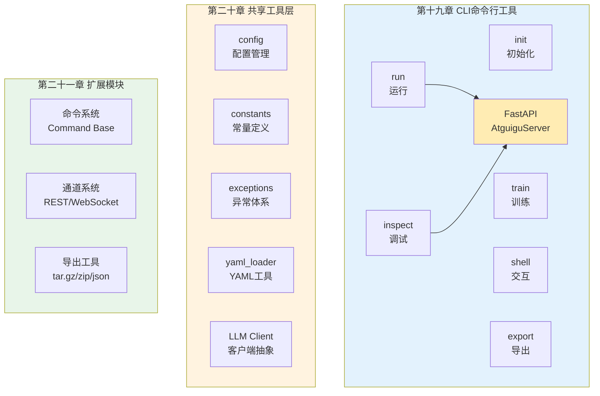
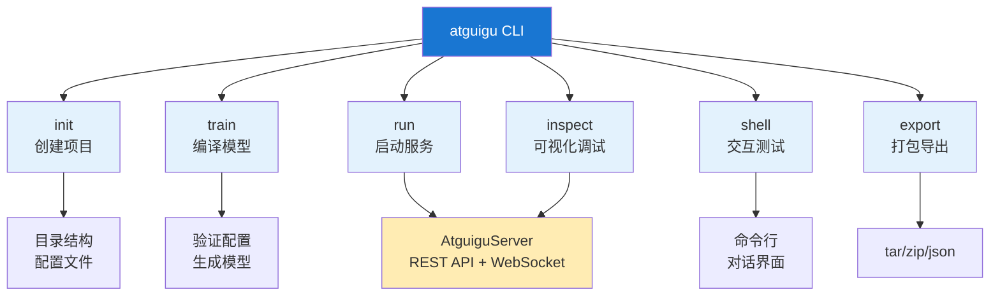
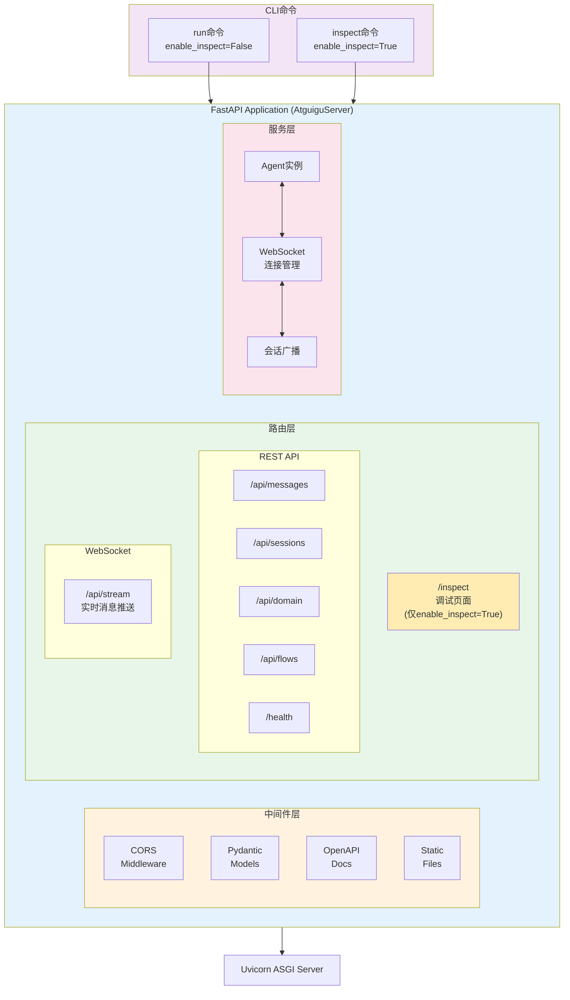
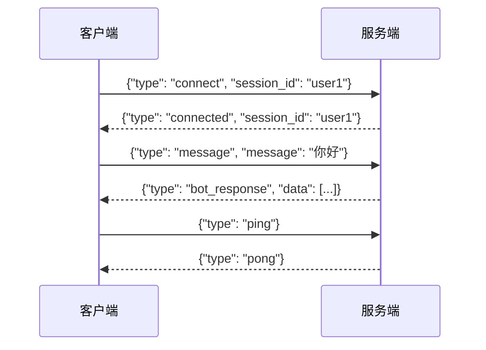
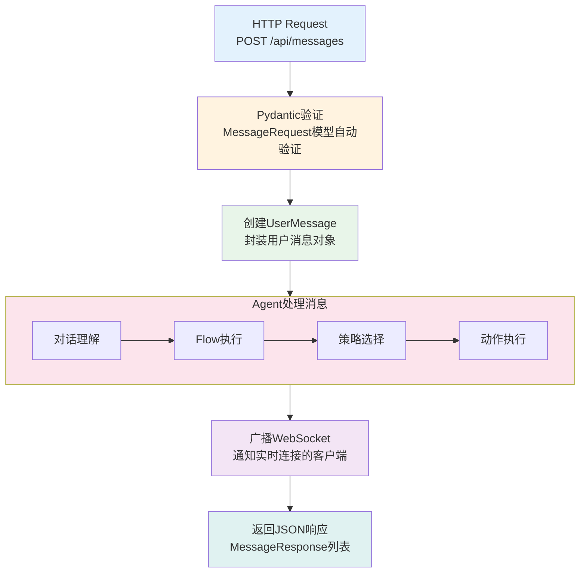
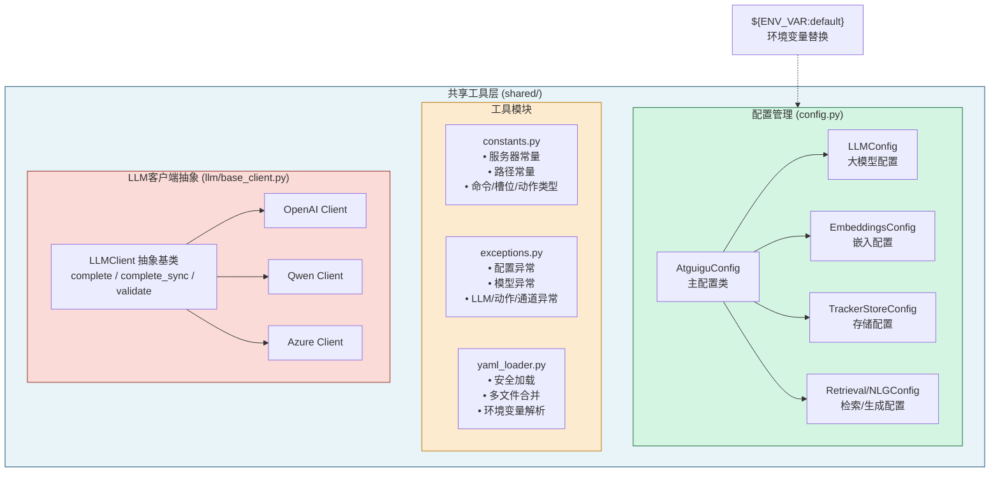
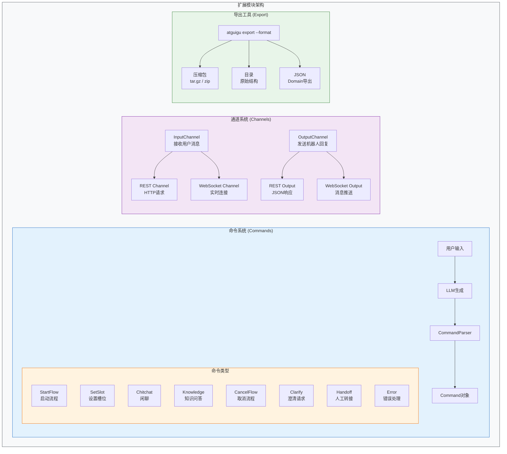

# 工具层与基础设施

本文档涵盖 atguigu_ai 对话系统的基础设施层，包括命令行工具、配置管理、异常处理、YAML工具和LLM客户端抽象等核心支撑模块。这些模块虽然不直接参与对话逻辑，但为整个系统提供了坚实的运行基础。

**文档结构全景**：



---

## 第十九章 CLI命令行工具

命令行接口(CLI)是开发者与对话系统交互的主要入口。本章详细介绍CLI框架的设计思想和各命令的实现细节。

**CLI工具体系图**：



### 19.1 CLI框架设计

#### 19.1.1 设计理念

CLI框架采用Click库构建，提供统一的命令行体验。设计上遵循以下原则：

- **模块化**：每个命令独立成模块，便于维护和扩展
- **一致性**：统一的参数风格和输出格式
- **友好性**：丰富的帮助信息和错误提示

**类比理解**：CLI就像是对话系统的"控制面板"，开发者通过不同的按钮（命令）来启动、训练、测试对话机器人。

#### 19.1.2 核心类：AtguiguCLI

AtguiguCLI是CLI的核心组件，继承自Click的Group类，负责命令注册和全局参数处理。

**设计意图**：
- 集中管理所有子命令
- 提供全局的版本信息和调试选项
- 支持.env文件自动加载环境变量

**完整代码**：

```python
# 文件: atguigu_ai/cli/__init__.py

"""Atguigu AI CLI - 命令行接口入口模块。

该模块定义了CLI的主入口和命令组织结构。
"""

from __future__ import annotations

import logging
import os
import sys
from typing import Any, Optional

import click
from dotenv import load_dotenv

from atguigu_ai import __version__

logger = logging.getLogger(__name__)


class AtguiguCLI(click.Group):
    """自定义CLI组，支持全局选项和命令组织。
    
    功能：
    1. 版本信息显示
    2. 详细/调试模式切换
    3. 自动发现和注册子命令
    """
    
    def __init__(
        self,
        name: Optional[str] = None,
        commands: Optional[dict] = None,
        **attrs: Any,
    ) -> None:
        """初始化CLI组。
        
        Args:
            name: CLI组名称
            commands: 预定义的命令字典
            **attrs: 其他Click Group参数
        """
        super().__init__(name, commands, **attrs)
        self._load_commands()
    
    def _load_commands(self) -> None:
        """加载所有可用的CLI命令。"""
        # 延迟导入避免循环依赖
        from atguigu_ai.cli.init import init
        from atguigu_ai.cli.train import train
        from atguigu_ai.cli.run import run
        from atguigu_ai.cli.shell import shell
        from atguigu_ai.cli.inspect import inspect_cmd
        from atguigu_ai.cli.export import export
        
        # 注册命令
        self.add_command(init)
        self.add_command(train)
        self.add_command(run)
        self.add_command(shell)
        self.add_command(inspect_cmd, name="inspect")
        self.add_command(export)
    
    def format_help(self, ctx: click.Context, formatter: click.HelpFormatter) -> None:
        """格式化帮助信息，添加自定义头部。
        
        Args:
            ctx: Click上下文
            formatter: 帮助信息格式化器
        """
        formatter.write_paragraph()
        formatter.write_text("Atguigu AI 对话系统命令行工具")
        formatter.write_paragraph()
        super().format_help(ctx, formatter)


def print_version(ctx: click.Context, param: click.Parameter, value: bool) -> None:
    """打印版本信息回调。
    
    Args:
        ctx: Click上下文
        param: 参数对象
        value: 参数值
    """
    if not value or ctx.resilient_parsing:
        return
    click.echo(f"Atguigu AI version: {__version__}")
    ctx.exit()


def configure_logging(verbose: bool, debug: bool) -> None:
    """配置日志级别。
    
    Args:
        verbose: 是否启用详细模式
        debug: 是否启用调试模式
    """
    if debug:
        level = logging.DEBUG
    elif verbose:
        level = logging.INFO
    else:
        level = logging.WARNING
    
    logging.basicConfig(
        level=level,
        format="%(asctime)s - %(name)s - %(levelname)s - %(message)s",
        datefmt="%Y-%m-%d %H:%M:%S",
    )


@click.group(cls=AtguiguCLI)
@click.option(
    "--version",
    "-V",
    is_flag=True,
    callback=print_version,
    expose_value=False,
    is_eager=True,
    help="显示版本信息",
)
@click.option(
    "--verbose",
    "-v",
    is_flag=True,
    default=False,
    help="启用详细输出模式",
)
@click.option(
    "--debug",
    "-d",
    is_flag=True,
    default=False,
    help="启用调试模式",
)
@click.pass_context
def main(ctx: click.Context, verbose: bool, debug: bool) -> None:
    """Atguigu AI 对话系统命令行工具。
    
    使用 --help 查看各子命令的详细用法。
    """
    ctx.ensure_object(dict)
    ctx.obj["verbose"] = verbose
    ctx.obj["debug"] = debug
    configure_logging(verbose, debug)


def cli_entry_point() -> None:
    """CLI入口点，负责环境初始化。
    
    功能：
    1. 加载.env文件中的环境变量
    2. 启动CLI主程序
    """
    # 加载项目根目录的.env文件
    env_path = os.path.join(os.getcwd(), ".env")
    if os.path.exists(env_path):
        load_dotenv(env_path)
        logger.debug(f"已加载环境变量文件: {env_path}")
    
    # 启动CLI
    main()


if __name__ == "__main__":
    cli_entry_point()
```

#### 19.1.3 调用关系

```
cli_entry_point()
    │
    ├── load_dotenv()          # 加载.env环境变量
    │
    └── main()                 # Click主命令组
        │
        ├── configure_logging()  # 配置日志级别
        │
        └── [子命令]
            ├── init          # 项目初始化
            ├── train         # 模型训练
            ├── run           # 服务运行
            ├── shell         # 交互式Shell
            ├── inspect       # 调试页面
            └── export        # 模型导出
```

### 19.2 项目初始化命令(init)

#### 19.2.1 功能概述

`init`命令用于创建新的对话项目，自动生成项目骨架和配置文件。支持三种项目模板，适应不同的学习和开发需求。

**类比理解**：就像IDE的"新建项目向导"，`init`命令帮助开发者快速搭建项目结构，省去手动创建目录和文件的繁琐工作。

#### 19.2.2 项目模板类型

系统提供三种预设模板：

| 模板类型 | 适用场景 | 包含内容 |
|---------|---------|---------|
| DEFAULT | 标准开发 | 完整配置、示例Flow、自定义Action |
| BASIC | 最小起步 | 基础配置、简单问候Flow |
| TUTORIAL | 学习入门 | 详细注释、教学示例、说明文档 |

#### 19.2.3 完整代码

```python
# 文件: atguigu_ai/cli/init.py

"""项目初始化命令模块。

提供创建新对话项目的功能，支持多种项目模板。
"""

from __future__ import annotations

import os
import logging
from enum import Enum
from pathlib import Path
from typing import Optional

import click

logger = logging.getLogger(__name__)


class ProjectTemplate(Enum):
    """项目模板类型枚举。
    
    Attributes:
        DEFAULT: 默认模板，包含完整示例
        BASIC: 基础模板，最小化配置
        TUTORIAL: 教程模板，包含详细注释
    """
    DEFAULT = "default"
    BASIC = "basic"
    TUTORIAL = "tutorial"


# ============================================================================
# 配置文件模板内容
# ============================================================================

def get_config_template(template: ProjectTemplate) -> str:
    """获取config.yml模板内容。
    
    Args:
        template: 项目模板类型
        
    Returns:
        配置文件内容字符串
    """
    if template == ProjectTemplate.BASIC:
        return '''# Atguigu AI 基础配置
recipe: default

# LLM配置
llm:
  type: ${LLM_TYPE:openai}
  model: ${LLM_MODEL:gpt-4o-mini}
  api_key: ${LLM_API_KEY}
  base_url: ${LLM_BASE_URL:}
  temperature: 0.7
  max_tokens: 1024

# 对话配置
dialogue:
  max_turns: 50
  session_timeout: 3600
'''
    
    elif template == ProjectTemplate.TUTORIAL:
        return '''# ============================================================================
# Atguigu AI 配置文件 (教程模板)
# ============================================================================
# 
# 本配置文件包含对话系统的核心设置。
# 使用 ${VAR_NAME:default} 语法可以引用环境变量，冒号后为默认值。
#
# ============================================================================

recipe: default  # 配置方案，目前仅支持 default

# ----------------------------------------------------------------------------
# LLM (大语言模型) 配置
# ----------------------------------------------------------------------------
# 系统支持多种LLM提供商：openai, qwen, azure, anthropic
# 
llm:
  # LLM类型，支持: openai, qwen, azure, anthropic
  type: ${LLM_TYPE:openai}
  
  # 模型名称
  model: ${LLM_MODEL:gpt-4o-mini}
  
  # API密钥 (建议通过环境变量设置，不要直接写在配置文件中)
  api_key: ${LLM_API_KEY}
  
  # API基础URL (可选，用于自定义端点)
  base_url: ${LLM_BASE_URL:}
  
  # 生成温度 (0.0-2.0，越高越随机)
  temperature: 0.7
  
  # 最大生成token数
  max_tokens: 1024
  
  # 请求超时时间(秒)
  timeout: 30

# ----------------------------------------------------------------------------
# 对话配置
# ----------------------------------------------------------------------------
dialogue:
  # 单次对话最大轮数
  max_turns: 50
  
  # 会话超时时间(秒)
  session_timeout: 3600
  
  # 是否启用对话历史记录
  enable_history: true

# ----------------------------------------------------------------------------
# 嵌入模型配置 (用于语义检索)
# ----------------------------------------------------------------------------
embeddings:
  type: ${EMBEDDING_TYPE:openai}
  model: ${EMBEDDING_MODEL:text-embedding-3-small}
  api_key: ${EMBEDDING_API_KEY:${LLM_API_KEY}}

# ----------------------------------------------------------------------------
# 跟踪器存储配置
# ----------------------------------------------------------------------------
tracker_store:
  # 存储类型: memory (内存), json (文件), mysql (数据库)
  type: json
  path: ./tracker_store
'''
    
    else:  # DEFAULT
        return '''# Atguigu AI 配置文件
recipe: default

# LLM配置
llm:
  type: ${LLM_TYPE:openai}
  model: ${LLM_MODEL:gpt-4o-mini}
  api_key: ${LLM_API_KEY}
  base_url: ${LLM_BASE_URL:}
  temperature: 0.7
  max_tokens: 1024
  timeout: 30

# 对话配置
dialogue:
  max_turns: 50
  session_timeout: 3600
  enable_history: true

# 嵌入模型配置
embeddings:
  type: ${EMBEDDING_TYPE:openai}
  model: ${EMBEDDING_MODEL:text-embedding-3-small}
  api_key: ${EMBEDDING_API_KEY:${LLM_API_KEY}}

# 跟踪器存储
tracker_store:
  type: json
  path: ./tracker_store

# NLG配置 (回复润色)
nlg:
  enabled: true
  style: friendly
'''


def get_domain_template(template: ProjectTemplate) -> str:
    """获取domain.yml模板内容。
    
    Args:
        template: 项目模板类型
        
    Returns:
        领域文件内容字符串
    """
    if template == ProjectTemplate.BASIC:
        return '''# 领域定义
version: "1.0"

intents:
  - greet
  - goodbye
  - ask_help

slots: {}

responses:
  utter_greet:
    - text: "你好！有什么可以帮助你的吗？"
  
  utter_goodbye:
    - text: "再见！祝你有美好的一天！"
'''
    
    elif template == ProjectTemplate.TUTORIAL:
        return '''# ============================================================================
# 领域定义文件 (Domain)
# ============================================================================
#
# Domain文件定义了对话系统的"词汇表"：
# - intents: 用户可能表达的意图
# - slots: 对话中需要收集的信息
# - responses: 机器人的回复模板
# - actions: 自定义动作列表
#
# ============================================================================

version: "1.0"

# ----------------------------------------------------------------------------
# 意图定义 (Intents)
# ----------------------------------------------------------------------------
# 意图代表用户说话的目的。例如 "你好" 对应 greet 意图。
# 
intents:
  - greet           # 问候
  - goodbye         # 告别
  - ask_help        # 寻求帮助
  - affirm          # 确认/同意
  - deny            # 否认/拒绝
  - inform          # 提供信息
  - ask_weather     # 询问天气 (示例)

# ----------------------------------------------------------------------------
# 槽位定义 (Slots)
# ----------------------------------------------------------------------------
# 槽位用于存储对话过程中收集的信息。
# 类比：填写表单时的各个字段。
#
slots:
  # 用户姓名
  user_name:
    type: text
    description: "用户的姓名"
    mappings:
      - type: from_text
        intent: inform
    
  # 查询的城市
  city:
    type: text
    description: "用户查询的城市"
    mappings:
      - type: from_entity
        entity: city

# ----------------------------------------------------------------------------
# 实体定义 (Entities)
# ----------------------------------------------------------------------------
# 实体是从用户输入中提取的具体信息片段。
#
entities:
  - city
  - date
  - person_name

# ----------------------------------------------------------------------------
# 回复模板 (Responses)
# ----------------------------------------------------------------------------
# 预定义的机器人回复，可以包含变量 {slot_name}
#
responses:
  utter_greet:
    - text: "你好！我是智能助手，有什么可以帮助你的吗？"
    - text: "嗨！很高兴见到你，请问需要什么帮助？"
  
  utter_goodbye:
    - text: "再见！祝你有美好的一天！"
    - text: "拜拜，欢迎下次再来！"
  
  utter_ask_name:
    - text: "请问您怎么称呼？"
  
  utter_greet_with_name:
    - text: "你好，{user_name}！有什么可以帮你的？"
  
  utter_ask_city:
    - text: "请问您想查询哪个城市的信息？"
  
  utter_default:
    - text: "抱歉，我没有理解您的意思，能换个方式说吗？"

# ----------------------------------------------------------------------------
# 自定义动作 (Actions)
# ----------------------------------------------------------------------------
# 需要执行代码逻辑的动作，在 actions/ 目录中实现。
#
actions:
  - action_query_weather
  - action_greet_user
'''
    
    else:  # DEFAULT
        return '''# 领域定义
version: "1.0"

intents:
  - greet
  - goodbye
  - ask_help
  - affirm
  - deny
  - inform

slots:
  user_name:
    type: text
    description: "用户姓名"
    mappings:
      - type: from_text
        intent: inform

entities:
  - person_name
  - date

responses:
  utter_greet:
    - text: "你好！我是智能助手，有什么可以帮助你的吗？"
  
  utter_goodbye:
    - text: "再见！祝你有美好的一天！"
  
  utter_ask_name:
    - text: "请问您怎么称呼？"
  
  utter_default:
    - text: "抱歉，我没有理解您的意思。"

actions:
  - action_greet_user
'''


def get_endpoints_template(template: ProjectTemplate) -> str:
    """获取endpoints.yml模板内容。
    
    Args:
        template: 项目模板类型
        
    Returns:
        端点配置文件内容字符串
    """
    base_content = '''# 外部服务端点配置
version: "1.0"

# Action服务端点
action_endpoint:
  url: "http://localhost:5055/webhook"

# 跟踪器存储端点 (可选，用于远程存储)
# tracker_store:
#   type: mysql
#   host: localhost
#   port: 3306
#   database: atguigu_ai
#   username: ${DB_USER}
#   password: ${DB_PASSWORD}
'''
    
    if template == ProjectTemplate.TUTORIAL:
        return '''# ============================================================================
# 端点配置文件 (Endpoints)
# ============================================================================
#
# 本文件配置对话系统连接的外部服务。
#
# ============================================================================

version: "1.0"

# ----------------------------------------------------------------------------
# Action服务端点
# ----------------------------------------------------------------------------
# 自定义Action运行在独立的服务中，通过HTTP与主服务通信。
#
action_endpoint:
  url: "http://localhost:5055/webhook"

# ----------------------------------------------------------------------------
# 跟踪器存储端点 (可选)
# ----------------------------------------------------------------------------
# 如需使用远程数据库存储对话状态，取消下方注释并配置。
#
# tracker_store:
#   type: mysql
#   host: localhost
#   port: 3306
#   database: atguigu_ai
#   username: ${DB_USER}
#   password: ${DB_PASSWORD}

# ----------------------------------------------------------------------------
# 事件代理端点 (可选)
# ----------------------------------------------------------------------------
# 用于将对话事件发送到外部系统进行分析。
#
# event_broker:
#   type: kafka
#   url: localhost:9092
#   topic: atguigu_events
'''
    
    return base_content


def get_flow_template(template: ProjectTemplate) -> str:
    """获取flows.yml模板内容。
    
    Args:
        template: 项目模板类型
        
    Returns:
        流程定义文件内容字符串
    """
    if template == ProjectTemplate.BASIC:
        return '''# Flow流程定义
flows:
  greet_flow:
    description: "问候流程"
    steps:
      - action: utter_greet
'''
    
    elif template == ProjectTemplate.TUTORIAL:
        return '''# ============================================================================
# Flow流程定义文件
# ============================================================================
#
# Flow是对话的"剧本"，定义了完成特定任务的对话步骤。
# 每个Flow包含：
# - description: 流程描述
# - steps: 执行步骤列表
# - nlu_trigger: 触发条件 (可选)
#
# ============================================================================

flows:
  # --------------------------------------------------------------------------
  # 问候流程
  # --------------------------------------------------------------------------
  # 当用户打招呼时触发
  #
  greet_flow:
    description: "处理用户问候"
    nlu_trigger:
      - intent: greet
    steps:
      - action: utter_greet
  
  # --------------------------------------------------------------------------
  # 收集用户信息流程
  # --------------------------------------------------------------------------
  # 演示如何通过多轮对话收集信息
  #
  collect_user_info:
    description: "收集用户基本信息"
    steps:
      # 步骤1: 询问姓名
      - id: ask_name
        action: utter_ask_name
        next: collect_name
      
      # 步骤2: 等待用户输入姓名
      - id: collect_name
        collect: user_name
        description: "用户的姓名"
        next: greet_by_name
      
      # 步骤3: 使用姓名问候
      - id: greet_by_name
        action: utter_greet_with_name
  
  # --------------------------------------------------------------------------
  # 天气查询流程 (示例)
  # --------------------------------------------------------------------------
  query_weather:
    description: "查询天气信息"
    nlu_trigger:
      - intent: ask_weather
    steps:
      # 如果没有城市信息，先询问
      - id: check_city
        condition: slots.city is null
        then:
          - action: utter_ask_city
          - collect: city
        next: do_query
      
      # 执行天气查询
      - id: do_query
        action: action_query_weather
'''
    
    else:  # DEFAULT
        return '''# Flow流程定义
flows:
  greet_flow:
    description: "问候流程"
    nlu_trigger:
      - intent: greet
    steps:
      - action: utter_greet
  
  goodbye_flow:
    description: "告别流程"
    nlu_trigger:
      - intent: goodbye
    steps:
      - action: utter_goodbye
  
  collect_user_info:
    description: "收集用户信息"
    steps:
      - id: ask_name
        action: utter_ask_name
        next: collect_name
      
      - id: collect_name
        collect: user_name
        next: greet_by_name
      
      - id: greet_by_name
        action: utter_greet_with_name
'''


def get_actions_template(template: ProjectTemplate) -> str:
    """获取actions.py模板内容。
    
    Args:
        template: 项目模板类型
        
    Returns:
        动作代码文件内容字符串
    """
    if template == ProjectTemplate.BASIC:
        return '''"""自定义动作模块。"""

from typing import Any, Dict, List, Text

from atguigu_ai.core.actions import Action
from atguigu_ai.core.events import SlotSet
from atguigu_ai.shared.tracker import DialogueStateTracker
from atguigu_ai.core.dispatcher import CollectingDispatcher


class ActionGreetUser(Action):
    """问候用户的自定义动作。"""
    
    def name(self) -> Text:
        return "action_greet_user"
    
    async def run(
        self,
        dispatcher: CollectingDispatcher,
        tracker: DialogueStateTracker,
        domain: Dict[Text, Any],
    ) -> List[Dict[Text, Any]]:
        user_name = tracker.get_slot("user_name")
        if user_name:
            dispatcher.utter_message(text=f"你好，{user_name}！")
        else:
            dispatcher.utter_message(text="你好！")
        return []
'''
    
    elif template == ProjectTemplate.TUTORIAL:
        return '''"""
============================================================================
自定义动作模块 (Custom Actions)
============================================================================

自定义动作是对话系统执行业务逻辑的地方。每个动作都是一个类，
继承自 Action 基类，实现 name() 和 run() 方法。

动作可以：
- 调用外部API
- 查询数据库
- 设置槽位值
- 发送消息给用户

============================================================================
"""

from typing import Any, Dict, List, Text
import logging

from atguigu_ai.core.actions import Action
from atguigu_ai.core.events import SlotSet, AllSlotsReset
from atguigu_ai.shared.tracker import DialogueStateTracker
from atguigu_ai.core.dispatcher import CollectingDispatcher

logger = logging.getLogger(__name__)


class ActionGreetUser(Action):
    """
    问候用户的自定义动作。
    
    根据是否已知用户姓名，发送个性化或通用的问候语。
    """
    
    def name(self) -> Text:
        """返回动作名称，必须与domain.yml中的定义一致。"""
        return "action_greet_user"
    
    async def run(
        self,
        dispatcher: CollectingDispatcher,
        tracker: DialogueStateTracker,
        domain: Dict[Text, Any],
    ) -> List[Dict[Text, Any]]:
        """
        执行动作逻辑。
        
        Args:
            dispatcher: 消息调度器，用于向用户发送消息
            tracker: 对话状态跟踪器，包含槽位值和历史
            domain: 领域配置字典
            
        Returns:
            事件列表，可以包含 SlotSet 等事件
        """
        # 获取用户姓名槽位
        user_name = tracker.get_slot("user_name")
        
        if user_name:
            # 如果知道用户姓名，发送个性化问候
            dispatcher.utter_message(text=f"你好，{user_name}！很高兴再次见到你！")
        else:
            # 否则发送通用问候
            dispatcher.utter_message(text="你好！我是你的智能助手。")
        
        # 返回空列表表示不产生任何事件
        return []


class ActionQueryWeather(Action):
    """
    查询天气的自定义动作 (示例)。
    
    演示如何：
    1. 从槽位获取参数
    2. 调用外部服务 (此处为模拟)
    3. 返回结果并设置槽位
    """
    
    def name(self) -> Text:
        return "action_query_weather"
    
    async def run(
        self,
        dispatcher: CollectingDispatcher,
        tracker: DialogueStateTracker,
        domain: Dict[Text, Any],
    ) -> List[Dict[Text, Any]]:
        # 获取城市槽位
        city = tracker.get_slot("city")
        
        if not city:
            dispatcher.utter_message(text="请告诉我您想查询哪个城市的天气？")
            return []
        
        # 模拟API调用 (实际项目中应调用真实的天气API)
        logger.info(f"查询城市天气: {city}")
        weather_info = self._mock_weather_api(city)
        
        # 发送天气信息
        dispatcher.utter_message(
            text=f"{city}今天的天气：{weather_info['condition']}，"
                 f"温度 {weather_info['temperature']}°C。"
        )
        
        # 返回事件：设置天气结果槽位
        return [SlotSet("weather_result", weather_info)]
    
    def _mock_weather_api(self, city: str) -> Dict[str, Any]:
        """模拟天气API返回。"""
        # 实际项目中应替换为真实API调用
        return {
            "city": city,
            "condition": "晴朗",
            "temperature": 25,
            "humidity": 60,
        }


class ActionResetSlots(Action):
    """重置所有槽位的动作。"""
    
    def name(self) -> Text:
        return "action_reset_slots"
    
    async def run(
        self,
        dispatcher: CollectingDispatcher,
        tracker: DialogueStateTracker,
        domain: Dict[Text, Any],
    ) -> List[Dict[Text, Any]]:
        dispatcher.utter_message(text="好的，让我们重新开始。")
        return [AllSlotsReset()]
'''
    
    else:  # DEFAULT
        return '''"""自定义动作模块。"""

from typing import Any, Dict, List, Text

from atguigu_ai.core.actions import Action
from atguigu_ai.core.events import SlotSet
from atguigu_ai.shared.tracker import DialogueStateTracker
from atguigu_ai.core.dispatcher import CollectingDispatcher


class ActionGreetUser(Action):
    """问候用户的自定义动作。"""
    
    def name(self) -> Text:
        return "action_greet_user"
    
    async def run(
        self,
        dispatcher: CollectingDispatcher,
        tracker: DialogueStateTracker,
        domain: Dict[Text, Any],
    ) -> List[Dict[Text, Any]]:
        user_name = tracker.get_slot("user_name")
        if user_name:
            dispatcher.utter_message(text=f"你好，{user_name}！")
        else:
            dispatcher.utter_message(text="你好！")
        return []
'''


def get_readme_template(project_name: str, template: ProjectTemplate) -> str:
    """获取README.md模板内容。
    
    Args:
        project_name: 项目名称
        template: 项目模板类型
        
    Returns:
        README文件内容字符串
    
    注：返回的是Markdown格式字符串，包含项目说明、快速开始指南和目录结构。
    具体内容包括：
    - 安装命令: pip install atguigu-ai
    - 环境配置: .env文件设置LLM_TYPE/LLM_MODEL/LLM_API_KEY
    - 训练命令: atguigu train
    - 运行命令: atguigu run
    - 测试命令: atguigu shell
    - 项目结构: config.yml, domain.yml, endpoints.yml, data/, actions/, models/
    """
    # 使用三引号字符串返回README模板内容（包含Markdown格式）
    # 此处省略具体模板内容以避免嵌套代码块标记的解析问题
    pass  # 实际实现见源码


# ============================================================================
# 项目创建逻辑
# ============================================================================

def create_directory(path: Path, exist_ok: bool = True) -> None:
    """创建目录。
    
    Args:
        path: 目录路径
        exist_ok: 如果目录已存在是否忽略错误
    """
    path.mkdir(parents=True, exist_ok=exist_ok)
    logger.debug(f"创建目录: {path}")


def write_file(path: Path, content: str) -> None:
    """写入文件。
    
    Args:
        path: 文件路径
        content: 文件内容
    """
    path.write_text(content, encoding="utf-8")
    logger.debug(f"创建文件: {path}")


def create_project_structure(
    project_path: Path,
    template: ProjectTemplate,
) -> None:
    """创建项目目录结构和文件。
    
    Args:
        project_path: 项目根目录路径
        template: 项目模板类型
    """
    project_name = project_path.name
    
    # 创建目录结构
    directories = [
        project_path,
        project_path / "data",
        project_path / "actions",
        project_path / "models",
        project_path / "tests",
    ]
    
    for directory in directories:
        create_directory(directory)
    
    # 创建配置文件
    files = {
        project_path / "config.yml": get_config_template(template),
        project_path / "domain.yml": get_domain_template(template),
        project_path / "endpoints.yml": get_endpoints_template(template),
        project_path / "data" / "flows.yml": get_flow_template(template),
        project_path / "actions" / "__init__.py": "",
        project_path / "actions" / "actions.py": get_actions_template(template),
        project_path / "README.md": get_readme_template(project_name, template),
        project_path / ".env.example": """# 环境变量配置示例
LLM_TYPE=openai
LLM_MODEL=gpt-4o-mini
LLM_API_KEY=your-api-key-here
LLM_BASE_URL=
""",
        project_path / ".gitignore": """.env
models/
__pycache__/
*.pyc
.idea/
.vscode/
tracker_store/
""",
    }
    
    for file_path, content in files.items():
        write_file(file_path, content)


# ============================================================================
# CLI命令定义
# ============================================================================

@click.command(name="init")
@click.argument("project_name", required=False, default=".")
@click.option(
    "--template",
    "-t",
    type=click.Choice(["default", "basic", "tutorial"]),
    default="default",
    help="项目模板类型",
)
@click.option(
    "--force",
    "-f",
    is_flag=True,
    default=False,
    help="强制覆盖已存在的项目",
)
@click.pass_context
def init(
    ctx: click.Context,
    project_name: str,
    template: str,
    force: bool,
) -> None:
    """初始化新的对话项目。
    
    PROJECT_NAME: 项目名称或路径，默认为当前目录
    
    示例:
    
        atguigu init my_bot
        
        atguigu init my_bot --template tutorial
        
        atguigu init . --template basic
    """
    # 解析项目路径
    if project_name == ".":
        project_path = Path.cwd()
        project_display_name = project_path.name
    else:
        project_path = Path.cwd() / project_name
        project_display_name = project_name
    
    # 检查目录是否已存在
    if project_path.exists() and any(project_path.iterdir()):
        if not force:
            click.echo(
                f"错误: 目录 '{project_path}' 已存在且不为空。"
                f"\n使用 --force 选项强制覆盖。",
                err=True,
            )
            ctx.exit(1)
        else:
            click.echo(f"警告: 将覆盖目录 '{project_path}' 中的同名文件。")
    
    # 创建项目
    template_enum = ProjectTemplate(template)
    click.echo(f"正在创建项目: {project_display_name}")
    click.echo(f"使用模板: {template}")
    
    try:
        create_project_structure(project_path, template_enum)
        click.echo(f"\n项目创建成功！")
        click.echo(f"\n下一步:")
        click.echo(f"  1. cd {project_display_name}")
        click.echo(f"  2. 配置 .env 文件")
        click.echo(f"  3. atguigu train")
        click.echo(f"  4. atguigu run")
    except Exception as e:
        logger.exception("项目创建失败")
        click.echo(f"错误: 项目创建失败 - {e}", err=True)
        ctx.exit(1)
```

#### 19.2.4 调用关系

```
init命令
    │
    ├── 参数解析
    │   ├── project_name     # 项目名称/路径
    │   ├── template         # 模板类型
    │   └── force           # 强制覆盖
    │
    ├── 目录检查
    │   └── 已存在 → 需要--force
    │
    └── create_project_structure()
        │
        ├── create_directory()     # 创建目录结构
        │   ├── data/
        │   ├── actions/
        │   ├── models/
        │   └── tests/
        │
        └── write_file()           # 生成配置文件
            ├── get_config_template()
            ├── get_domain_template()
            ├── get_endpoints_template()
            ├── get_flow_template()
            ├── get_actions_template()
            └── get_readme_template()
```

### 19.3 训练命令(train)

#### 19.3.1 功能概述

`train`命令用于训练对话模型，将配置文件、领域定义和Flow流程编译成可运行的模型。

**设计意图**：
- 验证配置文件的正确性
- 将流程定义编译为执行图
- 生成可部署的模型包

#### 19.3.2 完整代码

```python
# 文件: atguigu_ai/cli/train.py

"""模型训练命令模块。

提供对话模型的训练功能。
"""

from __future__ import annotations

import logging
import os
from pathlib import Path
from typing import Optional

import click

from atguigu_ai.shared.constants import (
    DEFAULT_CONFIG_PATH,
    DEFAULT_DOMAIN_PATH,
    DEFAULT_DATA_PATH,
    DEFAULT_MODELS_PATH,
)

logger = logging.getLogger(__name__)


def find_domain_file(data_path: Path) -> Optional[Path]:
    """在数据目录中查找domain文件。
    
    Args:
        data_path: 数据目录路径
        
    Returns:
        找到的domain文件路径，未找到返回None
    """
    # 检查标准位置
    standard_locations = [
        data_path.parent / "domain.yml",
        data_path.parent / "domain.yaml",
        data_path / "domain.yml",
        data_path / "domain.yaml",
    ]
    
    for location in standard_locations:
        if location.exists():
            return location
    
    return None


def validate_paths(
    config: Path,
    domain: Optional[Path],
    data: Path,
) -> tuple[Path, Path, Path]:
    """验证输入路径的有效性。
    
    Args:
        config: 配置文件路径
        domain: 领域文件路径
        data: 数据目录路径
        
    Returns:
        验证后的路径元组 (config, domain, data)
        
    Raises:
        click.ClickException: 路径无效时抛出
    """
    # 验证配置文件
    if not config.exists():
        raise click.ClickException(f"配置文件不存在: {config}")
    
    # 验证数据目录
    if not data.exists():
        raise click.ClickException(f"数据目录不存在: {data}")
    
    # 查找或验证domain文件
    if domain is None:
        domain = find_domain_file(data)
        if domain is None:
            raise click.ClickException(
                f"未找到domain文件，请使用 --domain 指定路径"
            )
    elif not domain.exists():
        raise click.ClickException(f"领域文件不存在: {domain}")
    
    return config, domain, data


@click.command(name="train")
@click.option(
    "--config",
    "-c",
    type=click.Path(exists=False, path_type=Path),
    default=DEFAULT_CONFIG_PATH,
    help="配置文件路径",
)
@click.option(
    "--domain",
    "-d",
    type=click.Path(exists=False, path_type=Path),
    default=None,
    help="领域文件路径",
)
@click.option(
    "--data",
    type=click.Path(exists=False, path_type=Path),
    default=DEFAULT_DATA_PATH,
    help="训练数据目录路径",
)
@click.option(
    "--out",
    "-o",
    type=click.Path(path_type=Path),
    default=DEFAULT_MODELS_PATH,
    help="模型输出目录",
)
@click.option(
    "--dry-run",
    is_flag=True,
    default=False,
    help="仅验证配置，不执行训练",
)
@click.option(
    "--force",
    "-f",
    is_flag=True,
    default=False,
    help="强制重新训练，忽略缓存",
)
@click.pass_context
def train(
    ctx: click.Context,
    config: Path,
    domain: Optional[Path],
    data: Path,
    out: Path,
    dry_run: bool,
    force: bool,
) -> None:
    """训练对话模型。
    
    示例:
    
        atguigu train
        
        atguigu train --config custom_config.yml
        
        atguigu train --dry-run  # 仅验证
    """
    click.echo("开始训练流程...")
    
    # 验证路径
    try:
        config, domain, data = validate_paths(config, domain, data)
    except click.ClickException:
        raise
    
    click.echo(f"配置文件: {config}")
    click.echo(f"领域文件: {domain}")
    click.echo(f"数据目录: {data}")
    click.echo(f"输出目录: {out}")
    
    if dry_run:
        click.echo("\n[Dry Run] 配置验证通过！")
        return
    
    # 创建输出目录
    out.mkdir(parents=True, exist_ok=True)
    
    # 执行训练
    try:
        from atguigu_ai.training.trainer import train_model
        
        click.echo("\n正在训练模型...")
        model_path = train_model(
            config_path=config,
            domain_path=domain,
            data_path=data,
            output_path=out,
            force_retrain=force,
        )
        
        click.echo(f"\n训练完成！模型保存至: {model_path}")
        
    except Exception as e:
        logger.exception("训练失败")
        raise click.ClickException(f"训练失败: {e}")
```

#### 19.3.3 调用关系

```
train命令
    │
    ├── validate_paths()           # 验证输入路径
    │   ├── 检查config.yml
    │   ├── 检查/查找domain.yml
    │   └── 检查data目录
    │
    ├── [dry_run模式]
    │   └── 仅验证，不训练
    │
    └── train_model()              # 执行训练
        ├── 加载配置
        ├── 解析Flow定义
        ├── 编译执行图
        └── 保存模型
```

### 19.4 运行命令(run)

#### 19.4.1 功能概述

`run`命令启动对话服务，提供HTTP API和WebSocket接口供客户端调用。

**类比理解**：如果说`train`是"厨师准备食材"，那么`run`就是"开门营业"，让客户可以点餐（发送消息）并获得服务（收到回复）。

#### 19.4.2 完整代码

```python
# 文件: atguigu_ai/cli/run.py

"""服务运行命令模块。

提供对话服务的启动功能。
"""

from __future__ import annotations

import logging
from pathlib import Path
from typing import Optional, List

import click

from atguigu_ai.shared.constants import (
    DEFAULT_SERVER_PORT,
    DEFAULT_SERVER_HOST,
    DEFAULT_MODELS_PATH,
    DEFAULT_ENDPOINTS_PATH,
    CHANNEL_REST,
    CHANNEL_SOCKETIO,
)

logger = logging.getLogger(__name__)


def parse_cors_origins(cors: Optional[str]) -> List[str]:
    """解析CORS允许的源列表。
    
    Args:
        cors: 逗号分隔的源列表，或 "*" 表示允许所有
        
    Returns:
        源列表
    """
    if cors is None:
        return []
    if cors == "*":
        return ["*"]
    return [origin.strip() for origin in cors.split(",")]


@click.command(name="run")
@click.option(
    "--model",
    "-m",
    type=click.Path(exists=False, path_type=Path),
    default=DEFAULT_MODELS_PATH,
    help="模型路径",
)
@click.option(
    "--endpoints",
    "-e",
    type=click.Path(exists=False, path_type=Path),
    default=DEFAULT_ENDPOINTS_PATH,
    help="端点配置文件路径",
)
@click.option(
    "--port",
    "-p",
    type=int,
    default=DEFAULT_SERVER_PORT,
    help="服务端口",
)
@click.option(
    "--host",
    "-H",
    type=str,
    default=DEFAULT_SERVER_HOST,
    help="服务主机地址",
)
@click.option(
    "--cors",
    type=str,
    default="*",
    help="CORS允许的源，逗号分隔，或 * 表示全部",
)
@click.option(
    "--enable-api/--disable-api",
    default=True,
    help="是否启用REST API",
)
@click.option(
    "--channel",
    type=click.Choice(["rest", "socketio", "all"]),
    default="all",
    help="启用的通道类型",
)
@click.option(
    "--debug",
    is_flag=True,
    default=False,
    help="启用调试模式",
)
@click.pass_context
def run(
    ctx: click.Context,
    model: Path,
    endpoints: Path,
    port: int,
    host: str,
    cors: str,
    enable_api: bool,
    channel: str,
    debug: bool,
) -> None:
    """启动对话服务。
    
    示例:
    
        atguigu run
        
        atguigu run --port 8080
        
        atguigu run --channel rest --cors "http://localhost:3000"
    """
    click.echo("启动对话服务...")
    click.echo(f"模型路径: {model}")
    click.echo(f"端口: {host}:{port}")
    
    # 验证模型路径
    if not model.exists():
        raise click.ClickException(
            f"模型路径不存在: {model}\n"
            f"请先运行 'atguigu train' 训练模型。"
        )
    
    # 解析CORS配置
    cors_origins = parse_cors_origins(cors)
    
    # 确定启用的通道
    channels = []
    if channel in ("rest", "all"):
        channels.append(CHANNEL_REST)
    if channel in ("socketio", "all"):
        channels.append(CHANNEL_SOCKETIO)
    
    click.echo(f"启用通道: {', '.join(channels)}")
    
    try:
        from atguigu_ai.agent.agent import Agent
        from atguigu_ai.server.app import create_app
        import uvicorn
        
        # 加载Agent
        click.echo("正在加载模型...")
        agent = Agent.load(model, endpoints_path=endpoints)
        
        # 创建应用
        app = create_app(
            agent=agent,
            cors_origins=cors_origins,
            enable_api=enable_api,
            channels=channels,
        )
        
        click.echo(f"\n服务已就绪: http://{host}:{port}")
        click.echo("按 Ctrl+C 停止服务\n")
        
        # 启动服务
        uvicorn.run(
            app,
            host=host,
            port=port,
            log_level="debug" if debug else "info",
        )
        
    except KeyboardInterrupt:
        click.echo("\n服务已停止")
    except Exception as e:
        logger.exception("服务启动失败")
        raise click.ClickException(f"服务启动失败: {e}")
```

#### 19.4.3 调用关系

```
run命令
    │
    ├── 参数解析
    │   ├── model          # 模型路径
    │   ├── port/host      # 服务地址
    │   ├── cors           # 跨域配置
    │   └── channel        # 通道类型
    │
    ├── Agent.load()       # 加载训练好的模型
    │
    ├── create_app()       # 创建FastAPI应用
    │   ├── REST路由
    │   ├── WebSocket路由
    │   └── CORS中间件
    │
    └── uvicorn.run()      # 启动ASGI服务器
```

### 19.5 交互式Shell命令(shell)

#### 19.5.1 功能概述

`shell`命令提供交互式命令行界面，用于测试和调试对话。开发者可以直接在终端与机器人对话，无需启动完整的HTTP服务。

**设计意图**：
- 快速测试对话流程
- 调试槽位填充和Flow执行
- 无需前端即可验证功能

#### 19.5.2 完整代码

```python
# 文件: atguigu_ai/cli/shell.py

"""交互式Shell命令模块。

提供命令行对话测试功能。
"""

from __future__ import annotations

import asyncio
import logging
from pathlib import Path
from typing import Optional, List, Dict, Any

import click

from atguigu_ai.shared.constants import DEFAULT_MODELS_PATH, DEFAULT_ENDPOINTS_PATH

logger = logging.getLogger(__name__)


class InteractiveShell:
    """交互式对话Shell。
    
    提供命令行界面进行对话测试，支持以下功能：
    - 发送消息并查看回复
    - 查看和修改槽位值
    - 重置对话状态
    - 查看对话历史
    """
    
    # Shell内置命令
    COMMANDS = {
        "/help": "显示帮助信息",
        "/reset": "重置对话状态",
        "/slots": "显示当前槽位值",
        "/quit": "退出Shell",
        "/history": "显示对话历史",
        "/debug": "切换调试模式",
    }
    
    def __init__(self, agent: Any, sender_id: str = "shell_user") -> None:
        """初始化Shell。
        
        Args:
            agent: Agent实例
            sender_id: 用户标识
        """
        self.agent = agent
        self.sender_id = sender_id
        self.debug_mode = False
        self.history: List[Dict[str, str]] = []
    
    def print_welcome(self) -> None:
        """打印欢迎信息。"""
        click.echo("\n" + "=" * 60)
        click.echo("Atguigu AI 交互式Shell")
        click.echo("=" * 60)
        click.echo("输入消息与机器人对话，或使用以下命令：")
        for cmd, desc in self.COMMANDS.items():
            click.echo(f"  {cmd:12} - {desc}")
        click.echo("=" * 60 + "\n")
    
    def handle_command(self, command: str) -> bool:
        """处理Shell命令。
        
        Args:
            command: 命令字符串
            
        Returns:
            是否继续运行（False表示退出）
        """
        cmd = command.lower().strip()
        
        if cmd == "/quit":
            click.echo("再见！")
            return False
        
        elif cmd == "/help":
            click.echo("\n可用命令：")
            for c, desc in self.COMMANDS.items():
                click.echo(f"  {c:12} - {desc}")
            click.echo()
        
        elif cmd == "/reset":
            asyncio.get_event_loop().run_until_complete(
                self._reset_conversation()
            )
            click.echo("对话已重置。\n")
        
        elif cmd == "/slots":
            self._show_slots()
        
        elif cmd == "/history":
            self._show_history()
        
        elif cmd == "/debug":
            self.debug_mode = not self.debug_mode
            status = "开启" if self.debug_mode else "关闭"
            click.echo(f"调试模式已{status}。\n")
        
        else:
            click.echo(f"未知命令: {command}\n")
        
        return True
    
    async def _reset_conversation(self) -> None:
        """重置对话状态。"""
        await self.agent.reset_conversation(self.sender_id)
        self.history.clear()
    
    def _show_slots(self) -> None:
        """显示当前槽位值。"""
        tracker = asyncio.get_event_loop().run_until_complete(
            self.agent.get_tracker(self.sender_id)
        )
        
        if tracker is None:
            click.echo("无对话记录。\n")
            return
        
        slots = tracker.current_slot_values()
        if not slots:
            click.echo("当前无槽位值。\n")
            return
        
        click.echo("\n当前槽位值：")
        click.echo("-" * 40)
        for name, value in slots.items():
            if value is not None:
                click.echo(f"  {name}: {value}")
        click.echo("-" * 40 + "\n")
    
    def _show_history(self) -> None:
        """显示对话历史。"""
        if not self.history:
            click.echo("无对话历史。\n")
            return
        
        click.echo("\n对话历史：")
        click.echo("-" * 40)
        for entry in self.history:
            click.echo(f"  用户: {entry['user']}")
            click.echo(f"  机器人: {entry['bot']}")
            click.echo()
        click.echo("-" * 40 + "\n")
    
    async def send_message(self, message: str) -> List[str]:
        """发送消息并获取回复。
        
        Args:
            message: 用户消息
            
        Returns:
            机器人回复列表
        """
        responses = await self.agent.handle_text(
            message,
            sender_id=self.sender_id,
        )
        
        # 提取文本回复
        texts = []
        for response in responses:
            if isinstance(response, dict) and "text" in response:
                texts.append(response["text"])
            elif hasattr(response, "text"):
                texts.append(response.text)
        
        return texts
    
    def run(self) -> None:
        """运行交互式Shell主循环。"""
        self.print_welcome()
        
        while True:
            try:
                # 读取用户输入
                user_input = click.prompt("你", prompt_suffix=": ")
                user_input = user_input.strip()
                
                if not user_input:
                    continue
                
                # 检查是否为命令
                if user_input.startswith("/"):
                    if not self.handle_command(user_input):
                        break
                    continue
                
                # 发送消息
                responses = asyncio.get_event_loop().run_until_complete(
                    self.send_message(user_input)
                )
                
                # 显示回复
                if responses:
                    for response in responses:
                        click.echo(f"机器人: {response}")
                    
                    # 记录历史
                    self.history.append({
                        "user": user_input,
                        "bot": " | ".join(responses),
                    })
                else:
                    click.echo("机器人: (无回复)")
                
                click.echo()  # 空行分隔
                
                # 调试模式下显示额外信息
                if self.debug_mode:
                    self._show_debug_info()
                
            except (KeyboardInterrupt, EOFError):
                click.echo("\n再见！")
                break
            except Exception as e:
                logger.exception("处理消息时出错")
                click.echo(f"错误: {e}\n")
    
    def _show_debug_info(self) -> None:
        """显示调试信息。"""
        tracker = asyncio.get_event_loop().run_until_complete(
            self.agent.get_tracker(self.sender_id)
        )
        
        if tracker:
            click.echo("  [DEBUG] 活动Flow: " + 
                      str(tracker.active_flow_name or "无"))
            click.echo("  [DEBUG] 对话轮数: " + 
                      str(len(tracker.events)))


@click.command(name="shell")
@click.option(
    "--model",
    "-m",
    type=click.Path(exists=False, path_type=Path),
    default=DEFAULT_MODELS_PATH,
    help="模型路径",
)
@click.option(
    "--endpoints",
    "-e",
    type=click.Path(exists=False, path_type=Path),
    default=DEFAULT_ENDPOINTS_PATH,
    help="端点配置文件路径",
)
@click.option(
    "--sender-id",
    type=str,
    default="shell_user",
    help="用户标识",
)
@click.pass_context
def shell(
    ctx: click.Context,
    model: Path,
    endpoints: Path,
    sender_id: str,
) -> None:
    """启动交互式对话Shell。
    
    示例:
    
        atguigu shell
        
        atguigu shell --model ./my_model
    """
    # 验证模型路径
    if not model.exists():
        raise click.ClickException(
            f"模型路径不存在: {model}\n"
            f"请先运行 'atguigu train' 训练模型。"
        )
    
    try:
        from atguigu_ai.agent.agent import Agent
        
        click.echo("正在加载模型...")
        agent = Agent.load(model, endpoints_path=endpoints)
        
        # 启动Shell
        interactive_shell = InteractiveShell(agent, sender_id)
        interactive_shell.run()
        
    except Exception as e:
        logger.exception("Shell启动失败")
        raise click.ClickException(f"Shell启动失败: {e}")
```

#### 19.5.3 Shell命令说明

| 命令 | 功能 | 使用场景 |
|-----|------|---------|
| `/help` | 显示帮助 | 查看可用命令 |
| `/reset` | 重置对话 | 清除状态重新开始 |
| `/slots` | 查看槽位 | 调试槽位填充 |
| `/history` | 对话历史 | 回顾对话过程 |
| `/debug` | 调试模式 | 显示额外调试信息 |
| `/quit` | 退出 | 结束Shell |

#### 19.5.4 调用关系

```
shell命令
    │
    ├── Agent.load()             # 加载模型
    │
    └── InteractiveShell.run()   # 主循环
        │
        ├── handle_command()     # 处理Shell命令
        │   ├── /reset → _reset_conversation()
        │   ├── /slots → _show_slots()
        │   └── /history → _show_history()
        │
        └── send_message()       # 发送对话消息
            └── agent.handle_text()
```

### 19.6 调试页面命令(inspect)

#### 19.6.1 功能概述

`inspect`命令启动可视化的调试页面，提供图形界面查看对话状态、Flow执行过程和槽位变化。

**设计意图**：
- 可视化对话状态
- 追踪Flow执行路径
- 辅助问题定位

**架构说明**：`inspect`命令复用了`AtguiguServer`（FastAPI应用），通过`enable_inspect=True`参数启用调试页面功能。这意味着inspect实际上是一个带有调试UI的完整对话服务，而非独立的调试工具。

#### 19.6.2 完整代码

```python
# 文件: atguigu_ai/cli/inspect.py

"""Inspect命令

启动调试页面服务。
"""

from __future__ import annotations

import logging
import webbrowser
from pathlib import Path
from typing import Optional

import click

from atguigu_ai.shared.constants import (
    DEFAULT_SERVER_HOST,
    DEFAULT_SERVER_PORT,
)

logger = logging.getLogger(__name__)


@click.command("inspect", help="启动调试页面")
@click.option(
    "--model", "-m",
    type=click.Path(exists=True),
    default=".",
    help="模型或项目目录路径",
)
@click.option(
    "--host", "-H",
    type=str,
    default=DEFAULT_SERVER_HOST,
    help="服务器监听地址",
)
@click.option(
    "--port", "-p",
    type=int,
    default=DEFAULT_SERVER_PORT,
    help="服务器监听端口",
)
@click.option(
    "--no-browser",
    is_flag=True,
    default=False,
    help="不自动打开浏览器",
)
@click.option(
    "--cors",
    type=str,
    multiple=True,
    default=["*"],
    help="CORS允许的源",
)
@click.pass_context
def inspect_command(
    ctx: click.Context,
    model: str,
    host: str,
    port: int,
    no_browser: bool,
    cors: tuple,
) -> None:
    """启动Inspect调试页面。
    
    提供可视化的对话调试界面，包括：
    - 实时对话窗口
    - Tracker状态查看
    - 命令和事件日志
    
    示例:
        atguigu inspect
        atguigu inspect --model ./my_bot --port 5005
        atguigu inspect --no-browser
    """
    verbose = ctx.obj.get("verbose", False)
    debug = ctx.obj.get("debug", False)
    
    model_path = Path(model)
    
    click.echo("=" * 50)
    click.echo("Atguigu AI - Inspect 调试页面")
    click.echo("=" * 50)
    
    click.echo(f"模型路径: {model_path.absolute()}")
    click.echo(f"服务地址: http://{host}:{port}")
    click.echo()
    
    try:
        # 导入必要模块
        from atguigu_ai.agent.agent import Agent
        from atguigu_ai.api.server import AtguiguServer
        
        # 加载Agent
        click.echo("加载Agent...")
        agent = Agent.load(str(model_path))
        click.echo("Agent加载完成")
        
        # 创建服务器（复用FastAPI应用，启用inspect页面）
        server = AtguiguServer(
            agent=agent,
            cors_origins=list(cors),
            enable_inspect=True,  # 关键：启用调试页面
        )
        
        inspect_url = f"http://{host}:{port}/inspect"
        # 浏览器 URL 使用 localhost（0.0.0.0 在浏览器中无法访问）
        browser_host = "localhost" if host == "0.0.0.0" else host
        browser_url = f"http://{browser_host}:{port}/inspect"
        
        click.echo()
        click.echo(f"Inspect页面: {inspect_url}")
        click.echo(f"API文档: http://{host}:{port}/docs")
        click.echo("按 Ctrl+C 停止服务")
        click.echo()
        
        # 自动打开浏览器
        if not no_browser:
            import threading
            
            def open_browser():
                import time
                time.sleep(1.5)  # 等待服务器启动
                webbrowser.open(browser_url)
            
            threading.Thread(target=open_browser, daemon=True).start()
        
        # 运行服务器
        server.run(host=host, port=port)
        
    except KeyboardInterrupt:
        click.echo("\n服务已停止")
    except ImportError as e:
        click.echo(f"导入错误: {e}", err=True)
        if debug:
            raise
        raise SystemExit(1)
    except Exception as e:
        click.echo(f"启动失败: {e}", err=True)
        if debug:
            raise
        raise SystemExit(1)
```

#### 19.6.3 与run命令的关系

`inspect`与`run`命令共享同一套FastAPI服务架构（AtguiguServer）：

| 特性 | run命令 | inspect命令 |
|------|---------|-------------|
| 底层实现 | AtguiguServer | AtguiguServer |
| enable_inspect | False | True |
| 主要用途 | 生产服务 | 开发调试 |
| /inspect端点 | 不可用 | 可用 |
| API端点 | 全部可用 | 全部可用 |

#### 19.6.4 调试页面功能

调试页面提供以下可视化功能：

1. **对话视图**：实时显示用户和机器人的对话消息
2. **状态面板**：显示当前槽位值、活动Flow、对话栈状态
3. **事件时间线**：按时间顺序展示所有对话事件
4. **Flow可视化**：图形化展示Flow定义和当前执行位置

#### 19.6.5 调用关系

```
inspect命令
    │
    ├── Agent.load()             # 加载Agent
    │
    ├── AtguiguServer()          # 创建FastAPI服务器
    │   └── enable_inspect=True  # 启用调试页面
    │       ├── REST API端点
    │       ├── WebSocket端点
    │       └── /inspect页面
    │
    ├── webbrowser.open()        # 自动打开浏览器
    │
    └── server.run()             # 启动Uvicorn服务
```

### 19.7 FastAPI Web服务架构

`AtguiguServer`是基于FastAPI构建的核心Web服务，被`run`和`inspect`两个命令共同使用：
- **run命令**：启动生产对话服务（`enable_inspect=False`）
- **inspect命令**：启动带调试页面的服务（`enable_inspect=True`）

FastAPI是本系统的核心Web框架，提供REST API和WebSocket实时通信能力。

#### 19.7.1 技术选型

**为什么选择FastAPI**：

| 特性 | FastAPI | Flask | Django |
|-----|---------|-------|--------|
| 异步支持 | 原生async/await | 需要扩展 | 部分支持 |
| 性能 | 极高(Starlette) | 中等 | 中等 |
| 类型提示 | 深度集成Pydantic | 无 | 无 |
| API文档 | 自动生成Swagger/ReDoc | 需要扩展 | 需要扩展 |
| WebSocket | 原生支持 | 需要扩展 | 需要扩展 |

**技术栈组合**：
- **FastAPI**：现代Python异步Web框架
- **Uvicorn**：高性能ASGI服务器
- **Pydantic**：数据验证和序列化

#### 19.7.2 架构全景图



#### 19.7.3 核心组件

**Pydantic数据模型**：

```python
from pydantic import BaseModel
from typing import Any, Dict, List, Optional

class MessageRequest(BaseModel):
    """消息请求模型 - 自动验证请求体。"""
    sender: str = "user"
    message: str
    metadata: Optional[Dict[str, Any]] = None

class MessageResponse(BaseModel):
    """消息响应模型。"""
    recipient_id: str
    text: Optional[str] = None
    buttons: Optional[List[Dict[str, Any]]] = None

class HealthResponse(BaseModel):
    """健康检查响应。"""
    status: str
    version: str
    agent_ready: bool
```

**AtguiguServer服务器类**：

```python
class AtguiguServer:
    """FastAPI应用服务器。
    
    核心职责：
    1. 创建和配置FastAPI应用
    2. 注册REST API和WebSocket路由
    3. 管理WebSocket连接池
    4. 桥接Agent处理消息
    """
    
    def __init__(self, agent=None, cors_origins=None):
        self.agent = agent
        self.cors_origins = cors_origins or ["*"]
        self._ws_connections: Dict[str, List[WebSocket]] = {}
        self.app = self._create_app()
    
    def _create_app(self) -> FastAPI:
        """创建FastAPI应用。"""
        app = FastAPI(
            title="Atguigu AI",
            description="教学版对话系统API",
            version="0.1.0",
            docs_url="/docs",      # Swagger UI
            redoc_url="/redoc",    # ReDoc
        )
        
        # CORS中间件
        app.add_middleware(
            CORSMiddleware,
            allow_origins=self.cors_origins,
            allow_credentials=True,
            allow_methods=["*"],
            allow_headers=["*"],
        )
        
        self._register_routes(app)
        return app
```

#### 19.7.4 API端点设计

**端点总览**：

| 端点 | 方法 | 功能 |
|------|------|------|
| `/` | GET | 健康检查 + 版本信息 |
| `/health` | GET | 健康检查 |
| `/docs` | GET | Swagger UI 文档 |
| `/redoc` | GET | ReDoc 文档 |
| `/api/messages` | POST | 发送消息，获取回复 |
| `/api/sessions/:id` | GET | 获取会话状态 |
| `/api/sessions/:id/reset` | POST | 重置会话 |
| `/api/domain` | GET | 获取Domain配置 |
| `/api/flows` | GET | 获取Flow定义 |
| `/api/tracker/:id/full` | GET | 获取完整Tracker状态（调试） |
| `/api/stream` | WS | WebSocket实时通信 |
| `/inspect` | GET | 调试页面 |

#### 19.7.5 WebSocket实时通信

**通信协议**：



**连接管理**：

```python
# WebSocket连接池：{session_id: [ws1, ws2, ...]}
self._ws_connections: Dict[str, List[WebSocket]] = {}

async def _broadcast_to_session(self, session_id: str, message: dict):
    """广播消息到会话的所有连接。"""
    if session_id not in self._ws_connections:
        return
    for ws in self._ws_connections[session_id]:
        await ws.send_json(message)
```

#### 19.7.6 请求处理流程


```

#### 19.7.7 工厂函数

```python
def create_app(agent=None, cors_origins=None, enable_inspect=True) -> FastAPI:
    """工厂函数：创建FastAPI应用。
    
    便于在不同场景下创建应用：
    - 生产环境：create_app(agent=loaded_agent)
    - 测试环境：create_app()  # 无Agent
    - 自定义CORS：create_app(cors_origins=["http://localhost:3000"])
    """
    server = AtguiguServer(agent=agent, cors_origins=cors_origins)
    return server.app
```

### 19.8 本章小结

本章详细介绍了atguigu_ai的CLI命令行工具体系：

1. **框架设计**：基于Click库构建，支持全局选项和子命令组织
2. **init命令**：快速创建项目骨架，支持多种模板
3. **train命令**：训练对话模型，验证配置正确性
4. **run命令**：启动HTTP服务，支持多种通道
5. **shell命令**：交互式对话测试，支持调试命令
6. **inspect命令**：可视化调试页面
7. **FastAPI架构**：现代异步Web框架，提供REST API和WebSocket

CLI工具是开发者与对话系统交互的主要方式，良好的命令行体验能大大提升开发效率。

---

## 第二十章 共享工具层

共享工具层提供了整个系统的基础设施支撑，包括配置管理、常量定义、异常处理、YAML工具和LLM客户端抽象。这些模块被系统各处复用，是构建稳定可靠对话系统的基石。

**共享工具层架构图**：



### 20.1 配置管理系统

#### 20.1.1 设计理念

配置管理采用分层设计，支持多种配置源和环境变量替换。

**类比理解**：配置系统就像是对话系统的"神经中枢设置面板"，集中管理LLM连接、存储后端、检索配置等各项参数。

**核心特性**：
- **环境变量替换**：支持`${VAR:default}`语法
- **类型安全**：使用dataclass确保配置结构
- **多源支持**：支持YAML文件、环境变量、代码默认值

#### 20.1.2 配置类层次

```
AtguiguConfig (主配置)
    │
    ├── LLMConfig           # LLM连接配置
    ├── EmbeddingsConfig    # 嵌入模型配置
    ├── TrackerStoreConfig  # 状态存储配置
    ├── RetrievalConfig     # 检索配置
    ├── NLGConfig           # 回复生成配置
    └── VectorStoreConfig   # 向量存储配置

EndpointsConfig (端点配置)
    │
    ├── action_endpoint     # Action服务端点
    ├── tracker_store       # 跟踪器存储端点
    └── event_broker        # 事件代理端点
```

#### 20.1.3 完整代码

```python
# 文件: atguigu_ai/shared/config.py

"""配置管理模块。

提供系统配置的加载、验证和访问功能。
"""

from __future__ import annotations

import os
import re
import logging
from dataclasses import dataclass, field
from pathlib import Path
from typing import Any, Dict, List, Optional, Union

from atguigu_ai.shared.yaml_loader import read_yaml_file
from atguigu_ai.shared.constants import (
    LLM_TYPE_OPENAI,
    TRACKER_STORE_TYPE_JSON,
    DEFAULT_SERVER_PORT,
)

logger = logging.getLogger(__name__)

# 环境变量替换正则表达式
# 匹配 ${VAR_NAME} 或 ${VAR_NAME:default_value}
ENV_VAR_PATTERN = re.compile(r'\$\{([^}:]+)(?::([^}]*))?\}')


def resolve_env_vars(value: Any) -> Any:
    """递归解析值中的环境变量引用。
    
    支持格式：
    - ${VAR_NAME}: 必须存在的环境变量
    - ${VAR_NAME:default}: 带默认值的环境变量
    
    Args:
        value: 待解析的值，可以是字符串、字典或列表
        
    Returns:
        解析后的值
    """
    if isinstance(value, str):
        def replace_env(match: re.Match) -> str:
            var_name = match.group(1)
            default_value = match.group(2)
            
            env_value = os.environ.get(var_name)
            if env_value is not None:
                return env_value
            elif default_value is not None:
                return default_value
            else:
                logger.warning(f"环境变量 {var_name} 未设置且无默认值")
                return ""
        
        return ENV_VAR_PATTERN.sub(replace_env, value)
    
    elif isinstance(value, dict):
        return {k: resolve_env_vars(v) for k, v in value.items()}
    
    elif isinstance(value, list):
        return [resolve_env_vars(item) for item in value]
    
    return value


@dataclass
class LLMConfig:
    """LLM配置。
    
    Attributes:
        type: LLM类型 (openai, qwen, azure, anthropic)
        model: 模型名称
        api_key: API密钥
        base_url: API基础URL
        temperature: 生成温度
        max_tokens: 最大生成token数
        timeout: 请求超时时间(秒)
        max_retries: 最大重试次数
    """
    type: str = LLM_TYPE_OPENAI
    model: str = "gpt-4o-mini"
    api_key: str = ""
    base_url: Optional[str] = None
    temperature: float = 0.7
    max_tokens: int = 1024
    timeout: int = 30
    max_retries: int = 3
    
    def __post_init__(self) -> None:
        """初始化后处理：解析环境变量。"""
        self.type = resolve_env_vars(self.type)
        self.model = resolve_env_vars(self.model)
        self.api_key = resolve_env_vars(self.api_key)
        if self.base_url:
            self.base_url = resolve_env_vars(self.base_url)
            if not self.base_url:  # 空字符串转为None
                self.base_url = None
    
    @classmethod
    def from_dict(cls, data: Dict[str, Any]) -> "LLMConfig":
        """从字典创建配置。
        
        Args:
            data: 配置字典
            
        Returns:
            LLMConfig实例
        """
        return cls(
            type=data.get("type", LLM_TYPE_OPENAI),
            model=data.get("model", "gpt-4o-mini"),
            api_key=data.get("api_key", ""),
            base_url=data.get("base_url"),
            temperature=float(data.get("temperature", 0.7)),
            max_tokens=int(data.get("max_tokens", 1024)),
            timeout=int(data.get("timeout", 30)),
            max_retries=int(data.get("max_retries", 3)),
        )
    
    def validate(self) -> None:
        """验证配置有效性。
        
        Raises:
            ValueError: 配置无效时抛出
        """
        if not self.api_key:
            raise ValueError("LLM API密钥未配置")
        
        valid_types = ["openai", "qwen", "azure", "anthropic"]
        if self.type not in valid_types:
            raise ValueError(f"不支持的LLM类型: {self.type}")


@dataclass
class EmbeddingsConfig:
    """嵌入模型配置。
    
    Attributes:
        type: 嵌入模型类型
        model: 模型名称
        api_key: API密钥
        base_url: API基础URL
        dimensions: 向量维度
    """
    type: str = "openai"
    model: str = "text-embedding-3-small"
    api_key: str = ""
    base_url: Optional[str] = None
    dimensions: int = 1536
    
    def __post_init__(self) -> None:
        """初始化后处理：解析环境变量。"""
        self.type = resolve_env_vars(self.type)
        self.model = resolve_env_vars(self.model)
        self.api_key = resolve_env_vars(self.api_key)
        if self.base_url:
            self.base_url = resolve_env_vars(self.base_url)
    
    @classmethod
    def from_dict(cls, data: Dict[str, Any]) -> "EmbeddingsConfig":
        """从字典创建配置。"""
        return cls(
            type=data.get("type", "openai"),
            model=data.get("model", "text-embedding-3-small"),
            api_key=data.get("api_key", ""),
            base_url=data.get("base_url"),
            dimensions=int(data.get("dimensions", 1536)),
        )


@dataclass
class TrackerStoreConfig:
    """跟踪器存储配置。
    
    Attributes:
        type: 存储类型 (memory, json, mysql)
        path: 文件存储路径 (json类型)
        host: 数据库主机 (mysql类型)
        port: 数据库端口
        database: 数据库名称
        username: 数据库用户名
        password: 数据库密码
    """
    type: str = TRACKER_STORE_TYPE_JSON
    path: str = "./tracker_store"
    host: str = "localhost"
    port: int = 3306
    database: str = "atguigu_ai"
    username: str = ""
    password: str = ""
    
    def __post_init__(self) -> None:
        """初始化后处理：解析环境变量。"""
        self.type = resolve_env_vars(self.type)
        self.path = resolve_env_vars(self.path)
        self.host = resolve_env_vars(self.host)
        self.database = resolve_env_vars(self.database)
        self.username = resolve_env_vars(self.username)
        self.password = resolve_env_vars(self.password)
    
    @classmethod
    def from_dict(cls, data: Dict[str, Any]) -> "TrackerStoreConfig":
        """从字典创建配置。"""
        return cls(
            type=data.get("type", TRACKER_STORE_TYPE_JSON),
            path=data.get("path", "./tracker_store"),
            host=data.get("host", "localhost"),
            port=int(data.get("port", 3306)),
            database=data.get("database", "atguigu_ai"),
            username=data.get("username", ""),
            password=data.get("password", ""),
        )


@dataclass
class RetrievalConfig:
    """检索配置。
    
    Attributes:
        enabled: 是否启用检索
        top_k: 检索返回数量
        score_threshold: 相似度阈值
        chunk_size: 文档分块大小
        chunk_overlap: 分块重叠大小
    """
    enabled: bool = False
    top_k: int = 5
    score_threshold: float = 0.7
    chunk_size: int = 500
    chunk_overlap: int = 50
    
    @classmethod
    def from_dict(cls, data: Dict[str, Any]) -> "RetrievalConfig":
        """从字典创建配置。"""
        return cls(
            enabled=bool(data.get("enabled", False)),
            top_k=int(data.get("top_k", 5)),
            score_threshold=float(data.get("score_threshold", 0.7)),
            chunk_size=int(data.get("chunk_size", 500)),
            chunk_overlap=int(data.get("chunk_overlap", 50)),
        )


@dataclass
class NLGConfig:
    """NLG(自然语言生成)配置。
    
    Attributes:
        enabled: 是否启用回复润色
        style: 回复风格 (friendly, formal, concise)
        max_length: 回复最大长度
    """
    enabled: bool = True
    style: str = "friendly"
    max_length: int = 500
    
    @classmethod
    def from_dict(cls, data: Dict[str, Any]) -> "NLGConfig":
        """从字典创建配置。"""
        return cls(
            enabled=bool(data.get("enabled", True)),
            style=data.get("style", "friendly"),
            max_length=int(data.get("max_length", 500)),
        )


@dataclass
class VectorStoreConfig:
    """向量存储配置。
    
    Attributes:
        type: 存储类型 (faiss, chroma, milvus)
        path: 本地存储路径
        collection_name: 集合名称
        host: 远程服务主机
        port: 远程服务端口
    """
    type: str = "faiss"
    path: str = "./vector_store"
    collection_name: str = "default"
    host: Optional[str] = None
    port: Optional[int] = None
    
    @classmethod
    def from_dict(cls, data: Dict[str, Any]) -> "VectorStoreConfig":
        """从字典创建配置。"""
        return cls(
            type=data.get("type", "faiss"),
            path=data.get("path", "./vector_store"),
            collection_name=data.get("collection_name", "default"),
            host=data.get("host"),
            port=data.get("port"),
        )


@dataclass
class DialogueConfig:
    """对话配置。
    
    Attributes:
        max_turns: 最大对话轮数
        session_timeout: 会话超时时间(秒)
        enable_history: 是否启用历史记录
    """
    max_turns: int = 50
    session_timeout: int = 3600
    enable_history: bool = True
    
    @classmethod
    def from_dict(cls, data: Dict[str, Any]) -> "DialogueConfig":
        """从字典创建配置。"""
        return cls(
            max_turns=int(data.get("max_turns", 50)),
            session_timeout=int(data.get("session_timeout", 3600)),
            enable_history=bool(data.get("enable_history", True)),
        )


@dataclass
class AtguiguConfig:
    """Atguigu AI主配置类。
    
    集中管理所有子配置模块。
    
    Attributes:
        recipe: 配置方案名称
        llm: LLM配置
        embeddings: 嵌入模型配置
        tracker_store: 跟踪器存储配置
        retrieval: 检索配置
        nlg: NLG配置
        vector_store: 向量存储配置
        dialogue: 对话配置
    """
    recipe: str = "default"
    llm: LLMConfig = field(default_factory=LLMConfig)
    embeddings: EmbeddingsConfig = field(default_factory=EmbeddingsConfig)
    tracker_store: TrackerStoreConfig = field(default_factory=TrackerStoreConfig)
    retrieval: RetrievalConfig = field(default_factory=RetrievalConfig)
    nlg: NLGConfig = field(default_factory=NLGConfig)
    vector_store: VectorStoreConfig = field(default_factory=VectorStoreConfig)
    dialogue: DialogueConfig = field(default_factory=DialogueConfig)
    
    @classmethod
    def load(cls, config_path: Union[str, Path]) -> "AtguiguConfig":
        """从YAML文件加载配置。
        
        Args:
            config_path: 配置文件路径
            
        Returns:
            AtguiguConfig实例
        """
        path = Path(config_path)
        if not path.exists():
            logger.warning(f"配置文件不存在: {path}，使用默认配置")
            return cls()
        
        data = read_yaml_file(path)
        return cls.from_dict(data)
    
    @classmethod
    def from_dict(cls, data: Dict[str, Any]) -> "AtguiguConfig":
        """从字典创建配置。
        
        Args:
            data: 配置字典
            
        Returns:
            AtguiguConfig实例
        """
        return cls(
            recipe=data.get("recipe", "default"),
            llm=LLMConfig.from_dict(data.get("llm", {})),
            embeddings=EmbeddingsConfig.from_dict(data.get("embeddings", {})),
            tracker_store=TrackerStoreConfig.from_dict(data.get("tracker_store", {})),
            retrieval=RetrievalConfig.from_dict(data.get("retrieval", {})),
            nlg=NLGConfig.from_dict(data.get("nlg", {})),
            vector_store=VectorStoreConfig.from_dict(data.get("vector_store", {})),
            dialogue=DialogueConfig.from_dict(data.get("dialogue", {})),
        )
    
    def validate(self) -> None:
        """验证所有配置的有效性。
        
        Raises:
            ValueError: 配置无效时抛出
        """
        self.llm.validate()


@dataclass
class ActionEndpointConfig:
    """Action端点配置。"""
    url: str = "http://localhost:5055/webhook"
    
    @classmethod
    def from_dict(cls, data: Dict[str, Any]) -> "ActionEndpointConfig":
        """从字典创建配置。"""
        return cls(url=data.get("url", "http://localhost:5055/webhook"))


@dataclass
class EndpointsConfig:
    """外部端点配置。
    
    Attributes:
        action_endpoint: Action服务端点
        tracker_store: 跟踪器存储端点配置
        event_broker: 事件代理配置
    """
    action_endpoint: Optional[ActionEndpointConfig] = None
    tracker_store: Optional[Dict[str, Any]] = None
    event_broker: Optional[Dict[str, Any]] = None
    
    @classmethod
    def load(cls, endpoints_path: Union[str, Path]) -> "EndpointsConfig":
        """从YAML文件加载端点配置。
        
        Args:
            endpoints_path: 端点配置文件路径
            
        Returns:
            EndpointsConfig实例
        """
        path = Path(endpoints_path)
        if not path.exists():
            logger.debug(f"端点配置文件不存在: {path}，使用默认配置")
            return cls()
        
        data = read_yaml_file(path)
        return cls.from_dict(data)
    
    @classmethod
    def from_dict(cls, data: Dict[str, Any]) -> "EndpointsConfig":
        """从字典创建配置。"""
        action_data = data.get("action_endpoint")
        action_endpoint = None
        if action_data:
            action_endpoint = ActionEndpointConfig.from_dict(action_data)
        
        return cls(
            action_endpoint=action_endpoint,
            tracker_store=data.get("tracker_store"),
            event_broker=data.get("event_broker"),
        )
```

#### 20.1.4 使用示例

```python
# 加载主配置
config = AtguiguConfig.load("config.yml")

# 访问LLM配置
print(f"LLM类型: {config.llm.type}")
print(f"模型: {config.llm.model}")

# 加载端点配置
endpoints = EndpointsConfig.load("endpoints.yml")
if endpoints.action_endpoint:
    print(f"Action端点: {endpoints.action_endpoint.url}")
```

### 20.2 常量定义

#### 20.2.1 设计理念

常量模块集中定义系统中使用的各类常量值，避免硬编码，便于统一管理和修改。

**类比理解**：常量模块就像是系统的"参数字典"，所有固定值都在这里定义，需要使用时只需查阅引用。

#### 20.2.2 完整代码

```python
# 文件: atguigu_ai/shared/constants.py

"""系统常量定义模块。

集中定义系统使用的各类常量。
"""

from __future__ import annotations

# ============================================================================
# 服务器配置常量
# ============================================================================

DEFAULT_SERVER_PORT = 5005
"""默认服务端口"""

DEFAULT_SERVER_HOST = "0.0.0.0"
"""默认服务主机地址"""

DEFAULT_ACTION_PORT = 5055
"""默认Action服务端口"""

# ============================================================================
# 默认路径常量
# ============================================================================

DEFAULT_CONFIG_PATH = "config.yml"
"""默认配置文件路径"""

DEFAULT_DOMAIN_PATH = "domain.yml"
"""默认领域文件路径"""

DEFAULT_ENDPOINTS_PATH = "endpoints.yml"
"""默认端点配置文件路径"""

DEFAULT_DATA_PATH = "data"
"""默认数据目录路径"""

DEFAULT_FLOWS_PATH = "data/flows.yml"
"""默认Flow定义文件路径"""

DEFAULT_ACTIONS_PATH = "actions"
"""默认动作模块目录路径"""

DEFAULT_MODELS_PATH = "models"
"""默认模型输出目录路径"""

DEFAULT_TRACKER_STORE_PATH = "tracker_store"
"""默认跟踪器存储目录路径"""

# ============================================================================
# 降级原因常量
# ============================================================================

class DegradationReason:
    """对话降级原因常量。
    
    当对话系统无法正常处理用户请求时，会触发降级，
    这些常量标识不同的降级原因。
    """
    
    LLM_ERROR = "llm_error"
    """LLM调用失败"""
    
    TIMEOUT = "timeout"
    """处理超时"""
    
    PARSE_ERROR = "parse_error"
    """响应解析失败"""
    
    NO_FLOW_MATCH = "no_flow_match"
    """无匹配的Flow"""
    
    MAX_RETRIES_EXCEEDED = "max_retries_exceeded"
    """超过最大重试次数"""
    
    INVALID_COMMAND = "invalid_command"
    """无效的命令"""
    
    INTERNAL_ERROR = "internal_error"
    """内部错误"""


# ============================================================================
# 命令类型常量
# ============================================================================

COMMAND_START_FLOW = "start_flow"
"""启动Flow命令"""

COMMAND_CANCEL_FLOW = "cancel_flow"
"""取消Flow命令"""

COMMAND_SET_SLOT = "set_slot"
"""设置槽位命令"""

COMMAND_CLARIFY = "clarify"
"""澄清命令"""

COMMAND_CHITCHAT = "chitchat"
"""闲聊命令"""

COMMAND_KNOWLEDGE = "knowledge"
"""知识问答命令"""

COMMAND_HUMAN_HANDOFF = "human_handoff"
"""人工转接命令"""

COMMAND_CANNOT_HANDLE = "cannot_handle"
"""无法处理命令"""

COMMAND_CORRECTION = "correction"
"""纠正命令"""

COMMAND_SKIP = "skip"
"""跳过命令"""

COMMAND_ERROR = "error"
"""错误命令"""

# 所有有效命令类型集合
VALID_COMMAND_TYPES = {
    COMMAND_START_FLOW,
    COMMAND_CANCEL_FLOW,
    COMMAND_SET_SLOT,
    COMMAND_CLARIFY,
    COMMAND_CHITCHAT,
    COMMAND_KNOWLEDGE,
    COMMAND_HUMAN_HANDOFF,
    COMMAND_CANNOT_HANDLE,
    COMMAND_CORRECTION,
    COMMAND_SKIP,
    COMMAND_ERROR,
}

# ============================================================================
# 槽位类型常量
# ============================================================================

SLOT_TYPE_TEXT = "text"
"""文本槽位"""

SLOT_TYPE_BOOL = "bool"
"""布尔槽位"""

SLOT_TYPE_FLOAT = "float"
"""浮点数槽位"""

SLOT_TYPE_LIST = "list"
"""列表槽位"""

SLOT_TYPE_CATEGORICAL = "categorical"
"""分类槽位"""

SLOT_TYPE_ANY = "any"
"""任意类型槽位"""

# 有效槽位类型集合
VALID_SLOT_TYPES = {
    SLOT_TYPE_TEXT,
    SLOT_TYPE_BOOL,
    SLOT_TYPE_FLOAT,
    SLOT_TYPE_LIST,
    SLOT_TYPE_CATEGORICAL,
    SLOT_TYPE_ANY,
}

# ============================================================================
# 动作名称常量
# ============================================================================

ACTION_LISTEN = "action_listen"
"""等待用户输入动作"""

ACTION_RESTART = "action_restart"
"""重启对话动作"""

ACTION_SESSION_START = "action_session_start"
"""会话开始动作"""

ACTION_DEFAULT_FALLBACK = "action_default_fallback"
"""默认回退动作"""

ACTION_DEACTIVATE_LOOP = "action_deactivate_loop"
"""停用循环动作"""

ACTION_REVERT_FALLBACK_EVENTS = "action_revert_fallback_events"
"""回退事件动作"""

ACTION_DEFAULT_ASK_AFFIRMATION = "action_default_ask_affirmation"
"""默认确认询问动作"""

ACTION_DEFAULT_ASK_REPHRASE = "action_default_ask_rephrase"
"""默认重述请求动作"""

ACTION_BACK = "action_back"
"""返回上一步动作"""

# 内置动作集合
BUILTIN_ACTIONS = {
    ACTION_LISTEN,
    ACTION_RESTART,
    ACTION_SESSION_START,
    ACTION_DEFAULT_FALLBACK,
    ACTION_DEACTIVATE_LOOP,
    ACTION_REVERT_FALLBACK_EVENTS,
    ACTION_DEFAULT_ASK_AFFIRMATION,
    ACTION_DEFAULT_ASK_REPHRASE,
    ACTION_BACK,
}

# ============================================================================
# LLM类型常量
# ============================================================================

LLM_TYPE_OPENAI = "openai"
"""OpenAI LLM"""

LLM_TYPE_QWEN = "qwen"
"""通义千问 LLM"""

LLM_TYPE_AZURE = "azure"
"""Azure OpenAI LLM"""

LLM_TYPE_ANTHROPIC = "anthropic"
"""Anthropic Claude LLM"""

# 有效LLM类型集合
VALID_LLM_TYPES = {
    LLM_TYPE_OPENAI,
    LLM_TYPE_QWEN,
    LLM_TYPE_AZURE,
    LLM_TYPE_ANTHROPIC,
}

# ============================================================================
# 跟踪器存储类型常量
# ============================================================================

TRACKER_STORE_TYPE_MEMORY = "memory"
"""内存存储"""

TRACKER_STORE_TYPE_JSON = "json"
"""JSON文件存储"""

TRACKER_STORE_TYPE_MYSQL = "mysql"
"""MySQL数据库存储"""

# 有效存储类型集合
VALID_TRACKER_STORE_TYPES = {
    TRACKER_STORE_TYPE_MEMORY,
    TRACKER_STORE_TYPE_JSON,
    TRACKER_STORE_TYPE_MYSQL,
}

# ============================================================================
# 通道类型常量
# ============================================================================

CHANNEL_REST = "rest"
"""REST API通道"""

CHANNEL_SOCKETIO = "socketio"
"""Socket.IO通道"""

CHANNEL_CONSOLE = "console"
"""控制台通道"""

# 有效通道类型集合
VALID_CHANNELS = {
    CHANNEL_REST,
    CHANNEL_SOCKETIO,
    CHANNEL_CONSOLE,
}

# ============================================================================
# 事件类型常量
# ============================================================================

EVENT_USER = "user"
"""用户消息事件"""

EVENT_BOT = "bot"
"""机器人消息事件"""

EVENT_ACTION = "action"
"""动作执行事件"""

EVENT_SLOT = "slot"
"""槽位设置事件"""

EVENT_FLOW_STARTED = "flow_started"
"""Flow启动事件"""

EVENT_FLOW_COMPLETED = "flow_completed"
"""Flow完成事件"""

EVENT_FLOW_CANCELLED = "flow_cancelled"
"""Flow取消事件"""

EVENT_SESSION_STARTED = "session_started"
"""会话开始事件"""

EVENT_RESTART = "restart"
"""重启事件"""

# ============================================================================
# 其他常量
# ============================================================================

DEFAULT_SENDER_ID = "default"
"""默认用户标识"""

DEFAULT_SESSION_EXPIRATION_TIME = 3600
"""默认会话过期时间(秒)"""

MAX_HISTORY_LENGTH = 100
"""最大历史记录长度"""

DEFAULT_NLU_THRESHOLD = 0.7
"""默认NLU置信度阈值"""

ENCODING_UTF8 = "utf-8"
"""UTF-8编码"""
```

#### 20.2.3 常量分类说明

| 类别 | 说明 | 示例 |
|-----|------|------|
| 服务器配置 | 默认端口、主机地址 | DEFAULT_SERVER_PORT |
| 路径配置 | 默认文件和目录路径 | DEFAULT_CONFIG_PATH |
| 命令类型 | 对话理解产生的命令 | COMMAND_START_FLOW |
| 槽位类型 | 支持的槽位数据类型 | SLOT_TYPE_TEXT |
| 动作名称 | 内置动作的名称 | ACTION_LISTEN |
| LLM类型 | 支持的LLM提供商 | LLM_TYPE_OPENAI |
| 存储类型 | 跟踪器存储后端 | TRACKER_STORE_TYPE_JSON |

### 20.3 异常层次结构

#### 20.3.1 设计理念

异常模块定义了统一的异常层次结构，便于错误分类和处理。

**类比理解**：异常层次就像是医院的"疾病分类系统"，不同类型的错误（疾病）有不同的处理方式（治疗方案）。

**设计原则**：
- **层次化**：从基类派生，便于捕获和处理
- **信息丰富**：包含错误上下文信息
- **可追溯**：支持链式异常

#### 20.3.2 异常层次图

```
AtguiguException (基类)
    │
    ├── ConfigurationException
    │   ├── InvalidConfigException
    │   └── MissingConfigException
    │
    ├── ModelException
    │   ├── ModelNotFound
    │   ├── ModelLoadException
    │   └── ModelTrainingException
    │
    ├── LLMException
    │   ├── LLMConnectionError
    │   ├── LLMTimeoutError
    │   ├── LLMResponseError
    │   ├── LLMAuthenticationError
    │   └── LLMRateLimitError
    │
    ├── TrackerStoreException
    │   ├── TrackerStoreConnectionError
    │   └── TrackerSerializationError
    │
    ├── DialogueUnderstandingException
    │   ├── CommandParseError
    │   ├── FlowNotFoundError
    │   └── SlotValidationError
    │
    ├── ActionException
    │   ├── ActionNotFoundError
    │   └── ActionExecutionError
    │
    ├── ChannelException
    │   ├── ChannelNotFoundError
    │   └── ChannelConnectionError
    │
    ├── GraphException
    │   ├── GraphValidationError
    │   └── GraphExecutionError
    │
    ├── RetrievalException
    │   ├── VectorStoreError
    │   └── EmbeddingError
    │
    └── ValidationException
        ├── DomainValidationError
        ├── FlowValidationError
        └── DataValidationError
```

#### 20.3.3 完整代码

```python
# 文件: atguigu_ai/shared/exceptions.py

"""异常定义模块。

定义系统中使用的所有自定义异常类。
"""

from __future__ import annotations

from typing import Any, Dict, Optional


class AtguiguException(Exception):
    """Atguigu AI基础异常类。
    
    所有自定义异常的基类，提供统一的异常接口。
    
    Attributes:
        message: 错误消息
        details: 额外的错误详情
    """
    
    def __init__(
        self,
        message: str = "An error occurred",
        details: Optional[Dict[str, Any]] = None,
    ) -> None:
        """初始化异常。
        
        Args:
            message: 错误消息
            details: 错误详情字典
        """
        self.message = message
        self.details = details or {}
        super().__init__(self.message)
    
    def __str__(self) -> str:
        """返回异常字符串表示。"""
        if self.details:
            return f"{self.message} | Details: {self.details}"
        return self.message


# ============================================================================
# 配置相关异常
# ============================================================================

class ConfigurationException(AtguiguException):
    """配置异常基类。"""
    pass


class InvalidConfigException(ConfigurationException):
    """无效配置异常。
    
    当配置值不符合要求时抛出。
    """
    
    def __init__(
        self,
        config_key: str,
        message: str = "Invalid configuration",
        details: Optional[Dict[str, Any]] = None,
    ) -> None:
        details = details or {}
        details["config_key"] = config_key
        super().__init__(message, details)


class MissingConfigException(ConfigurationException):
    """缺失配置异常。
    
    当必需的配置项缺失时抛出。
    """
    
    def __init__(
        self,
        config_key: str,
        message: str = "Missing required configuration",
        details: Optional[Dict[str, Any]] = None,
    ) -> None:
        details = details or {}
        details["config_key"] = config_key
        super().__init__(f"{message}: {config_key}", details)


# ============================================================================
# 模型相关异常
# ============================================================================

class ModelException(AtguiguException):
    """模型异常基类。"""
    pass


class ModelNotFound(ModelException):
    """模型未找到异常。"""
    
    def __init__(
        self,
        model_path: str,
        message: str = "Model not found",
        details: Optional[Dict[str, Any]] = None,
    ) -> None:
        details = details or {}
        details["model_path"] = model_path
        super().__init__(f"{message}: {model_path}", details)


class ModelLoadException(ModelException):
    """模型加载异常。"""
    
    def __init__(
        self,
        message: str = "Failed to load model",
        details: Optional[Dict[str, Any]] = None,
    ) -> None:
        super().__init__(message, details)


class ModelTrainingException(ModelException):
    """模型训练异常。"""
    pass


# ============================================================================
# LLM相关异常
# ============================================================================

class LLMException(AtguiguException):
    """LLM异常基类。"""
    pass


class LLMConnectionError(LLMException):
    """LLM连接错误。
    
    当无法连接到LLM服务时抛出。
    """
    
    def __init__(
        self,
        message: str = "Failed to connect to LLM service",
        details: Optional[Dict[str, Any]] = None,
    ) -> None:
        super().__init__(message, details)


class LLMTimeoutError(LLMException):
    """LLM超时错误。
    
    当LLM请求超时时抛出。
    """
    
    def __init__(
        self,
        timeout: float,
        message: str = "LLM request timed out",
        details: Optional[Dict[str, Any]] = None,
    ) -> None:
        details = details or {}
        details["timeout"] = timeout
        super().__init__(f"{message} after {timeout}s", details)


class LLMResponseError(LLMException):
    """LLM响应错误。
    
    当LLM返回无效响应时抛出。
    """
    pass


class LLMAuthenticationError(LLMException):
    """LLM认证错误。
    
    当API密钥无效或过期时抛出。
    """
    
    def __init__(
        self,
        message: str = "LLM authentication failed",
        details: Optional[Dict[str, Any]] = None,
    ) -> None:
        super().__init__(message, details)


class LLMRateLimitError(LLMException):
    """LLM限流错误。
    
    当触发API限流时抛出。
    """
    
    def __init__(
        self,
        retry_after: Optional[float] = None,
        message: str = "LLM rate limit exceeded",
        details: Optional[Dict[str, Any]] = None,
    ) -> None:
        details = details or {}
        if retry_after:
            details["retry_after"] = retry_after
        super().__init__(message, details)


# ============================================================================
# 跟踪器存储相关异常
# ============================================================================

class TrackerStoreException(AtguiguException):
    """跟踪器存储异常基类。"""
    pass


class TrackerStoreConnectionError(TrackerStoreException):
    """跟踪器存储连接错误。"""
    
    def __init__(
        self,
        store_type: str,
        message: str = "Failed to connect to tracker store",
        details: Optional[Dict[str, Any]] = None,
    ) -> None:
        details = details or {}
        details["store_type"] = store_type
        super().__init__(message, details)


class TrackerSerializationError(TrackerStoreException):
    """跟踪器序列化错误。"""
    pass


# ============================================================================
# 对话理解相关异常
# ============================================================================

class DialogueUnderstandingException(AtguiguException):
    """对话理解异常基类。"""
    pass


class CommandParseError(DialogueUnderstandingException):
    """命令解析错误。
    
    当无法解析LLM生成的命令时抛出。
    """
    
    def __init__(
        self,
        raw_response: str,
        message: str = "Failed to parse command from LLM response",
        details: Optional[Dict[str, Any]] = None,
    ) -> None:
        details = details or {}
        details["raw_response"] = raw_response[:500]  # 截断过长响应
        super().__init__(message, details)


class FlowNotFoundError(DialogueUnderstandingException):
    """Flow未找到错误。
    
    当引用不存在的Flow时抛出。
    """
    
    def __init__(
        self,
        flow_name: str,
        message: str = "Flow not found",
        details: Optional[Dict[str, Any]] = None,
    ) -> None:
        details = details or {}
        details["flow_name"] = flow_name
        super().__init__(f"{message}: {flow_name}", details)


class SlotValidationError(DialogueUnderstandingException):
    """槽位验证错误。
    
    当槽位值不符合类型要求时抛出。
    """
    
    def __init__(
        self,
        slot_name: str,
        expected_type: str,
        actual_value: Any,
        message: str = "Slot validation failed",
        details: Optional[Dict[str, Any]] = None,
    ) -> None:
        details = details or {}
        details["slot_name"] = slot_name
        details["expected_type"] = expected_type
        details["actual_value"] = str(actual_value)
        super().__init__(message, details)


# ============================================================================
# 动作相关异常
# ============================================================================

class ActionException(AtguiguException):
    """动作异常基类。"""
    pass


class ActionNotFoundError(ActionException):
    """动作未找到错误。
    
    当引用不存在的动作时抛出。
    """
    
    def __init__(
        self,
        action_name: str,
        message: str = "Action not found",
        details: Optional[Dict[str, Any]] = None,
    ) -> None:
        details = details or {}
        details["action_name"] = action_name
        super().__init__(f"{message}: {action_name}", details)


class ActionExecutionError(ActionException):
    """动作执行错误。
    
    当动作执行过程中发生错误时抛出。
    """
    
    def __init__(
        self,
        action_name: str,
        original_error: Optional[Exception] = None,
        message: str = "Action execution failed",
        details: Optional[Dict[str, Any]] = None,
    ) -> None:
        details = details or {}
        details["action_name"] = action_name
        if original_error:
            details["original_error"] = str(original_error)
        super().__init__(f"{message}: {action_name}", details)


# ============================================================================
# 通道相关异常
# ============================================================================

class ChannelException(AtguiguException):
    """通道异常基类。"""
    pass


class ChannelNotFoundError(ChannelException):
    """通道未找到错误。"""
    
    def __init__(
        self,
        channel_name: str,
        message: str = "Channel not found",
        details: Optional[Dict[str, Any]] = None,
    ) -> None:
        details = details or {}
        details["channel_name"] = channel_name
        super().__init__(f"{message}: {channel_name}", details)


class ChannelConnectionError(ChannelException):
    """通道连接错误。"""
    pass


# ============================================================================
# 图相关异常
# ============================================================================

class GraphException(AtguiguException):
    """图执行异常基类。"""
    pass


class GraphValidationError(GraphException):
    """图验证错误。
    
    当图定义不合法时抛出。
    """
    pass


class GraphExecutionError(GraphException):
    """图执行错误。
    
    当图执行过程中发生错误时抛出。
    """
    
    def __init__(
        self,
        node_name: Optional[str] = None,
        message: str = "Graph execution failed",
        details: Optional[Dict[str, Any]] = None,
    ) -> None:
        details = details or {}
        if node_name:
            details["node_name"] = node_name
        super().__init__(message, details)


# ============================================================================
# 检索相关异常
# ============================================================================

class RetrievalException(AtguiguException):
    """检索异常基类。"""
    pass


class VectorStoreError(RetrievalException):
    """向量存储错误。"""
    pass


class EmbeddingError(RetrievalException):
    """嵌入生成错误。"""
    pass


# ============================================================================
# 验证相关异常
# ============================================================================

class ValidationException(AtguiguException):
    """验证异常基类。"""
    pass


class DomainValidationError(ValidationException):
    """领域验证错误。
    
    当domain.yml内容不合法时抛出。
    """
    
    def __init__(
        self,
        message: str = "Domain validation failed",
        errors: Optional[list] = None,
        details: Optional[Dict[str, Any]] = None,
    ) -> None:
        details = details or {}
        if errors:
            details["errors"] = errors
        super().__init__(message, details)


class FlowValidationError(ValidationException):
    """Flow验证错误。
    
    当Flow定义不合法时抛出。
    """
    
    def __init__(
        self,
        flow_name: str,
        message: str = "Flow validation failed",
        details: Optional[Dict[str, Any]] = None,
    ) -> None:
        details = details or {}
        details["flow_name"] = flow_name
        super().__init__(f"{message}: {flow_name}", details)


class DataValidationError(ValidationException):
    """数据验证错误。"""
    pass
```

#### 20.3.4 异常使用示例

```python
from atguigu_ai.shared.exceptions import (
    LLMTimeoutError,
    FlowNotFoundError,
    ActionExecutionError,
)

# 抛出超时异常
raise LLMTimeoutError(
    timeout=30.0,
    details={"model": "gpt-4o-mini"}
)

# 抛出Flow未找到异常
raise FlowNotFoundError(
    flow_name="payment_flow",
    details={"available_flows": ["greet_flow", "order_flow"]}
)

# 捕获并处理异常
try:
    await run_action(action_name)
except ActionExecutionError as e:
    logger.error(f"动作执行失败: {e.message}")
    logger.debug(f"详情: {e.details}")
```

### 20.4 YAML加载工具

#### 20.4.1 设计理念

YAML工具模块提供安全的YAML文件读写功能，防止YAML注入攻击。

**类比理解**：YAML加载器就像是"安全检查站"，所有YAML内容都经过安全检查后才能进入系统。

**安全特性**：
- 使用SafeLoader防止代码执行
- 支持行号追踪便于错误定位
- 提供多文档合并功能

#### 20.4.2 完整代码

```python
# 文件: atguigu_ai/shared/yaml_loader.py

"""YAML安全加载工具模块。

提供安全的YAML文件读写功能。
"""

from __future__ import annotations

import logging
from pathlib import Path
from typing import Any, Dict, List, Optional, Union

import yaml

from atguigu_ai.shared.constants import ENCODING_UTF8

logger = logging.getLogger(__name__)


class SafeLineLoader(yaml.SafeLoader):
    """带行号信息的安全YAML加载器。
    
    在加载YAML时保留行号信息，便于错误定位。
    """
    pass


def _construct_mapping(loader: SafeLineLoader, node: yaml.Node) -> Dict[str, Any]:
    """构造映射并添加行号信息。
    
    Args:
        loader: YAML加载器
        node: YAML节点
        
    Returns:
        带行号的字典
    """
    loader.flatten_mapping(node)
    mapping = {}
    for key_node, value_node in node.value:
        key = loader.construct_object(key_node)
        value = loader.construct_object(value_node)
        mapping[key] = value
    
    # 添加行号信息（如需要）
    mapping["__line__"] = node.start_mark.line + 1
    return mapping


# 注册自定义构造器
SafeLineLoader.add_constructor(
    yaml.resolver.BaseResolver.DEFAULT_MAPPING_TAG,
    _construct_mapping
)


def read_yaml_file(file_path: Union[str, Path]) -> Dict[str, Any]:
    """读取单个YAML文件。
    
    Args:
        file_path: YAML文件路径
        
    Returns:
        解析后的字典
        
    Raises:
        FileNotFoundError: 文件不存在
        yaml.YAMLError: YAML解析错误
    """
    path = Path(file_path)
    
    if not path.exists():
        raise FileNotFoundError(f"YAML文件不存在: {path}")
    
    with open(path, "r", encoding=ENCODING_UTF8) as f:
        content = f.read()
    
    return read_yaml_string(content)


def read_yaml_string(yaml_string: str) -> Dict[str, Any]:
    """解析YAML字符串。
    
    Args:
        yaml_string: YAML格式字符串
        
    Returns:
        解析后的字典
        
    Raises:
        yaml.YAMLError: YAML解析错误
    """
    if not yaml_string or not yaml_string.strip():
        return {}
    
    try:
        result = yaml.safe_load(yaml_string)
        return result if isinstance(result, dict) else {}
    except yaml.YAMLError as e:
        logger.error(f"YAML解析错误: {e}")
        raise


def read_yaml_files(file_paths: List[Union[str, Path]]) -> List[Dict[str, Any]]:
    """读取多个YAML文件。
    
    Args:
        file_paths: YAML文件路径列表
        
    Returns:
        解析后的字典列表
    """
    results = []
    for path in file_paths:
        try:
            data = read_yaml_file(path)
            results.append(data)
        except Exception as e:
            logger.warning(f"读取文件失败 {path}: {e}")
    
    return results


def read_yaml_multi_document(file_path: Union[str, Path]) -> List[Dict[str, Any]]:
    """读取多文档YAML文件。
    
    多文档YAML文件使用 --- 分隔多个文档。
    
    Args:
        file_path: YAML文件路径
        
    Returns:
        文档字典列表
    """
    path = Path(file_path)
    
    if not path.exists():
        raise FileNotFoundError(f"YAML文件不存在: {path}")
    
    with open(path, "r", encoding=ENCODING_UTF8) as f:
        content = f.read()
    
    try:
        documents = list(yaml.safe_load_all(content))
        return [doc for doc in documents if doc is not None]
    except yaml.YAMLError as e:
        logger.error(f"多文档YAML解析错误: {e}")
        raise


def write_yaml_file(
    file_path: Union[str, Path],
    data: Dict[str, Any],
    default_flow_style: bool = False,
    allow_unicode: bool = True,
) -> None:
    """写入YAML文件。
    
    Args:
        file_path: 目标文件路径
        data: 要写入的数据字典
        default_flow_style: 是否使用流式风格
        allow_unicode: 是否允许Unicode字符
    """
    path = Path(file_path)
    
    # 确保父目录存在
    path.parent.mkdir(parents=True, exist_ok=True)
    
    with open(path, "w", encoding=ENCODING_UTF8) as f:
        yaml.dump(
            data,
            f,
            default_flow_style=default_flow_style,
            allow_unicode=allow_unicode,
            sort_keys=False,
        )
    
    logger.debug(f"YAML文件已写入: {path}")


def dump_yaml_string(
    data: Dict[str, Any],
    default_flow_style: bool = False,
    allow_unicode: bool = True,
) -> str:
    """将字典序列化为YAML字符串。
    
    Args:
        data: 要序列化的数据
        default_flow_style: 是否使用流式风格
        allow_unicode: 是否允许Unicode字符
        
    Returns:
        YAML格式字符串
    """
    return yaml.dump(
        data,
        default_flow_style=default_flow_style,
        allow_unicode=allow_unicode,
        sort_keys=False,
    )


def merge_yaml_files(
    file_paths: List[Union[str, Path]],
    deep_merge: bool = True,
) -> Dict[str, Any]:
    """合并多个YAML文件。
    
    Args:
        file_paths: 要合并的文件路径列表
        deep_merge: 是否进行深度合并
        
    Returns:
        合并后的字典
    """
    result: Dict[str, Any] = {}
    
    for path in file_paths:
        try:
            data = read_yaml_file(path)
            if deep_merge:
                result = deep_merge_dicts(result, data)
            else:
                result.update(data)
        except Exception as e:
            logger.warning(f"合并文件失败 {path}: {e}")
    
    return result


def deep_merge_dicts(
    base: Dict[str, Any],
    override: Dict[str, Any],
) -> Dict[str, Any]:
    """深度合并两个字典。
    
    Args:
        base: 基础字典
        override: 覆盖字典
        
    Returns:
        合并后的字典
    """
    result = base.copy()
    
    for key, value in override.items():
        if (
            key in result
            and isinstance(result[key], dict)
            and isinstance(value, dict)
        ):
            result[key] = deep_merge_dicts(result[key], value)
        else:
            result[key] = value
    
    return result


def validate_yaml_schema(
    data: Dict[str, Any],
    required_keys: Optional[List[str]] = None,
) -> List[str]:
    """验证YAML数据结构。
    
    Args:
        data: 待验证的数据
        required_keys: 必需的键列表
        
    Returns:
        错误消息列表（空表示验证通过）
    """
    errors = []
    
    if required_keys:
        for key in required_keys:
            if key not in data:
                errors.append(f"缺少必需的键: {key}")
    
    return errors
```

#### 20.4.3 使用示例

```python
from atguigu_ai.shared.yaml_loader import (
    read_yaml_file,
    write_yaml_file,
    merge_yaml_files,
)

# 读取配置文件
config = read_yaml_file("config.yml")

# 合并多个配置文件
merged = merge_yaml_files([
    "config.yml",
    "config.local.yml",
])

# 写入配置文件
write_yaml_file("output.yml", {"key": "value"})
```

### 20.5 LLM客户端抽象

#### 20.5.1 设计理念

LLM客户端模块定义了与大语言模型交互的统一抽象层，支持多种LLM提供商。

**类比理解**：LLM客户端抽象就像是"翻译官"，无论后端使用哪种LLM服务，对话系统都通过统一的接口与之交流。

**设计优势**：
- **可扩展**：新增LLM只需实现接口
- **可替换**：切换LLM无需修改业务代码
- **统一响应**：标准化的响应格式

#### 20.5.2 完整代码

```python
# 文件: atguigu_ai/shared/llm/base_client.py

"""LLM客户端抽象基类模块。

定义与LLM交互的统一接口。
"""

from __future__ import annotations

import logging
from abc import ABC, abstractmethod
from dataclasses import dataclass, field
from typing import Any, Dict, List, Optional

logger = logging.getLogger(__name__)


@dataclass
class LLMResponse:
    """LLM响应数据类。
    
    封装LLM调用的完整响应信息。
    
    Attributes:
        content: 生成的文本内容
        model: 使用的模型名称
        finish_reason: 完成原因 (stop, length, etc.)
        usage: token使用统计
        raw_response: 原始响应对象
        thinking: 思维链内容 (如果有)
    """
    content: str
    model: str = ""
    finish_reason: str = "stop"
    usage: Dict[str, int] = field(default_factory=dict)
    raw_response: Optional[Any] = None
    thinking: Optional[str] = None
    
    @property
    def prompt_tokens(self) -> int:
        """获取输入token数量。"""
        return self.usage.get("prompt_tokens", 0)
    
    @property
    def completion_tokens(self) -> int:
        """获取输出token数量。"""
        return self.usage.get("completion_tokens", 0)
    
    @property
    def total_tokens(self) -> int:
        """获取总token数量。"""
        return self.usage.get("total_tokens", 0)
    
    @property
    def thinking_content(self) -> Optional[str]:
        """获取思维链内容（如果启用）。"""
        return self.thinking


@dataclass
class Message:
    """对话消息数据类。
    
    Attributes:
        role: 角色 (system, user, assistant)
        content: 消息内容
    """
    role: str
    content: str
    
    def to_dict(self) -> Dict[str, str]:
        """转换为字典格式。"""
        return {"role": self.role, "content": self.content}


class LLMClient(ABC):
    """LLM客户端抽象基类。
    
    定义与LLM交互的统一接口，所有LLM客户端实现都应继承此类。
    """
    
    def __init__(
        self,
        model: str,
        api_key: str,
        base_url: Optional[str] = None,
        temperature: float = 0.7,
        max_tokens: int = 1024,
        timeout: int = 30,
        max_retries: int = 3,
    ) -> None:
        """初始化LLM客户端。
        
        Args:
            model: 模型名称
            api_key: API密钥
            base_url: API基础URL
            temperature: 生成温度
            max_tokens: 最大生成token数
            timeout: 请求超时时间(秒)
            max_retries: 最大重试次数
        """
        self.model = model
        self.api_key = api_key
        self.base_url = base_url
        self.temperature = temperature
        self.max_tokens = max_tokens
        self.timeout = timeout
        self.max_retries = max_retries
        
        self._client = None
        self._initialize_client()
    
    @abstractmethod
    def _initialize_client(self) -> None:
        """初始化底层客户端。
        
        子类必须实现此方法以创建具体的API客户端。
        """
        pass
    
    @abstractmethod
    async def complete(
        self,
        messages: List[Message],
        **kwargs: Any,
    ) -> LLMResponse:
        """异步生成回复。
        
        Args:
            messages: 对话消息列表
            **kwargs: 额外参数
            
        Returns:
            LLM响应对象
        """
        pass
    
    @abstractmethod
    def complete_sync(
        self,
        messages: List[Message],
        **kwargs: Any,
    ) -> LLMResponse:
        """同步生成回复。
        
        Args:
            messages: 对话消息列表
            **kwargs: 额外参数
            
        Returns:
            LLM响应对象
        """
        pass
    
    def validate(self) -> None:
        """验证客户端配置。
        
        Raises:
            ValueError: 配置无效时抛出
        """
        if not self.api_key:
            raise ValueError("API密钥未配置")
        
        if not self.model:
            raise ValueError("模型名称未配置")
    
    def _prepare_messages(
        self,
        messages: List[Message],
    ) -> List[Dict[str, str]]:
        """准备消息格式。
        
        Args:
            messages: 消息对象列表
            
        Returns:
            字典格式的消息列表
        """
        return [msg.to_dict() for msg in messages]
    
    def _build_params(self, **kwargs: Any) -> Dict[str, Any]:
        """构建API调用参数。
        
        Args:
            **kwargs: 覆盖参数
            
        Returns:
            完整的参数字典
        """
        params = {
            "model": self.model,
            "temperature": self.temperature,
            "max_tokens": self.max_tokens,
        }
        params.update(kwargs)
        return params


class LLMClientFactory:
    """LLM客户端工厂。
    
    根据配置创建对应的LLM客户端实例。
    """
    
    _registry: Dict[str, type] = {}
    
    @classmethod
    def register(cls, llm_type: str, client_class: type) -> None:
        """注册LLM客户端类型。
        
        Args:
            llm_type: LLM类型标识
            client_class: 客户端类
        """
        cls._registry[llm_type] = client_class
    
    @classmethod
    def create(
        cls,
        llm_type: str,
        **kwargs: Any,
    ) -> LLMClient:
        """创建LLM客户端实例。
        
        Args:
            llm_type: LLM类型
            **kwargs: 客户端配置参数
            
        Returns:
            LLM客户端实例
            
        Raises:
            ValueError: 不支持的LLM类型
        """
        if llm_type not in cls._registry:
            raise ValueError(f"不支持的LLM类型: {llm_type}")
        
        client_class = cls._registry[llm_type]
        return client_class(**kwargs)
    
    @classmethod
    def available_types(cls) -> List[str]:
        """获取可用的LLM类型列表。"""
        return list(cls._registry.keys())
```

#### 20.5.3 调用关系

```
LLMClientFactory
    │
    ├── create()                 # 创建客户端实例
    │   └── 根据type查找注册的类
    │
    └── register()              # 注册客户端类型
        ├── OpenAIClient        # type="openai"
        ├── QwenClient          # type="qwen"
        ├── AzureClient         # type="azure"
        └── AnthropicClient     # type="anthropic"

LLMClient (抽象基类)
    │
    ├── complete()              # 异步调用
    │   └── _prepare_messages()
    │
    ├── complete_sync()         # 同步调用
    │
    └── validate()              # 配置验证
```

#### 20.5.4 使用示例

```python
from atguigu_ai.shared.llm.base_client import (
    LLMClientFactory,
    Message,
)

# 创建客户端
client = LLMClientFactory.create(
    llm_type="openai",
    model="gpt-4o-mini",
    api_key="sk-xxx",
)

# 构造消息
messages = [
    Message(role="system", content="你是一个helpful assistant"),
    Message(role="user", content="你好"),
]

# 异步调用
response = await client.complete(messages)
print(f"回复: {response.content}")
print(f"使用tokens: {response.total_tokens}")
```

### 20.6 本章小结

本章详细介绍了atguigu_ai的共享工具层：

1. **配置管理**：分层配置设计，支持环境变量替换
2. **常量定义**：集中管理系统常量，避免硬编码
3. **异常层次**：统一的异常分类，便于错误处理
4. **YAML工具**：安全的YAML读写，支持多文档合并
5. **LLM客户端**：统一的LLM抽象，支持多种提供商

这些基础设施模块为整个对话系统提供了稳定可靠的底层支撑。

---

## 第二十一章 扩展模块

扩展模块包含命令系统、通道实现和导出工具等功能组件，为对话系统提供了灵活的扩展能力。

**扩展模块架构图**：



### 21.1 命令系统架构

#### 21.1.1 命令与动作的职责边界

在架构设计中，Command（命令）和Action（动作）有明确的职责分工：

**Command（命令）**：
- **来源**：由LLM根据用户输入生成
- **职责**：解析用户意图，更新对话状态
- **执行方式**：通过CommandProcessor执行
- **输出**：直接修改Tracker状态

**Action（动作）**：
- **来源**：由Policy根据栈帧状态选择
- **职责**：执行具体操作，压入栈帧
- **执行方式**：通过Agent执行
- **输出**：返回ActionResult

**处理流程**：
```
用户输入 → LLM生成Command → CommandProcessor执行 → 更新Tracker
    ↓
Policy检测栈帧 → 选择Action → Agent执行 → 生成响应
```

#### 21.1.2 命令基类设计

**设计意图**：
- 统一的命令接口规范
- 支持注册和动态创建
- 支持DSL文本解析

**完整代码**：

```python
# 文件: atguigu_ai/dialogue_understanding/commands/base.py

"""命令基类模块。

定义所有命令的抽象基类，提供统一的接口规范。
"""

from __future__ import annotations

import re
import dataclasses
from abc import ABC, abstractmethod
from dataclasses import dataclass, field
from typing import Any, Dict, List, Optional, Type, TYPE_CHECKING

if TYPE_CHECKING:
    from atguigu_ai.core.tracker import DialogueStateTracker


# 命令注册表
_COMMAND_REGISTRY: Dict[str, Type["Command"]] = {}


def register_command(cls: Type["Command"]) -> Type["Command"]:
    """命令注册装饰器。
    
    用于将命令类注册到全局注册表中，便于动态创建命令。
    
    Args:
        cls: 要注册的命令类
        
    Returns:
        注册后的命令类
    """
    _COMMAND_REGISTRY[cls.command_name()] = cls
    return cls


def get_command_class(name: str) -> Optional[Type["Command"]]:
    """根据命令名获取命令类。
    
    Args:
        name: 命令名称
        
    Returns:
        命令类，如果不存在则返回None
    """
    return _COMMAND_REGISTRY.get(name)


def get_all_command_classes() -> Dict[str, Type["Command"]]:
    """获取所有已注册的命令类。
    
    Returns:
        命令名到命令类的映射
    """
    return _COMMAND_REGISTRY.copy()


@dataclass
class Command(ABC):
    """命令基类。
    
    命令是本架构中的核心概念，表示对话系统可以执行的原子操作。
    所有具体的命令类型都应继承此基类。
    
    命令的生命周期：
    1. LLM生成器根据用户输入生成命令文本
    2. 命令解析器将文本解析为命令对象
    3. 命令处理器执行命令并更新对话状态
    """
    
    @classmethod
    @abstractmethod
    def command_name(cls) -> str:
        """返回命令名称。
        
        用于识别命令类型，应该是唯一的。
        例如: "start_flow", "set_slot", "cancel_flow"
        
        Returns:
            命令名称字符串
        """
        raise NotImplementedError()
    
    @classmethod
    def command_type(cls) -> str:
        """返回命令类型（别名）。
        
        Returns:
            命令类型字符串
        """
        return cls.command_name()
    
    @classmethod
    @abstractmethod
    def from_dict(cls, data: Dict[str, Any]) -> "Command":
        """从字典创建命令实例。
        
        Args:
            data: 包含命令参数的字典
            
        Returns:
            命令实例
            
        Raises:
            ValueError: 如果参数缺失或无效
        """
        raise NotImplementedError()
    
    def as_dict(self) -> Dict[str, Any]:
        """将命令转换为字典。
        
        Returns:
            包含命令参数的字典
        """
        data = dataclasses.asdict(self)
        data["command"] = self.command_name()
        return data
    
    @abstractmethod
    def run(
        self,
        tracker: "DialogueStateTracker",
        flows: Optional[Any] = None,
    ) -> List[Dict[str, Any]]:
        """执行命令。
        
        在对话状态追踪器上执行此命令，并返回产生的事件。
        
        Args:
            tracker: 对话状态追踪器
            flows: 可用的Flow列表
            
        Returns:
            执行命令产生的事件列表
        """
        raise NotImplementedError()
    
    @classmethod
    def from_dsl(cls, text: str) -> Optional["Command"]:
        """从DSL文本解析命令。
        
        Args:
            text: DSL格式的命令文本
            
        Returns:
            命令实例，如果解析失败则返回None
        """
        pattern = cls.regex_pattern()
        if not pattern:
            return None
        
        match = re.match(pattern, text, re.IGNORECASE)
        if match:
            return cls._from_regex_match(match)
        return None
    
    @classmethod
    def _from_regex_match(cls, match: re.Match) -> Optional["Command"]:
        """从正则匹配结果创建命令。
        
        子类应该覆盖此方法以实现具体的解析逻辑。
        
        Args:
            match: 正则匹配结果
            
        Returns:
            命令实例
        """
        raise NotImplementedError()
    
    def to_dsl(self) -> str:
        """将命令转换为DSL文本。
        
        Returns:
            DSL格式的命令字符串
        """
        return f"{self.command_name()}"
    
    @classmethod
    def regex_pattern(cls) -> Optional[str]:
        """返回用于解析此命令的正则表达式模式。
        
        Returns:
            正则表达式字符串，如果不支持DSL解析则返回None
        """
        return None
    
    def __hash__(self) -> int:
        """计算命令的哈希值。"""
        return hash(self.command_name())
    
    def __eq__(self, other: object) -> bool:
        """判断两个命令是否相等。"""
        if not isinstance(other, Command):
            return False
        return self.as_dict() == other.as_dict()
    
    def __repr__(self) -> str:
        """返回命令的字符串表示。"""
        return f"{self.__class__.__name__}({self.as_dict()})"


def command_from_dict(data: Dict[str, Any]) -> Command:
    """从字典创建命令对象。
    
    根据字典中的command字段确定命令类型，然后创建对应的命令对象。
    
    Args:
        data: 包含命令信息的字典
        
    Returns:
        命令对象
        
    Raises:
        ValueError: 如果命令类型未知
    """
    command_name = data.get("command")
    if not command_name:
        raise ValueError("Missing 'command' field in data")
    
    command_cls = get_command_class(command_name)
    if command_cls is None:
        raise ValueError(f"Unknown command type: {command_name}")
    
    return command_cls.from_dict(data)


def parse_command_from_text(text: str) -> Optional[Command]:
    """从文本解析命令。
    
    尝试使用所有已注册的命令类的正则模式解析文本。
    
    Args:
        text: 待解析的文本
        
    Returns:
        命令对象，如果解析失败则返回None
    """
    text = text.strip()
    for command_cls in _COMMAND_REGISTRY.values():
        try:
            command = command_cls.from_dsl(text)
            if command is not None:
                return command
        except (NotImplementedError, ValueError):
            continue
    return None
```

#### 21.1.3 命令类型分类

系统预定义了多种命令类型：

| 命令类型 | 文件 | 功能 |
|---------|------|------|
| StartFlowCommand | flow_commands.py | 启动指定Flow |
| CancelFlowCommand | flow_commands.py | 取消当前Flow |
| SetSlotCommand | slot_commands.py | 设置槽位值 |
| ChitchatCommand | answer_commands.py | 处理闲聊 |
| KnowledgeCommand | answer_commands.py | 知识问答 |
| ClarifyCommand | session_commands.py | 澄清请求 |
| HumanHandoffCommand | session_commands.py | 人工转接 |
| ErrorCommand | error_commands.py | 错误处理 |

#### 21.1.4 调用关系

```
LLM生成响应
    │
    └── CommandParser
        │
        ├── parse_command_from_text()  # DSL解析
        │
        └── command_from_dict()        # JSON解析
            │
            └── Command.run()          # 执行命令
                │
                └── 更新Tracker状态
```

### 21.2 通道系统

#### 21.2.1 通道架构设计

通道系统负责对话系统与外部世界的消息收发。采用输入/输出通道分离的设计，支持多种通信协议。

**类比理解**：通道就像是对话系统的"门窗"，不同的通道对应不同的接入方式（HTTP、WebSocket等）。

#### 21.2.2 通道基类

**完整代码**：

```python
# 文件: atguigu_ai/channels/base_channel.py

"""通道基类模块。

定义输入和输出通道的抽象接口。
"""

from __future__ import annotations

from abc import ABC, abstractmethod
from dataclasses import dataclass, field
from typing import Any, Callable, Dict, List, Optional, Awaitable
import time
import uuid


@dataclass
class UserMessage:
    """用户消息。
    
    Attributes:
        text: 消息文本
        sender_id: 发送者ID
        input_channel: 输入通道名称
        message_id: 消息ID
        timestamp: 时间戳
        metadata: 元数据
    """
    text: str
    sender_id: str = "default"
    input_channel: str = "default"
    message_id: Optional[str] = None
    timestamp: Optional[float] = None
    metadata: Dict[str, Any] = field(default_factory=dict)
    
    def __post_init__(self):
        if self.message_id is None:
            self.message_id = str(uuid.uuid4())
        if self.timestamp is None:
            self.timestamp = time.time()


@dataclass
class BotResponse:
    """机器人响应。
    
    Attributes:
        text: 响应文本
        recipient_id: 接收者ID
        buttons: 按钮列表
        image: 图片URL
        attachment: 附件
        custom: 自定义数据
    """
    text: str = ""
    recipient_id: str = ""
    buttons: List[Dict[str, Any]] = field(default_factory=list)
    image: Optional[str] = None
    attachment: Optional[str] = None
    custom: Optional[Dict[str, Any]] = None


class OutputChannel(ABC):
    """输出通道抽象基类。
    
    负责发送消息给用户。
    """
    
    @property
    @abstractmethod
    def name(self) -> str:
        """通道名称。"""
        raise NotImplementedError()
    
    @abstractmethod
    async def send_response(
        self,
        recipient_id: str,
        message: Dict[str, Any],
    ) -> None:
        """发送响应消息。
        
        Args:
            recipient_id: 接收者ID
            message: 消息内容
        """
        raise NotImplementedError()
    
    async def send_text_message(
        self,
        recipient_id: str,
        text: str,
        **kwargs: Any,
    ) -> None:
        """发送文本消息。"""
        await self.send_response(recipient_id, {"text": text, **kwargs})
    
    async def send_text_with_buttons(
        self,
        recipient_id: str,
        text: str,
        buttons: List[Dict[str, Any]],
        **kwargs: Any,
    ) -> None:
        """发送带按钮的文本消息。"""
        await self.send_response(
            recipient_id,
            {"text": text, "buttons": buttons, **kwargs},
        )
    
    async def send_image_url(
        self,
        recipient_id: str,
        image: str,
        **kwargs: Any,
    ) -> None:
        """发送图片消息。"""
        await self.send_response(recipient_id, {"image": image, **kwargs})


class CollectingOutputChannel(OutputChannel):
    """收集输出通道。
    
    将所有发送的消息收集到列表中，用于测试或同步处理。
    """
    
    def __init__(self) -> None:
        self.messages: List[Dict[str, Any]] = []
    
    @property
    def name(self) -> str:
        return "collector"
    
    async def send_response(
        self,
        recipient_id: str,
        message: Dict[str, Any],
    ) -> None:
        """收集消息。"""
        self.messages.append({
            "recipient_id": recipient_id,
            **message,
        })
    
    def get_messages(self) -> List[Dict[str, Any]]:
        """获取所有收集的消息。"""
        return self.messages
    
    def clear(self) -> None:
        """清空收集的消息。"""
        self.messages.clear()


class InputChannel(ABC):
    """输入通道抽象基类。
    
    负责接收用户消息并传递给Agent处理。
    """
    
    @property
    @abstractmethod
    def name(self) -> str:
        """通道名称。"""
        raise NotImplementedError()
    
    def get_output_channel(self) -> Optional[OutputChannel]:
        """获取关联的输出通道。"""
        return None
    
    def get_metadata(self, request: Any) -> Optional[Dict[str, Any]]:
        """从请求中提取元数据。"""
        return None
    
    @classmethod
    def from_credentials(
        cls,
        credentials: Optional[Dict[str, Any]],
    ) -> "InputChannel":
        """从认证配置创建通道。"""
        return cls()


# 消息处理回调类型
MessageHandler = Callable[[UserMessage], Awaitable[Any]]
```

#### 21.2.3 REST通道实现

REST通道提供HTTP REST API接口，适合同步请求-响应模式。

**完整代码**：

```python
# 文件: atguigu_ai/channels/rest_channel.py

"""REST通道模块。

基于HTTP REST API的通道实现。
"""

from __future__ import annotations

import logging
from typing import Any, Dict, List, Optional, Callable, Awaitable, TYPE_CHECKING

from atguigu_ai.channels.base_channel import (
    InputChannel,
    OutputChannel,
    CollectingOutputChannel,
    UserMessage,
)

if TYPE_CHECKING:
    from fastapi import FastAPI, Request
    from fastapi.responses import JSONResponse

logger = logging.getLogger(__name__)


class RestOutputChannel(OutputChannel):
    """REST输出通道。
    
    收集响应消息，等待一次性返回。
    """
    
    def __init__(self) -> None:
        self.messages: List[Dict[str, Any]] = []
    
    @property
    def name(self) -> str:
        return "rest"
    
    async def send_response(
        self,
        recipient_id: str,
        message: Dict[str, Any],
    ) -> None:
        """收集消息。"""
        self.messages.append(message)
    
    def get_messages(self) -> List[Dict[str, Any]]:
        """获取所有消息。"""
        return self.messages


class RestChannel(InputChannel):
    """REST API通道。
    
    提供HTTP端点接收用户消息。
    
    端点：
    - POST /webhooks/rest/webhook: 发送消息
    - GET /webhooks/rest/: 健康检查
    """
    
    @property
    def name(self) -> str:
        return "rest"
    
    def get_output_channel(self) -> OutputChannel:
        return RestOutputChannel()
    
    def create_routes(
        self,
        on_new_message: Callable[[UserMessage], Awaitable[Any]],
    ) -> Any:
        """创建FastAPI路由。
        
        Args:
            on_new_message: 消息处理回调
            
        Returns:
            FastAPI Router
        """
        from fastapi import APIRouter, Request
        from fastapi.responses import JSONResponse
        
        router = APIRouter(prefix="/webhooks/rest", tags=["rest"])
        
        @router.get("/")
        async def health_check():
            """健康检查。"""
            return {"status": "ok", "channel": self.name}
        
        @router.post("/webhook")
        async def receive_message(request: Request):
            """接收用户消息。"""
            try:
                data = await request.json()
                
                sender_id = data.get("sender", "default")
                text = data.get("message", data.get("text", ""))
                metadata = data.get("metadata", {})
                
                if not text:
                    return JSONResponse(
                        status_code=400,
                        content={"error": "No message text provided"},
                    )
                
                # 创建用户消息
                user_message = UserMessage(
                    text=text,
                    sender_id=sender_id,
                    input_channel=self.name,
                    metadata=metadata,
                )
                
                # 处理消息
                output_channel = RestOutputChannel()
                await on_new_message(user_message)
                
                return JSONResponse(content=output_channel.get_messages())
                
            except Exception as e:
                logger.error(f"Error processing message: {e}")
                return JSONResponse(
                    status_code=500,
                    content={"error": str(e)},
                )
        
        return router
```

#### 21.2.4 Socket.IO通道实现

Socket.IO通道提供实时双向通信，适合需要即时响应的场景。

**完整代码**：

```python
# 文件: atguigu_ai/channels/socketio_channel.py

"""SocketIO通道模块。

基于Socket.IO的实时通道实现。
"""

from __future__ import annotations

import logging
from typing import Any, Callable, Dict, List, Optional, Awaitable, TYPE_CHECKING

from atguigu_ai.channels.base_channel import (
    InputChannel,
    OutputChannel,
    UserMessage,
)

if TYPE_CHECKING:
    from socketio import AsyncServer

logger = logging.getLogger(__name__)


class SocketIOOutputChannel(OutputChannel):
    """SocketIO输出通道。
    
    通过Socket.IO实时发送消息。
    """
    
    def __init__(
        self,
        sio: "AsyncServer",
        bot_message_evt: str = "bot_uttered",
    ) -> None:
        """初始化。
        
        Args:
            sio: Socket.IO服务器
            bot_message_evt: 机器人消息事件名
        """
        self.sio = sio
        self.bot_message_evt = bot_message_evt
    
    @property
    def name(self) -> str:
        return "socketio"
    
    async def send_response(
        self,
        recipient_id: str,
        message: Dict[str, Any],
    ) -> None:
        """发送消息。"""
        await self.sio.emit(
            self.bot_message_evt,
            message,
            room=recipient_id,
        )


class SocketIOChannel(InputChannel):
    """Socket.IO通道。
    
    提供基于WebSocket的实时双向通信。
    
    事件：
    - connect: 客户端连接
    - disconnect: 客户端断开
    - user_uttered: 用户发送消息
    - bot_uttered: 机器人回复消息
    - session_request: 请求会话
    """
    
    def __init__(
        self,
        user_message_evt: str = "user_uttered",
        bot_message_evt: str = "bot_uttered",
        session_persistence: bool = True,
        socketio_path: str = "/socket.io",
    ):
        """初始化Socket.IO通道。
        
        Args:
            user_message_evt: 用户消息事件名
            bot_message_evt: 机器人消息事件名
            session_persistence: 是否保持会话
            socketio_path: Socket.IO路径
        """
        self.user_message_evt = user_message_evt
        self.bot_message_evt = bot_message_evt
        self.session_persistence = session_persistence
        self.socketio_path = socketio_path
        self.sio: Optional["AsyncServer"] = None
    
    @property
    def name(self) -> str:
        return "socketio"
    
    def get_output_channel(self) -> Optional[OutputChannel]:
        if self.sio:
            return SocketIOOutputChannel(self.sio, self.bot_message_evt)
        return None
    
    def create_sio_server(self) -> "AsyncServer":
        """创建Socket.IO服务器。"""
        import socketio
        
        self.sio = socketio.AsyncServer(
            async_mode="asgi",
            cors_allowed_origins="*",
        )
        return self.sio
    
    def register_handlers(
        self,
        sio: "AsyncServer",
        on_new_message: Callable[[UserMessage], Awaitable[Any]],
    ) -> None:
        """注册Socket.IO事件处理器。
        
        Args:
            sio: Socket.IO服务器
            on_new_message: 消息处理回调
        """
        self.sio = sio
        
        @sio.event
        async def connect(sid: str, environ: Dict[str, Any]) -> bool:
            """客户端连接。"""
            logger.info(f"Client connected: {sid}")
            return True
        
        @sio.event
        async def disconnect(sid: str) -> None:
            """客户端断开。"""
            logger.info(f"Client disconnected: {sid}")
        
        @sio.on("session_request")
        async def session_request(sid: str, data: Dict[str, Any]) -> None:
            """会话请求。"""
            session_id = data.get("session_id", sid)
            logger.info(f"Session request from {sid}: {session_id}")
            
            # 将客户端加入会话房间
            await sio.enter_room(sid, session_id)
            await sio.emit("session_confirm", {"session_id": session_id}, room=sid)
        
        @sio.on(self.user_message_evt)
        async def handle_message(sid: str, data: Dict[str, Any]) -> None:
            """处理用户消息。"""
            try:
                text = data.get("message", data.get("text", ""))
                sender_id = data.get("session_id", data.get("sender_id", sid))
                metadata = data.get("metadata", {})
                
                if not text:
                    return
                
                logger.debug(f"Received message from {sender_id}: {text}")
                
                # 创建用户消息
                user_message = UserMessage(
                    text=text,
                    sender_id=sender_id,
                    input_channel=self.name,
                    metadata=metadata,
                )
                
                # 处理消息
                await on_new_message(user_message)
                
            except Exception as e:
                logger.error(f"Error handling message: {e}")
                await sio.emit(
                    self.bot_message_evt,
                    {"text": "抱歉，处理消息时出现错误。"},
                    room=sid,
                )
```

#### 21.2.5 通道对比

| 特性 | REST通道 | Socket.IO通道 |
|-----|---------|--------------|
| 通信模式 | 请求-响应 | 双向实时 |
| 连接方式 | 短连接 | 长连接 |
| 适用场景 | API集成 | 实时聊天 |
| 消息推送 | 不支持 | 支持 |
| 资源消耗 | 低 | 中等 |

### 21.3 导出工具

#### 21.3.1 功能概述

导出命令用于将项目的模型、配置和数据打包导出，支持多种输出格式。

**使用场景**：
- 模型部署迁移
- 配置备份
- 项目分享

#### 21.3.2 完整代码

```python
# 文件: atguigu_ai/cli/export.py

"""导出命令模块。

导出模型、配置或数据。
"""

from __future__ import annotations

import json
import logging
import shutil
from pathlib import Path
from typing import Optional, List
from datetime import datetime

import click

logger = logging.getLogger(__name__)


@click.command("export", help="导出模型或配置")
@click.option(
    "--model", "-m",
    type=click.Path(exists=True),
    default=".",
    help="模型或项目目录路径",
)
@click.option(
    "--output", "-o",
    type=click.Path(),
    required=True,
    help="输出路径",
)
@click.option(
    "--format", "-f",
    type=click.Choice(["tar.gz", "zip", "dir", "json"]),
    default="tar.gz",
    help="输出格式",
)
@click.option(
    "--include-data/--no-data",
    default=True,
    help="包含训练数据",
)
@click.option(
    "--include-config/--no-config",
    default=True,
    help="包含配置文件",
)
@click.pass_context
def export_command(
    ctx: click.Context,
    model: str,
    output: str,
    format: str,
    include_data: bool,
    include_config: bool,
) -> None:
    """导出模型或配置。
    
    将模型、配置和数据打包导出。
    
    示例:
        atguigu export --output ./export/model.tar.gz
        atguigu export --format zip --output ./export/model.zip
        atguigu export --format json --output ./export/domain.json
    """
    verbose = ctx.obj.get("verbose", False)
    debug = ctx.obj.get("debug", False)
    
    model_path = Path(model)
    output_path = Path(output)
    
    click.echo("=" * 50)
    click.echo("Atguigu AI - 导出")
    click.echo("=" * 50)
    
    click.echo(f"源路径: {model_path.absolute()}")
    click.echo(f"输出路径: {output_path.absolute()}")
    click.echo(f"格式: {format}")
    click.echo()
    
    try:
        if format == "json":
            # 导出domain为JSON
            _export_json(model_path, output_path)
        elif format == "dir":
            # 导出为目录
            _export_directory(
                model_path,
                output_path,
                include_data,
                include_config,
            )
        else:
            # 导出为压缩包
            _export_archive(
                model_path,
                output_path,
                format,
                include_data,
                include_config,
            )
        
        click.echo()
        click.echo("=" * 50)
        click.echo(f"导出完成: {output_path}")
        click.echo("=" * 50)
        
    except Exception as e:
        click.echo(f"导出失败: {e}", err=True)
        if debug:
            raise
        raise SystemExit(1)


def _export_json(source: Path, output: Path) -> None:
    """导出为JSON格式。"""
    from atguigu_ai.core.domain import Domain
    
    domain_file = source / "domain.yml"
    if not domain_file.exists():
        domain_file = source / "domain.yaml"
    
    if not domain_file.exists():
        raise FileNotFoundError(f"未找到domain文件: {source}")
    
    click.echo("加载domain...")
    domain = Domain.from_yaml(str(domain_file))
    
    click.echo("导出JSON...")
    output.parent.mkdir(parents=True, exist_ok=True)
    
    with open(output, "w", encoding="utf-8") as f:
        json.dump(domain.as_dict(), f, ensure_ascii=False, indent=2)


def _export_directory(
    source: Path,
    output: Path,
    include_data: bool,
    include_config: bool,
) -> None:
    """导出为目录。"""
    click.echo("创建导出目录...")
    output.mkdir(parents=True, exist_ok=True)
    
    # 复制domain
    for domain_file in ["domain.yml", "domain.yaml"]:
        src = source / domain_file
        if src.exists():
            click.echo(f"  复制 {domain_file}")
            shutil.copy2(src, output / domain_file)
            break
    
    # 复制配置
    if include_config:
        for config_file in ["config.yml", "config.yaml"]:
            src = source / config_file
            if src.exists():
                click.echo(f"  复制 {config_file}")
                shutil.copy2(src, output / config_file)
                break
        
        # 复制endpoints
        for endpoints_file in ["endpoints.yml", "endpoints.yaml"]:
            src = source / endpoints_file
            if src.exists():
                click.echo(f"  复制 {endpoints_file}")
                shutil.copy2(src, output / endpoints_file)
                break
    
    # 复制数据
    if include_data:
        data_dir = source / "data"
        if data_dir.exists():
            click.echo("  复制 data/")
            shutil.copytree(data_dir, output / "data", dirs_exist_ok=True)
    
    # 复制actions
    actions_dir = source / "actions"
    if actions_dir.exists():
        click.echo("  复制 actions/")
        shutil.copytree(actions_dir, output / "actions", dirs_exist_ok=True)
    
    # 写入元数据
    metadata = {
        "exported_at": datetime.now().isoformat(),
        "source": str(source.absolute()),
        "version": "0.1.0",
    }
    
    with open(output / "metadata.json", "w", encoding="utf-8") as f:
        json.dump(metadata, f, ensure_ascii=False, indent=2)


def _export_archive(
    source: Path,
    output: Path,
    format: str,
    include_data: bool,
    include_config: bool,
) -> None:
    """导出为压缩包。"""
    import tempfile
    
    # 先导出到临时目录
    with tempfile.TemporaryDirectory() as temp_dir:
        temp_path = Path(temp_dir) / "export"
        _export_directory(source, temp_path, include_data, include_config)
        
        # 创建压缩包
        output.parent.mkdir(parents=True, exist_ok=True)
        
        if format == "tar.gz":
            click.echo("创建tar.gz压缩包...")
            archive_name = str(output).replace(".tar.gz", "")
            shutil.make_archive(archive_name, "gztar", temp_path)
        
        elif format == "zip":
            click.echo("创建zip压缩包...")
            archive_name = str(output).replace(".zip", "")
            shutil.make_archive(archive_name, "zip", temp_path)
```

#### 21.3.3 导出格式说明

| 格式 | 说明 | 适用场景 |
|-----|------|---------|
| tar.gz | Gzip压缩包 | Linux部署 |
| zip | ZIP压缩包 | 跨平台分享 |
| dir | 目录结构 | 本地开发 |
| json | JSON文件 | Domain导出 |

### 21.4 本章小结

本章介绍了atguigu_ai的扩展模块：

1. **命令系统**：统一的命令接口，支持注册和动态创建
2. **通道系统**：灵活的输入输出通道，支持REST和WebSocket
3. **导出工具**：多格式项目导出，便于部署和分享

这些扩展模块增强了系统的灵活性和可扩展性。

---

## 总结

本文档详细介绍了atguigu_ai对话系统的工具层与基础设施：

**第十九章 CLI命令行工具**
- 基于Click的命令行框架
- init/train/run/shell/inspect/export六大命令
- 统一的命令行体验

**第二十章 共享工具层**
- 分层配置管理系统
- 集中式常量定义
- 统一的异常层次结构
- 安全的YAML工具
- 可扩展的LLM客户端抽象

**第二十一章 扩展模块**
- 命令系统架构
- 多协议通道支持
- 灵活的导出工具

这些基础设施模块共同构成了对话系统稳定运行的基石，为上层业务逻辑提供了坚实的支撑。

